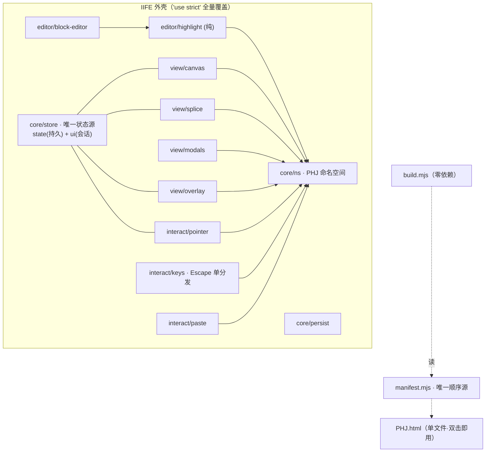

# 拼好镜（PHJ）· 重构简报 · 架构决策文档

> 作者：高见远（Architect）｜ 日期：2026-09-14 ｜ 状态：**待 Holly 拍板**
> 对象：`dev/src/`（7 片 CSS + 16 片 JS，2285 行）与 `dev/build.mjs` 的**可持续性**评估与目标架构
> 依据：实读全部 `src/` 源码 + `RECON.md` + `README.md` + `build.mjs`；结论均带**具体符号名/行号**取证

---

## 0. TL;DR

**推荐「职责重切 + 显式命名空间 + manifest 单源构建」（主推）**：交付物仍是单文件 `PHJ.html`、零运行时依赖、双击即用；但把现在"按行段切片 + 拼回"的**伪模块化**换成**按职责切分、只经 `PHJ.*` 通信、由构建器加 IIFE 外壳统一严格模式**的真模块化，构建器仍是**零依赖纯 node**。
**备选**：只止血——保留现有切片，仅加"IIFE 包裹 + manifest + 耦合闸门"。

---

## 1. 现状诊断：为什么"按行段保序切片 + 拼回"不可持续

一句话：**它付了构建管线的成本，却没买到模块化的收益。** 这 16 片不是模块，而是"共用同一作用域的 16 段相邻代码"，靠**全局变量 + 脚本加载顺序**耦合。

### 1.1 关键取证（引用真实符号与行号）

| # | 证据 | 位置 | 说明 |
|---|---|---|---|
| **E1** | 状态未集中：约 **35 个可变模块级全局**散落 **11 个文件**，仅约 10 个在 `10-state.js` | `selected`（10-state.js:12）；`activeId`（25-overlay.js:65）；`spliceMode/dropUnitEl`（68-drag.js:98）、`ghostEl/ghostSrcId/ghostOffX/ghostOffY`（68-drag.js:126）；`keyDir/keyVel/keyLoop/keyLastT/keyState`（60-keyboard.js:3-4）；`spacePan`（66-pan.js:43）；`tplOpen/tplCur`（40-template.js:2,61）；`blkCb`（50-editor.js:160）；`modalCb/__ctxBlock/__ctxX/__ctxY`（55-menu.js:2,55-56）；`_hlCode/_hlPre`（50-editor.js:127）；`canvas/board`（20-render.js:2） | **"10-state.js 是唯一状态源"不成立**：它只持有持久模型 `state` 与少量拖拽变量；**会话态被劈成 8 份**① |
| **E2** | 一次 `render()` 穿透 **6 个切片** | `render()`（20-render.js:4）依次调用 `buildCard`（62-block-size.js:2）、`autoSizeAll`（62:88）、`applyPan`（62:140）、`updateZoomBtn`（64-zoom.js:20）、`renderSplice`（35-splice.js:2）、`refreshSel`（30-selection.js:13）、`refreshOverlays`（25-overlay.js:1） | 名为"render"的模块（20-render.js 仅 31 行）**不拥有渲染**；真正的块渲染器 `buildCard` 落在名为"block-size"的切片里——**文件名说谎** |
| **E3** | 视角刷新被**串联触发两次** | `render()`→`applyPan()`（62:140 调 `updateLinks`/`updatePeekDots`）**与** `render()`→`refreshOverlays()`（25:1 又调 `updatePeekDots`/`updateLinks`） | 作者在 25-overlay.js:40-41 注释里承认此现象，并用"复用式更新"绕开——**顺序耦合被迫以补丁形式存在** |
| **E4** | **Escape 由 5 个独立 `keydown` 监听器处理**，靠注册顺序 + `.hide` 条件互斥 | 55-menu.js:142（关右键菜单）、90-boot.js:81（退拼模式）、90-boot.js:101（关预览）、90-boot.js:104（关模板窗）、90-boot.js:138（关块编辑器） | 全局键盘语义拆散在 2 个文件，**优先级靠"谁先注册"**；新增窗口极易踩踏 |
| **E5** | 事件**全局撒网**：`document`/`window`/`board` 上共 22 个监听 | 55-menu.js:82,122,142；60-keyboard.js:23,35,44,45；66-pan.js:44,52；90-boot.js:3,81,101,104,138,242,280,281；68-drag.js:1,295,296,297 | 无统一事件入口，无事件优先级模型；`window.blur` 就有 3 个（60-keyboard.js:44,45 + 68-drag.js:1） |
| **E6** | **dev 与 prod 语义不等价**（严格模式作用域分裂） | 仅 `00-header.js:1` 有 `'use strict'`；`src/index.html` 用 16 个 `<script src>` 分片加载 → 第 2~16 片**运行于非严格模式**；而 `build.mjs:58-59` 把全部 JS 并成**单个 `<script>`** → 严格模式覆盖全量 | README 明写为"可接受差异"，实为**同一份源码两套执行语义**——非严格下能跑的隐式全局/历史写法，在产物里会抛错② |
| **E7** | CSS 亦为**尾部覆盖式堆叠**，非职责切分 | `.block` 的 transition 在 10-canvas.css:1 与 90-effects.css:60 重复声明；`.block.selected` 在 10-canvas.css:7 与 90-effects.css:63 重复；`.peek-dot` 的 animation 在 90-effects.css:21 与 84-85 自相覆盖；全局原子 `.toast` 被放进"canvas"片（10-canvas.css:40） | 同名选择器跨文件多处声明，**只靠层叠顺序收口**；改一处必查全局 |
| **E8** | 启动契约是**隐式时序**：函数跨片**先调用后定义**，仅因唯一入口在末片 | `load()`（10-state.js:96）调 `render()`（20-render.js:4，定义在更后片），实际由 `90-boot.js:283` 最后一行**单点调用** | 任何"按需加载/懒初始化/调片序"都会**静默炸**；片号 `00→90` 承载的是**加载顺序契约**，不是语义 |
| **E9** | 命名债：近义函数并存 | `findBlockById`（30-selection.js:21）与 `findBlock`（90-boot.js:205，DOMContentLoaded 内局部） | 同名/近名两实现，维护者易错改 |
| **E10** | 真实 bug 是"克隆式改建"的副产物 | `deleteTemplate()`（40-template.js:309-321）读 v6.13 已删除的 `t.name` → toast 显示 `undefined` | 反复"尾部追加/覆盖"而非重构，导致**新旧字段并存**（与 README 2026-09-13 审计结论一致） |

> ① 会话态分布：`10-state.js` 仅 `state/saveTimer/toastTimer/drag/panning/panVel/panLooping/panEndX/Y/selected`；其余分散于 20/25/40/50/55/60/62/66/68 共 9 片。
> ② 严格模式分裂的**具体风险**：非严格下"给未声明变量赋值"会**静默创建全局**，产物（严格）下则**抛 `ReferenceError`**——即"dev 能跑、产物炸"或反之。P1 的 IIFE 包裹正是**主动引爆**这个隐患的探针。

### 1.2 结论

`dev/src` 是"**把 2706 行单文件在第 8–323 / 419–2703 行切开、逐字未改**"的产物（`split_phj_to_src.mjs` 的闸门就是"拼回逐字节等价"）。因此：

- **该闸门只能证明"切分忠实"，不能证明"结构合理"**；
- 一旦开始真正改结构（重排/包裹/重命名/重切），**字节等价闸门必然失效**——它保护的是"**没动过**"，不是"**改对了**"。

---

## 2. 决策：推荐架构

### 2.1 主推（Primary）：职责重切 + 显式命名空间 + manifest 单源构建

**一句话**：交付物仍是单文件 `PHJ.html`；但源码按**职责**切分，模块间**只经显式命名空间 `PHJ.*` 通信**，构建器用 **IIFE 外壳**把全部模块包成一个严格作用域，**加载顺序由唯一 manifest 决定**。

#### 目标目录结构（按职责切，不按行段）

```
dev/
├─ build.mjs              # 零依赖纯 node：读 manifest → 拼装 → IIFE 外壳 → 输出单文件；并校验 dev/prod 同源
├─ src/
│  ├─ manifest.mjs        # ★唯一顺序源：模块清单（dev index.html 与 prod 拼接共用，杜绝漂移）
│  ├─ index.html          # 骨架（不再散列 <script src>；由 manifest 生成/校验）
│  ├─ shell/
│  │  ├─ head.js          # IIFE 首行 + 'use strict' + 命名空间声明
│  │  └─ tail.js          # 末尾唯一启动调用 PHJ.boot.init()
│  ├─ core/
│  │  ├─ ns.js            # PHJ 命名空间 + 极简 define/require（≈20 行，零依赖）
│  │  ├─ store.js         # ★唯一状态源：持久 state + 会话 ui + 订阅通知
│  │  ├─ persist.js       # localStorage/防抖/migrate(v1→v12)/sanitize/导入导出
│  │  └─ clipboard.js     # copyText/fallbackCopy/toast
│  ├─ view/
│  │  ├─ canvas.js        # buildCard/fitBlock/autoResize/arrangeAll
│  │  ├─ splice.js        # renderSplice/spItem/spUnit/spUBlock/copySpliced
│  │  ├─ overlay.js       # peek 光点 + 光线
│  │  └─ modals.js        # 通用 modal / 模板窗 / 预览窗 / 右键菜单
│  ├─ editor/
│  │  ├─ highlight.js     # ★纯函数引擎：HL_* 表 + classify/toHTML/status（零 DOM，可单测）
│  │  └─ block-editor.js  # 编辑器窗口接线（依赖 highlight）
│  ├─ interact/
│  │  ├─ pointer.js       # drag/pan/zoom/selection（统一 mousedown/move/up 路由）
│  │  ├─ keys.js          # 方向键/空格 + ★统一 Escape 分发（显式 modal 栈）
│  │  └─ paste.js         # Ctrl+V 文本/图片
│  └─ styles/             # tokens / layout / canvas / splice / modal / editor / effects（按职责，非行段）
```

#### 模块边界与通信约定（硬规则）

1. **单一状态源**：只有 `core/store.js` 持有 `state`（持久）与 `ui`（会话：`selected/activeId/spliceMode/ghost*/tplCur/drag/panning/keyState`…）；其余模块**只读**，改值一律走 store action（`store.set()/commit()`）。→ 干掉 **E1**。
2. **渲染归属单一**：`view/*` 独占 DOM 生成；`render()` 编排只在一处，"视角刷新"只触发一次。→ 干掉 **E2/E3**。
3. **事件入口收敛**：指针事件在 `interact/pointer.js` **单点注册 + 分发**；键盘在 `interact/keys.js` 用**显式 modal 栈**处理 Escape（谁在栈顶谁响应）。→ 干掉 **E4/E5**。
4. **无裸全局**：模块只经 `PHJ.xxx` 通信；IIFE 外壳保证**不向 window 泄漏**、`'use strict'` 全量覆盖。→ 干掉 **E6/E8**。
5. **纯核心可测**：`editor/highlight.js` 抽成**输入文本 → 分类结果**的纯函数（当前 `hlClassify/hlToHTML/hlStatus` 已近此形态，只需切断对 `document.getElementById('blkInput')` 的直接依赖）。→ 除 85/F/G 外可新增**引擎级单测**。



#### 构建产物形态：如何仍是"单文件、零依赖、双击即用"

| 要求 | 实现 |
|---|---|
| 单文件 | `build.mjs` **不打包**，只做 `shell/head.js` + 按 manifest 顺序内联模块 + `shell/tail.js` → 拼成**一个 `<script>`**，再套 `<style>`，输出 `PHJ.html` |
| 双击即用 | **不输出 ES module**（`file://` 下 `<script type=module>` 会被 CORS 拦）→ **继续用经典脚本**（红线） |
| 零运行时依赖 | 产物只含 HTML/CSS/JS + 内联字体栈，**无外链、无 CDN、无 fetch** |
| **dev≡prod** | `src/index.html` 改为引用**同一拼接产物**（构建器额外产出 dev bundle），不再用 16 个散列 `<script src>` → **一套执行语义**。→ 关掉 **E6** |

### 2.2 备选（Alternative）：只止血（冻结现状 + 最小包裹）

保留现有 16 片**行段切片**，只做三件事：① 构建器加 **IIFE 外壳**（统一严格模式、去全局泄漏）；② 引入 **manifest** 让顺序单源；③ 加**耦合闸门**（lint：禁止在非 state 模块新增模块级 `var`）。

- **优点**：改动面最小、风险最低，**字节等价闸门可继续用到最后一刻**；能立刻消除 E6/E8。
- **代价**：E1/E2/E3/E4/E7 五条**结构性病灶原样保留**，债务继续复利；"block-size 里放渲染器"这类**命名说谎**不解决。
- **适用**：若 Holly 判断"补功能优先、结构债可暂缓"，选它。

### 2.3 取舍小结

| 维度 | 主推（真模块化） | 备选（只止血） |
|---|---|---|
| 一次性投入 | 中高（分阶段、逐模块） | 低 |
| 回归风险 | 中（增量 + 行为闸门压制） | 低 |
| 长期可维护性 | 高 | 低（债复利） |
| 现有验收资产用法 | 主闸门从"字节等价"切到"行为回归 + 基线 A/B" | 可沿用字节等价 |
| 是否动模块职责 | 动 | 不动 |

---

## 3. 迁移路径（分步 · 闸门 · 回退点）

> 前置认知：**真实重构 → 产物字节必变 → 字节等价闸门必须退役**。故迁移第一步是**先把"行为回归"扶正为主闸门**，并以**冻结基线 `PHJ_v7.7_baseline.html`** 做 A/B 对照（同口径跑同一套 CDP 断言）。

| 阶段 | 动作 | 验证闸门 | 回退点 |
|---|---|---|---|
| **P0 护栏扶正**（不改行为） | 冻结基线快照；把 `<85 回归>+F18+G16+dev-index18` 变成**一条命令可复跑**；**先修好动效断言工装**（用 CDP `Emulation.setEmulatedMedia` 钉 `prefers-reduced-motion`，见 RECON §5） | 全部套件在**基线产物**与**当前 src 产物**上**双绿** | 无（只读/只加脚本） |
| **P1 止血**（消除 dev≠prod + 全局泄漏） | 构建器加 IIFE 外壳；引入 manifest；`src/index.html` 改引同一拼接产物 | 全套 CDP 双绿；**IIFE 包裹即探针**：隐式全局/非严格写法**在此显式报错**（引爆 E6 隐患） | `git` 单提交回退 |
| **P2 按职责重切**（行为保持，逐模块） | 逐块搬迁到 `core/view/editor/interact`；引入 `PHJ.*` 显式通信；**每搬一个模块 = 一个原子提交**；**先抽 `editor/highlight`**（最独立、最纯） | **每模块**提交后全套 CDP 绿 + 基线 A/B 像素对比无回归 | 每模块独立提交可回退 |
| **P3 收口**（清历史债 + 固化） | Escape/blur 合并为单分发；单状态源收编会话态；删死代码；修 `deleteTemplate` 的 `t.name`；去 CSS 重复声明 | 全套 CDP 绿；**重建新基线 `PHJ_v8_baseline.html`**，字节等价闸门对新基线**重启** | 打 tag / 保留旧基线 |
| **P4 文档** | 更新 README 目录与闸门表；归档旧快照 | 交付方按新 README **一条命令复现** | 文档回退 |

**现有资产在迁移中的角色：**

| 资产 | 迁移期角色 |
|---|---|
| `snapshots/PHJ_v7.7_baseline.html` + `BASELINE_v7.7.md` | **A/B 对照基准**（P0–P3 全程）；P3 后转历史存档 |
| `verify_build_equivalence.mjs` | **仅 P0–P1 有效**（保护"没动过"）；**P2 起退役**，P3 对新基线重启 |
| `85 回归 + F18 + G16 + dev-index18` | **P0 起升为主闸门**，全程护栏（这正是"为什么先做 P0"） |
| `split_phj_to_src.mjs` | P2 后**退役**（其存在意义仅"保序切分"） |

---

## 4. 风险与不变量

### 4.1 不可破坏的不变量（红线）

1. **交付物 = 根目录单个 `PHJ.html`，双击即用**（`file://` 直开）。
2. **零安装 / 零进程 / 零系统残留**：产物无外链、无网络、无运行时依赖。
3. **经典脚本**：**不得**改用 `<script type=module>` 或动态 `import()`（`file://` 会被 CORS 挡）。
4. **构建期零依赖**：`build.mjs` 保持纯 node、无 `node_modules`、路径相对自身解析 → **任意目录 / 任意机器**可复现。
5. **数据兼容**：localStorage 键 `storyboard-prompt-panel:v1` 与 `version:12` 不变；**必须继续接受 v1→v12 旧数据**（`migrate()` 行为等价）。
6. **无障碍降级**：`prefers-reduced-motion` 直切规则保留。
7. **行为等价**：85+F18+G16+dev-index 全绿；像素/视觉断言保持（P0 修好工装后）。

### 4.2 主要风险

| 风险 | 影响 | 缓解 |
|---|---|---|
| 字节等价退役后**行为盲区** | 静默回归 | P0 先钉住动效断言（现 11 项因 `reduce` 误红）；基线 A/B 双跑对照 |
| 严格模式全量覆盖**暴露隐式全局/历史写法** | P1 直接抛错 | **这正是 P1 的价值**：把隐患在小步内显式爆出，而非潜伏 |
| 大爆炸式重切 | 大面积回归 | 严格**逐模块原子提交** + 每步 CDP 绿 |
| `file://` 限制被无意突破 | 双击打不开 | 红线 3 写入 lint：构建产物**扫描** `type="module"` / `import(` / 外部 URL |
| 会话态收编（E1）漏改 | 多选/拼模式/拖拽行为漂移 | P3 专项 + 对应断言（v6.1/v6.18/v7.3 套件覆盖） |

---

## 5. 结论与建议动作

1. **采纳主推**：职责重切 + 显式命名空间 + manifest 单源；**交付物与便携性红线一字不动**。
2. **先做 P0**（护栏扶正 + 修动效工装）——它与团队任务 #1（可移植性）**同一批工作**，且是后续所有阶段的**前提**。
3. **P2 从 `editor/highlight` 开刀**：它最独立、最纯、最有单测价值，能最小代价验证新架构的通信约定。
4. **退役"字节等价"主闸门，改立"行为回归 + 基线 A/B"**——因为"保序切分"这个前提在重构中必然消失。
5. **两个真 bug（`deleteTemplate` undefined / `copySpliced` 首行空行）另案（v7.7.1）**，不混入本次结构重构，避免"行为修复"与"结构变更"相互污染回退点。

---

## 6. 待确认（需 Holly 拍板）

| # | 待确认项 | 我的倾向 | 理由 |
|---|---|---|---|
| **Q1** | **重构深度**：主推（真模块化）还是备选（只止血）？ | 主推 | 债在复利（E1–E10 已现隐患与真 bug）；但投入与回归面更大，需 Holly 定夺 |
| **Q2** | **构建期是否允许 npm 依赖**（如 esbuild/rollup）？ | **不允许** | "任意机器复现"是产品红线；零依赖 plain-node 拼接对 2.3k 行足够 |
| **Q3** | **是否同意退役"字节等价"主闸门**，改立行为回归 + 基线 A/B？ | 同意 | 真重构必然改变字节；该闸门保护的是"没动过"，非"改对了" |
| **Q4** | P2 的**切分粒度**（模块数/文件数）是否需先出细则？ | 需要 | 建议 P1 产出一版 `manifest.mjs` 草案再评估 |
