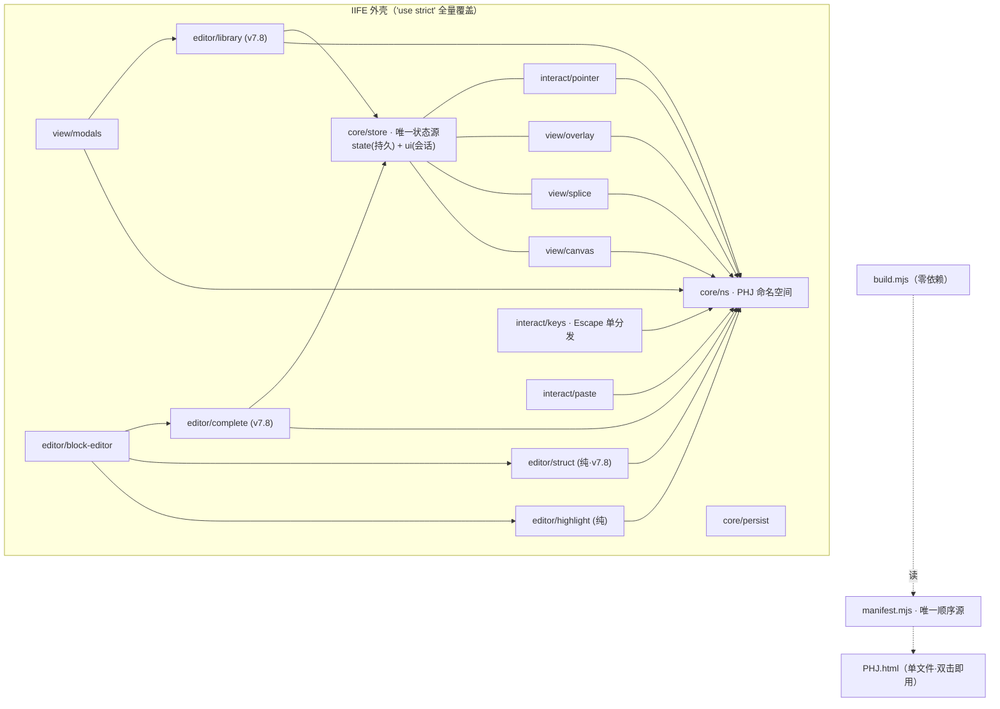
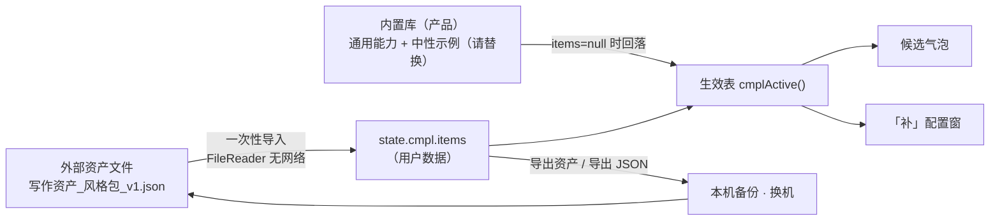
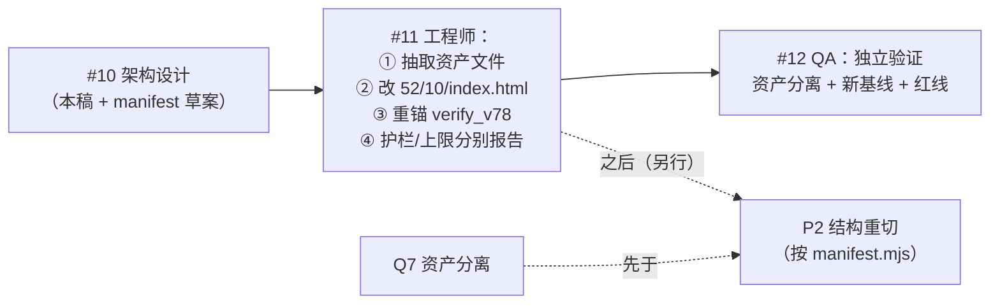

# 拼好镜（PHJ）· 重构简报 · 架构决策文档

> 作者：高见远（Architect）｜ 日期：2026-09-14（**v7.8 增量更新**；**v7.8.1 拍板回填**）｜ 状态：**已拍板（Q1–Q8）**
> 对象：`dev/src/`（**9 片 CSS + 19 片 JS**；v7.7 为 7+16）与 `dev/build.mjs` 的**可持续性**评估与目标架构
> 依据：实读全部 `src/` 源码 + `RECON.md` + `README.md` + `build.mjs`；**v7.8 增量经 git 对象 `ce8b7a0`↔基线 `9f7a3c8` 实读取证**；结论均带**具体符号名/行号**
> 变更说明：前团队 fork 出 **v7.8「编辑器补全」**（分支 `feat/editor-blocks`，`ce8b7a0`）并入。本稿为**增量更新**——原有 **E1–E10 一字不删**，变化处标 **v7.8**，新增 **E11/E12**；**主推结论不变**。
>
> ⚠️ 2026-09-15 更新：本文 §6 的 Q7「内置降为中性示例」处置已被 **v7.8.2 撤销**（Holly 认定风格包即语料的一部分，已放回内置）。**已按 v7.8.2 现状校准**：文中失效/过期处就地加 `⚠️ v7.8.2` 标注（汇总见文末「校准说明（v7.8.2）」小节），原文**保留为历史留档、不再"勿据此施工"**；当前现状以 `dev/_build/snapshots/BASELINE_v7.8.2.md` 为准。

---

## 0. TL;DR

**推荐「职责重切 + 显式命名空间 + manifest 单源构建」（主推）**：交付物仍是单文件 `PHJ.html`、零运行时依赖、双击即用；但把现在"按行段切片 + 拼回"的**伪模块化**换成**按职责切分、只经 `PHJ.*` 通信、由构建器加 IIFE 外壳统一严格模式**的真模块化，构建器仍是**零依赖纯 node**。
**备选**：只止血——保留现有切片，仅加"IIFE 包裹 + manifest + 耦合闸门"。

**v7.8 结论（一句话）**：**不推翻、反而强化**——新团队用 **3 个"按职责命名且片内内聚"** 的新片（`51-struct`/`52-complete`/`53-library`）**证明了"行段切片"约束可局部突破**（利好 P2），**但没有引入任何模块系统**（同款顶层全局 + 加载序 + 运行期晚期调用），把 **E1/E4/E5/E6 全部恶化**；同时**等价性闸门被改义为"构建可复现"**（源码↔交付物一致性），其价值**升格为全程护栏**（见 §3 / §6 Q3）。

---

## 1. 现状诊断：为什么"按行段保序切片 + 拼回"不可持续

一句话：**它付了构建管线的成本，却没买到模块化的收益。** 这 **16 片**（v7.8 后为 **19 片**）不是模块，而是"共用同一作用域的相邻代码段"，靠**全局变量 + 脚本加载顺序**耦合。

### 1.1 关键取证（引用真实符号与行号）

| # | 证据 | 位置 | 说明 |
|---|---|---|---|
| **E1** | 状态未集中：约 **35 个可变模块级全局**散落 **11 个文件**，仅约 10 个在 `10-state.js` | `selected`（10-state.js:12）；`activeId`（25-overlay.js:65）；`spliceMode/dropUnitEl`（68-drag.js:98）、`ghostEl/ghostSrcId/ghostOffX/ghostOffY`（68-drag.js:126）；`keyDir/keyVel/keyLoop/keyLastT/keyState`（60-keyboard.js:3-4）；`spacePan`（66-pan.js:43）；`tplOpen/tplCur`（40-template.js:2,61）；`blkCb`（50-editor.js:160）；`modalCb/__ctxBlock/__ctxX/__ctxY`（55-menu.js:2,55-56）；`_hlCode/_hlPre`（50-editor.js:127）；`canvas/board`（20-render.js:2） | **"10-state.js 是唯一状态源"不成立**：它只持有持久模型 `state` 与少量拖拽变量；**会话态被劈成 8 份**① |
| **E2** | 一次 `render()` 穿透 **6 个切片** | `render()`（20-render.js:4）依次调用 `buildCard`（62-block-size.js:2）、`autoSizeAll`（62:88）、`applyPan`（62:140）、`updateZoomBtn`（64-zoom.js:20）、`renderSplice`（35-splice.js:2）、`refreshSel`（30-selection.js:13）、`refreshOverlays`（25-overlay.js:1） | 名为"render"的模块（20-render.js 仅 31 行）**不拥有渲染**；真正的块渲染器 `buildCard` 落在名为"block-size"的切片里——**文件名说谎** |
| **E3** | 视角刷新被**串联触发两次** | `render()`→`applyPan()`（62:140 调 `updateLinks`/`updatePeekDots`）**与** `render()`→`refreshOverlays()`（25:1 又调 `updatePeekDots`/`updateLinks`） | 作者在 25-overlay.js:40-41 注释里承认此现象，并用"复用式更新"绕开——**顺序耦合被迫以补丁形式存在** |
| **E4** | **Escape 由 5 个独立 `keydown` 监听器处理**，靠注册顺序 + `.hide` 条件互斥 | 55-menu.js:142（关右键菜单）、90-boot.js:81（退拼模式）、90-boot.js:101（关预览）、90-boot.js:104（关模板窗）、90-boot.js:138（关块编辑器） | 全局键盘语义拆散在 2 个文件，**优先级靠"谁先注册"**；新增窗口极易踩踏 |
| **E5** | 事件**全局撒网**：`document`/`window`/`board` 上共 22 个监听 | 55-menu.js:82,122,142；60-keyboard.js:23,35,44,45；66-pan.js:44,52；90-boot.js:3,81,101,104,138,242,280,281；68-drag.js:1,295,296,297 | 无统一事件入口，无事件优先级模型；`window.blur` 就有 3 个（60-keyboard.js:44,45 + 68-drag.js:1） |
| **E6** | **dev 与 prod 语义不等价**（严格模式作用域分裂） | 仅 `00-header.js:1` 有 `'use strict'`；`src/index.html` 用 16 个 `<script src>` 分片加载 → 第 2~16 片**运行于非严格模式**；而 `build.mjs:58-59` 把全部 JS 并成**单个 `<script>`** → 严格模式覆盖全量 | README 明写为"可接受差异"，实为**同一份源码两套执行语义**——非严格下能跑的隐式全局/历史写法，在产物里会抛错② |
| **E7** | CSS 亦为**尾部覆盖式堆叠**，非职责切分 | `.block` 的 transition 在 10-canvas.css:1 与 90-effects.css:60 重复声明；`.block.selected` 在 10-canvas.css:7 与 90-effects.css:63 重复；`.peek-dot` 的 animation 在 90-effects.css:21 与 84-85 自相覆盖；全局原子 `.toast` 被放进"canvas"片（10-canvas.css:40） | 同名选择器跨文件多处声明，**只靠层叠顺序收口**；改一处必查全局 |
| **E8** | 启动契约是**隐式时序**：函数跨片**先调用后定义**，仅因唯一入口在末片 | `load()`（10-state.js:96）调 `render()`（20-render.js:4，定义在更后片），实际由 `90-boot.js:283` 最后一行**单点调用** | 任何"按需加载/懒初始化/调片序"都会**静默炸**；片号 `00→90` 承载的是**加载顺序契约**，不是语义 |
| **E9** | 命名债：近义函数并存 | `findBlockById`（30-selection.js:21）与 `findBlock`（90-boot.js:205，DOMContentLoaded 内局部） | 同名/近名两实现，维护者易错改 |
| **E10** | 真实 bug 是"克隆式改建"的副产物 | `deleteTemplate()`（40-template.js:309-321）读 v6.13 已删除的 `t.name` → toast 显示 `undefined` | 反复"尾部追加/覆盖"而非重构，导致**新旧字段并存**（与 README 2026-09-13 审计结论一致） |

> ① 会话态分布：`10-state.js` 仅 `state/saveTimer/toastTimer/drag/panning/panVel/panLooping/panEndX/Y/selected`；其余分散于 20/25/40/50/55/60/62/66/68 共 9 片。
> ② 严格模式分裂的**具体风险**：非严格下"给未声明变量赋值"会**静默创建全局**，产物（严格）下则**抛 `ReferenceError`**——即"dev 能跑、产物炸"或反之。P1 的 IIFE 包裹正是**主动引爆**这个隐患的探针。

### 1.1b v7.8 增量取证（前提变更 · 全部经 `git show ce8b7a0:…` 实读）

| # | 证据 | 前后对比（实测） | v7.8 结论 |
|---|---|---|---|
| **E1′** | **状态分散恶化** | 顶层 `var` 语句/名字/散落片：**38 / 51 / 11 片** → **57 / 82 / 14 片**（+3 = 51/52/53） | 新增**会话态 10 处全落新片顶层全局**：`52-complete.js` = `cmplItems/cmplSel/cmplOpen/cmplSlots/cmplSlotIdx/cmplComposing/cmplGroup`（:86-88）+ 缓存 `_cmplCache/_cmplCacheSrc/_cmctx`；`53-library.js` = `cmplCfgQ/cmplCfgEditing/cmplCfgAdding/cmplCfgDrag`（:8,60）。**唯一亮点**：新增**持久**字段 `state.cmpl` 正确入 `10-state.js`（`version 12→13` + `migrate` 分支，红线 5 守住） |
| **E4′** | **Escape 分发恶化** | **document 级 Escape 监听 5 → 6**；**全部 Escape 处理点 7 → 10** | +`90-boot.js:166`（关补全窗）、+`90-boot.js:162`（配置窗内退回列表）、+`52-complete.js:388 cmplKeydown`（关候选/退组/清槽）。候选气泡被迫 `e.stopPropagation()` 抢优先级（`52:388,396`）——**"靠注册序互斥"的脆弱性被新代码亲手确认** |
| **E5′** | **全局事件撒网恶化** | `document`/`window` 上 `addEventListener` **22 → 24**（+`90-boot.js:166`、+`52:436` DOMContentLoaded） | 另新增**元素级监听簇**：`52` 对 `blkInput` 6 个 + 气泡 1 + `blkCopy` 1；`53` 对**动态行**挂 4 类 drag 事件（`cmplCfgDnd`）。仍无统一入口/优先级模型 |
| **E6′** | **dev≠prod 恶化（稀释）** | `'use strict'` 片 **1/16 → 1/19**；`index.html` `<script src>` **16 → 19** | 产物单 `<script>` 仍全量严格、dev 仍仅首片严格 → **同源两套语义不变，非严格覆盖的代码面更大** |
| **E11** | **★ Q1 核心：新片是"职责命名"而非"行段追加"，但契约未变** | `51-struct.js` = **纯函数 + 单表 `STRUCT_MARKS`**（`structLineMark/structMap/structAt/structSummary`，零 DOM）；`52`=候选引擎、`53`=配置界面，**各自命名内聚** | **但通信契约与旧片完全相同**：无 `export`、无命名空间、无 manifest，全是**顶层全局 + 加载序 + 运行期晚期调用**。跨片裸调用成链：`50→51`(`structAt`)、`50→52`(`cmplReset`)、`52→51`(`structAt`)、`53→52`(`cmplActive/cmplSetItems/cmplSeedItems/cmplGroupOrder`)、`90→52/53`(`cmplCfg*`)——**E8 的"隐式时序"又添 5 条边**（`50` 片序在前却引用 `51/52`）。→ **"行段切片"约束被局部打破（利好 P2），模块系统零改变（E6/E8 照旧）** |
| **E12** | **体积膨胀** | `PHJ.html` 155315 → **214433 B（+38.1%）**；`PHJ_v7.8_20260913.html` = 产物副本（含 banner，逐字节相同） | 预算：`166400 → 229376 B（224KB）`（工程师已落盘为**临时值**，注释明写"待 Holly 拍板产品上限"）；见 §6 **Q5** |

> 取证：`git show ce8b7a0:dev/src/js/<f>.js` 逐文件实读 + node 计数（顶层 `^var`/`^function`、`addEventListener` 目标、`'Escape'` 处理点）。**E2/E3 未变**（`buildCard` 仍在 `62-block-size.js:2`、`render()` 仍穿透 6 片）；**E7 未恶化**（新增 2 个 CSS 片均为特性命名空间 `.cmpl-*`，未新增跨文件重复声明）。

### 1.2 结论

`dev/src` 是"**把 2706 行单文件在第 8–323 / 419–2703 行切开、逐字未改**"的产物（`split_phj_to_src.mjs` 的闸门就是"拼回逐字节等价"）。因此：

- **该闸门只能证明"切分忠实"，不能证明"结构合理"**；
- 一旦开始真正改结构（重排/包裹/重命名/重切），**字节等价闸门必然失效**——它保护的是"**没动过**"，不是"**改对了**"。

**v7.8 的启示（重要）**：新团队**已经动手改了结构**——不再"逐字切开"，而是**按职责新写**了 `51/52/53` 三片（E11）。这说明：① **"行段切片"并非物理约束，只是当初的切法**，按职责切分**在本项目完全可行**（P2 的技术前提被现实案例验证）；② 但他们**停在"文件级职责"，没走到"模块级契约"**，于是把 E1/E4/E5/E6 一并继承并放大。→ 结论：**主推路径方向正确，且 P2 不再是"未知水域"**。

---

## 2. 决策：推荐架构

### 2.1 主推（Primary）：职责重切 + 显式命名空间 + manifest 单源构建

**一句话**：交付物仍是单文件 `PHJ.html`；但源码按**职责**切分，模块间**只经显式命名空间 `PHJ.*` 通信**，构建器用 **IIFE 外壳**把全部模块包成一个严格作用域，**加载顺序由唯一 manifest 决定**。

#### 目标目录结构（按职责切，不按行段）

```
dev/
├─ build.mjs              # 零依赖纯 node：读 manifest → 拼装 → IIFE 外壳 → 输出单文件；并校验 dev/prod 同源
├─ src/
│  ├─ manifest.mjs        # ★唯一顺序源：模块清单（dev index.html 与 prod 拼接共用，杜绝漂移）
│  ├─ index.html          # 骨架（不再散列 <script src>；由 manifest 生成/校验）
│  ├─ shell/
│  │  ├─ head.js          # IIFE 首行 + 'use strict' + 命名空间声明
│  │  └─ tail.js          # 末尾唯一启动调用 PHJ.boot.init()
│  ├─ core/
│  │  ├─ ns.js            # PHJ 命名空间 + 极简 define/require（≈20 行，零依赖）
│  │  ├─ store.js         # ★唯一状态源：持久 state + 会话 ui + 订阅通知
│  │  ├─ persist.js       # localStorage/防抖/migrate(v1→v13)/sanitize/导入导出
│  │  └─ clipboard.js     # copyText/fallbackCopy/toast
│  ├─ view/
│  │  ├─ canvas.js        # buildCard/fitBlock/autoResize/arrangeAll
│  │  ├─ splice.js        # renderSplice/spItem/spUnit/spUBlock/copySpliced
│  │  ├─ overlay.js       # peek 光点 + 光线
│  │  └─ modals.js        # 通用 modal / 模板窗 / 预览窗 / ★补全配置窗(v7.8) / 右键菜单
│  ├─ editor/
│  │  ├─ highlight.js     # ★纯函数引擎：HL_* 表 + classify/toHTML/status（零 DOM，可单测）
│  │  ├─ struct.js        # ★v7.8 现成纯函数：STRUCT_MARKS + structMap/structAt/structSummary（零 DOM）
│  │  ├─ complete.js      # ★v7.8：候选引擎（触发/评分/两级气泡/槽位 ${n}）+ blkCopyAll
│  │  ├─ library.js       # ★v7.8：片段库配置界面（浏览/改/增/删/排序；改 state.cmpl）
│  │  └─ block-editor.js  # 编辑器窗口接线（依赖 highlight/struct/complete）
│  ├─ interact/
│  │  ├─ pointer.js       # drag/pan/zoom/selection（统一 mousedown/move/up 路由）
│  │  ├─ keys.js          # 方向键/空格 + ★统一 Escape 分发（显式 modal 栈）★收编 v7.8 新增 3 处
│  │  └─ paste.js         # Ctrl+V 文本/图片
│  └─ styles/             # tokens / layout / canvas / splice / modal / editor / complete / library / effects（按职责，非行段）
```

#### 模块边界与通信约定（硬规则）

1. **单一状态源**：只有 `core/store.js` 持有 `state`（持久）与 `ui`（会话：`selected/activeId/spliceMode/ghost*/tplCur/drag/panning/keyState`…）；其余模块**只读**，改值一律走 store action（`store.set()/commit()`）。→ 干掉 **E1**。
2. **渲染归属单一**：`view/*` 独占 DOM 生成；`render()` 编排只在一处，"视角刷新"只触发一次。→ 干掉 **E2/E3**。
3. **事件入口收敛**：指针事件在 `interact/pointer.js` **单点注册 + 分发**；键盘在 `interact/keys.js` 用**显式 modal 栈**处理 Escape（谁在栈顶谁响应）。→ 干掉 **E4/E5**。
4. **无裸全局**：模块只经 `PHJ.xxx` 通信；IIFE 外壳保证**不向 window 泄漏**、`'use strict'` 全量覆盖。→ 干掉 **E6/E8**。
5. **纯核心可测**：`editor/highlight.js` 抽成**输入文本 → 分类结果**的纯函数（当前 `hlClassify/hlToHTML/hlStatus` 已近此形态，只需切断对 `document.getElementById('blkInput')` 的直接依赖）。→ 除 85/F/G 外可新增**引擎级单测**。
6. **v7.8 现成样板**：`51-struct.js` 已是"零 DOM 纯函数 + 单表"形态，**直接就是目标结构**——P2 可**首迁它**（比 highlight 更省事），作为验证 `PHJ.*` 通信约定的**第一个原子提交**。



#### 构建产物形态：如何仍是"单文件、零依赖、双击即用"

| 要求 | 实现 |
|---|---|
| 单文件 | `build.mjs` **不打包**，只做 `shell/head.js` + 按 manifest 顺序内联模块 + `shell/tail.js` → 拼成**一个 `<script>`**，再套 `<style>`，输出 `PHJ.html` |
| 双击即用 | **不输出 ES module**（`file://` 下 `<script type=module>` 会被 CORS 拦）→ **继续用经典脚本**（红线） |
| 零运行时依赖 | 产物只含 HTML/CSS/JS + 内联字体栈，**无外链、无 CDN、无 fetch** |
| **dev≡prod** | `src/index.html` 改为引用**同一拼接产物**（构建器额外产出 dev bundle），不再用 16→**19** 个散列 `<script src>` → **一套执行语义**。→ 关掉 **E6′** |

### 2.2 备选（Alternative）：只止血（冻结现状 + 最小包裹）

保留现有 **19 片**（v7.7 的 16 片 + v7.8 的 3 片）**行段/职责混合切片**，只做三件事：① 构建器加 **IIFE 外壳**（统一严格模式、去全局泄漏）；② 引入 **manifest** 让顺序单源；③ 加**耦合闸门**（lint：禁止在非 state 模块新增模块级 `var`）。

- **优点**：改动面最小、风险最低，**字节等价闸门可继续用到最后一刻**；能立刻消除 E6′/E8。
- **代价**：E1′/E2/E3/E4′/E5′/E7 六条**结构性病灶原样保留**，债务继续复利；"block-size 里放渲染器"这类**命名说谎**不解决。
- **适用**：若 Holly 判断"补功能优先、结构债可暂缓"，选它。

### 2.3 取舍小结

| 维度 | 主推（真模块化） | 备选（只止血） |
|---|---|---|
| 一次性投入 | 中高（分阶段、逐模块） | 低 |
| 回归风险 | 中（增量 + 行为闸门压制） | 低 |
| 长期可维护性 | 高 | 低（债复利） |
| 现有验收资产用法 | 闸门改义为"构建可复现/源码↔交付物一致"（全程）+ 行为回归 + 基线 A/B | 可沿用原字节等价（对 v7.7） |
| 是否动模块职责 | 动 | 不动 |

---

## 3. 迁移路径（分步 · 闸门 · 回退点）

> 前置认知：**真实重构 → 产物字节必变 → 原有"对 v7.7 基线逐字节"的闸门必然失效**。故迁移第一步是**先把"行为回归"扶正为主闸门**，并以**冻结基线 `PHJ_v7.7_baseline.html`** 做 A/B 对照（同口径跑同一套 CDP 断言）。
>
> **v7.9 更新（P1 已执行 · 2026-09-16）**：P1 止血落地——产物 JS 收进**单个 IIFE**（顶层声明自全局收进一个私有函数作用域；产品**新增全局名 = 0**，由 P1-D 在产品上实测 window 自有键增量为空集）；manifest 成**唯一顺序源**；开发态改引同一 `dev-bundle.js`（**dev≡prod 逐字一致**）。实测产物 **222381 B**（v7.8.2 → +22 B，仅 IIFE 外壳）、闸门 **7/7**（构建 222381 ｜ 等价性 PASS ｜ 87/87 ｜ F 18/18 ｜ G 16/16 ｜ H+I+X+P1 **44/44** ｜ 开发态 18/18）、新快照 **`PHJ_v7.9_20260916.html`** + **`BASELINE_v7.9.md`**。CDP 套件对内部的可达性改由**构建侧测试产物**承担（`dev/_build/lib/test-artifact.mjs` = 产物 + 1 行访问器，逐行 diff 可断言审计），**产品零新增全局**。
>
> **v7.8 更新（闸门已改义 · 已落盘）**：工程师把等价性闸门从"剥 banner 后与 v7.7 基线逐字节（保护'没动过'）"**改义为"构建可复现"**——**默认**即 **`node dev/build.mjs` 产出 ↔ 交付快照 `PHJ_v7.8_20260913.html`（含 banner）逐字节一致**（`verify_build_equivalence.mjs` 文件头已写明改义理由）。**旧语义保留**为 argv 选项（显式传 v7.7 基线 → 走剥 banner 比对，退出码 `2` 区分）。这不是降级：它是**"源码↔交付物一致性"检查**，证明"交付的单文件确由这份 src 构建"，**在整个迁移期与发布期都成立**，比原闸门更有价值（见 §6 Q3）。

| 阶段 | 动作 | 验证闸门 | 回退点 |
|---|---|---|---|
| **P0 护栏扶正**（不改行为） | 冻结基线快照；把 `<85 回归>+F18+G16+dev-index18` 变成**一条命令可复跑**；**先修好动效断言工装**（CDP `Emulation.setEmulatedMedia` 钉 `prefers-reduced-motion`，见 RECON §5）｜**v7.8 已到位**：`run-gate.mjs`（自包含起收浏览器）+ `verify_v78.mjs`（H+I 35/35 实测绿〔⚠️ v7.8.2 现状 = **H+I+X 40/40**，见 §6.3〕） | 全部套件在**基线产物**与**当前 src 产物**上**双绿** | 无（只读/只加脚本） |
| **P1 止血**（消除 dev≠prod + 全局泄漏） | 构建器加 IIFE 外壳；引入 manifest（**19 片**）；`src/index.html` 改引同一拼接产物 | 全套 CDP 双绿；**IIFE 包裹即探针**：隐式全局/非严格写法**在此显式报错**（引爆 E6′ 隐患）；⚠️ **★加 IIFE 外壳会改变产物字节** → 必须**重建新基线快照**，并把「构建可复现」等价性闸门的**默认比对基准改指新快照**（否则默认闸门必然报红——此步原简报仅在 P3 写过，P1 同样必须）｜**✅ 已执行（2026-09-16 · v7.9）**：产物 **222381 B**（+22 B，仅 IIFE 外壳）、闸门 **7/7**（构建 222381 ｜ 等价性 PASS ｜ 87/87 ｜ F 18/18 ｜ G 16/16 ｜ H+I+X+P1 **44/44** ｜ 开发态 18/18）、新快照 **`PHJ_v7.9_20260916.html`** + **`BASELINE_v7.9.md`**；IIFE 未引爆任何存量非严格写法（产物**本已是严格模式**）；CDP 内部可达性由**构建侧测试产物**（+1 行访问器，可审计）承担，**产品零新增全局** | `git` 单提交回退 |
| **P2 按职责重切**（行为保持，逐模块） | 逐块搬迁到 `core/view/editor/interact`；引入 `PHJ.*` 显式通信；**每搬一个模块 = 一个原子提交**；**首迁 `editor/struct`**（v7.8 已是纯函数，最省事）〔✅ **2026-09-16 已执行完毕**：17 个模块落地 + `PHJ.*` 显式导出面；顺序仍由 manifest 的 `SLICES` 显式给出（**未让 resolveOrder 接管**——deps 是运行期依赖，与加载序无关）；新基线 `PHJ_v7.10_20260916.html`，闸门 7/7。详见 `BASELINE_v7.10.md`〕→ 再 `editor/highlight` → `editor/complete` → `editor/library` | **每模块**提交后全套 CDP 绿 + 基线 A/B 像素对比无回归 | 每模块独立提交可回退 |
| **P3 收口**（清历史债 + 固化）〔✅ **2026-09-16 已执行**：Escape 8 处 document 级处理器 → **1 处 closeTopLayer 单点分发**（元素级 4 处保留）；跨模块会话态收编进 core/store；`PHJ` 对外面由 239 收敛到 **108**；修 deleteTemplate 的 `t.name`；`copySpliced` 的"开头空行"判定为**有意规则**（A2a/A2d 锁定）不改；新基线 v7.11，闸门 7/7（83/18/16/47/18）。详见 BASELINE_v7.11.md〕 | Escape/blur 合并为单分发（**6 个 document 级 + 3 处元素级 → 1 处显式 modal 栈**）；单状态源收编会话态（**含 v7.8 新增 10 处**）；删死代码；修 `deleteTemplate` 的 `t.name`；去 CSS 重复声明 | 全套 CDP 绿；**重建新基线快照**，"构建可复现"闸门对新基线**重启** | 打 tag / 保留旧基线 |
| **P4 文档** | 更新 README 目录与闸门表；归档旧快照 | 交付方按新 README **一条命令复现** | 文档回退 |
| ⤴ **P4 执行结果（2026-09-16）** | README：目录 / 闸门表 / 体积政策 / **架构现状**全部定稿到 v7.11；新增 `dev/_build/snapshots/INDEX.md` 快照索引——因**所有快照仍被引用**（argv 复跑 / 历史文档 / H 组夹具），故**不移动文件**，改以索引说明每个快照的角色与"不可动"清单 | `node dev/_build/run-gate.mjs` 一条命令 7/7（83/18/16/47/18），退出码 0 | 纯文档，可回退 |

**现有资产在迁移中的角色：**

| 资产 | 迁移期角色 |
|---|---|
| `snapshots/PHJ_v7.7_baseline.html` + `BASELINE_v7.7.md` | **A/B 对照基准**（P0–P3 全程）；P3 后转历史存档 |
| `snapshots/PHJ_v7.8_20260913.html` + `BASELINE_v7.8.md` | **★产物副本（含 banner，非改动前基线）** → 现为**"构建可复现"的默认比对基准**；**不可**当"改动前基线"做行为 A/B |
| `verify_build_equivalence.mjs`（改义后） | **★全程有效**：默认 = **"源码↔交付物一致性（构建可复现，含 banner 逐字节）"**——P0–P4 与日常发布都适用，**不再 P2 退役**；旧 v7.7 语义保留为 argv 选项 |
| `85 回归 + F18 + G16 + dev-index18 + v7.8 H/I 35` | **P0 起升为主闸门**，全程护栏｜v7.8 实测：**83/85**（唯二红 = `B10a/C8a` 体积）→ 预算上调至 229376 后 **85/85**（功能与动效始终全绿）｜⚠️ v7.8.2 现状：v7.8 断言 **35/35 → 40/40**（X1/X2 删除、H19 新增），见 §6.3 |
| `run-gate.mjs`（v7.8 新增 · 7 道闸门） | **一键自包含**：自动起/收 headless 浏览器 + 端口自适应 → 交付方"一条命令复现"的载体（构建 → 等价性 → 85 → F18 → G16 → 40〔v7.8.2；v7.8 时为 35〕 → 开发态18） |
| `split_phj_to_src.mjs` | P2 后**退役**（其存在意义仅"保序切分"） |

---

## 4. 风险与不变量

### 4.1 不可破坏的不变量（红线）

1. **交付物 = 根目录单个 `PHJ.html`，双击即用**（`file://` 直开）。
2. **零安装 / 零进程 / 零系统残留**：产物无外链、无网络、无运行时依赖。
3. **经典脚本**：**不得**改用 `<script type=module>` 或动态 `import()`（`file://` 会被 CORS 挡）。
4. **构建期零依赖**：`build.mjs` 保持纯 node、无 `node_modules`、路径相对自身解析 → **任意目录 / 任意机器**可复现。
5. **数据兼容**：localStorage 键 `storyboard-prompt-panel:v1` **不变**；`version` **12 → 13**（v7.8 新增 `cmpl` 字段）〔⚠️ **当时值 → 现值**：v7.8.1 资产分离时 **13 → 14**，**现值 = 14**（v7.8.2 沿用、schema 未变）〕；**必须继续接受 v1→v14 全部旧数据**（`migrate()` 对缺 `cmpl` 者回落内置表，行为等价）。
6. **无障碍降级**：`prefers-reduced-motion` 直切规则保留（v7.8 气泡 `cmplIn` 亦已降级）。
7. **行为等价**：`85+F18+G16+dev-index18+v7.8 35` 全绿；像素/视觉断言保持（P0 修好工装后）。
8. **★v7.8 新增持久化不变量**：`state.cmpl = { v, items, gorder }`（片段库）。`items===null ⇒ 用内置表`；**首次打开配置窗即物化**为用户表；**内置表升版（`CMPL_SEED_V` +1）时必须把新内置条目并入用户表**（缺此机制则老用户丢新片段）。随「导出 JSON」走，**无新增网络/外链/外部依赖**。
9. **★候选内容红线（H10c 断言守住）**：候选片段 `body` **一律用 `@` 绑素材位，禁止出现 `{{node:…}}`**（后者是即梦画布自动生成物，非本地面板语法）。
10. **★零外部依赖（v7.8 复核）**：画布语料 53 条仅**落档于 `_build/artifacts/`**，**不随产物发布**；产物内联候选表 → 便携红线未破。

### 4.2 主要风险

| 风险 | 影响 | 缓解 |
|---|---|---|
| 行为闸门外的**行为盲区**（改义后不再靠"逐字节"兜底） | 静默回归 | P0 先钉住动效断言（现 11 项因 `reduce` 误红）；基线 A/B 双跑对照 |
| 严格模式全量覆盖**暴露隐式全局/历史写法** | P1 直接抛错 | **这正是 P1 的价值**：把隐患在小步内显式爆出，而非潜伏 |
| 大爆炸式重切 | 大面积回归 | 严格**逐模块原子提交** + 每步 CDP 绿 |
| `file://` 限制被无意突破 | 双击打不开 | 红线 3 写入 lint：构建产物**扫描** `type="module"` / `import(` / 外部 URL |
| 会话态收编（E1）漏改 | 多选/拼模式/拖拽行为漂移 | P3 专项 + 对应断言（v6.1/v6.18/v7.3 套件覆盖）；**v7.8 新增 10 处一并纳入** |
| **★v7.8：体积 +38%** | 便携定位被侵蚀 / 首次解析变慢 | 见 §6 Q5；建议设产品上限口径 + 后续瘦身评估 |
| **★v7.8：内置「风格包」逐字烧进产品代码** | `52-complete.js:20-27` 把用户**项目级资产**（5 段 542 字符 + 硬性要求）**硬编码进通用代码** → 若对外分发，**用户私有写作资产随代码发布** | 归入配置/外部数据；或标注"示例数据、按需替换"；见 §6 Q7 ｜ ⚠️ **该顾虑已由 v7.8.2 撤销**：Holly 认定**风格包即语料的一部分**、非保密内容 → 风格包**已放回内置**（本风险项随之作废，保留为历史留档） |
| **★v7.8：快照被误当"改动前基线"** | `PHJ_v7.8_20260913.html` = **产物副本含 banner**，用它做 A/B 会得出"零差异"的假绿 | 闸门/文档明确其**只是"构建可复现"锚点**；A/B 一律用 `PHJ_v7.7_baseline.html` |
| **★v7.8：新片恶化 E4/E5/E6** | 后续再加窗口/浮层时 Escape 踩踏概率上升 | 不再靠"注册序"；P3 单点收编为显式 modal 栈 |

---

## 5. 结论与建议动作

1. **采纳主推**：职责重切 + 显式命名空间 + manifest 单源；**交付物与便携性红线一字不动**。
2. **先做 P0**（护栏扶正 + 修动效工装）——它与团队任务 #1（可移植性）**同一批工作**，且是后续所有阶段的**前提**；v7.8 已把 `run-gate.mjs` 与 `verify_v78.mjs` 备好，**P0 大半已就位**。
3. **P2 首迁 `editor/struct`**（v7.8 的 `51-struct.js` 已是零 DOM 纯函数 + 单表，**现成样板**）→ 次迁 `editor/highlight` → 再 `complete`/`library`；每步一个原子提交。
4. **修正：不再"退役字节等价"**——闸门已**改义为"构建可复现 / 源码↔交付物一致性"**，**全程保留**（P0–P4 与发布都适用）；A/B 行为对照另用 `PHJ_v7.7_baseline.html`。
5. **两个真 bug（`deleteTemplate` undefined / `copySpliced` 首行空行）另案（v7.7.1）**，不混入本次结构重构，避免"行为修复"与"结构变更"相互污染回退点。
6. **★体积拍板**：v7.8 的 +38% 是**真实新功能**，非口径问题；须由 Holly 定**产品上限**（建议 256KB），详见 §6 Q5。

---

## 6. 已拍板 + 执行顺序（原「待确认 · 需 Holly 拍板」）

> Q1–Q8 已拍板（2026-09-14）。下表「拍板」= 最终决定；**不再有待确认项**（技术细节由架构师定完）。
> 唯一**仍需 Holly 一句话**的点：仓库**是否计划公开**（见 §6.4）。

### 6.1 拍板结果

| # | 议题 | 拍板 | 落点 |
|---|---|---|---|
| **Q1** | 重构深度 | **主推：职责重切 + `PHJ.*` 显式命名空间 + manifest 单源构建**（真模块化） | §2.1 |
| **Q2** | 构建期 npm 依赖 | **不允许**（纯 node 拼接） | `build.mjs` 不变 |
| **Q3** | 等价性闸门 | **=「构建可复现」**（产出 ↔ 交付快照，含 banner 逐字节一致），**全程有效**；原「P2 起退役」**作废** | `verify_build_equivalence.mjs` / README |
| **Q4** | P2 切分粒度 | 本轮交 **`manifest.mjs` 草案** → `dev/manifest.mjs` | 见该文件 |
| **Q5** | 体积政策 | ~~**产品硬上限 262144 B（256KB）→ 触发 P0 阻断**；**工程临时护栏 229376 B（224KB）→ 触发告警不阻断**（须注明「临时、非产品政策」）；两者**分别报告**~~〔⚠️ **2026-09-16 已解除**（Holly 指示）：两条阈值一并作废、`verify_v7` 四条体积断言删除（87→83）；体积仍实测打印但不再阻断/告警〕 | README / 闸门 |
| **Q6** | 闸门改义文档化 | 「构建可复现」写入 README/交接；**校准/删除**旧「仅 P0–P1 有效 / P2 起退役」表述 | README / `verify_*` 头 |
| **Q7** | **资产分离（本轮主体）** | 见 §6.2–§6.4〔⚠️ **v7.8.2 撤销**：「内置降为中性示例」的处置**已撤销**，风格包**放回内置**；v7.8.1 的导入/导出等其余成果**保留**〕 | — |
| **Q8** | v7.8 `51/52/53` | **纳入 P2 重切**（首迁样板） | §2.1 / manifest |

### 6.2 ★Q7 落地方案（主推 + 备选）

> ⚠️ **v7.8.2 撤销（本节整段适用）**：本节「内置降为**中性示例（请替换）**」的处置**已由 v7.8.2 撤销**——Holly 认定**风格包即语料的一部分**、不必在"是否暴露"上做设计，**风格包已放回内置**（逐字＝v7.8 原文）。v7.8.1 的其余成果（**导入/导出**、`src` 字段、version 14、migrate 零丢失、reset 语义）**全部保留**。以下原文**保留为历史留档**，凡涉「内置中性示例」的表述以本标注为准。

**主推（唯一）**：**内置降为「中性示例（请替换）」 + 一次性导入外部资产 + 原样保留 `state.cmpl.items`**。 ｜ ⚠️ v7.8.2 撤销：「**内置降为中性示例**」**已撤销**（风格包放回内置）；「**一次性导入外部资产 + 原样保留 `state.cmpl.items`**」**保留生效**。
**备选**：内置风格包**留空** + 仅非阻断提示（不选：可发现性差）。

**① 三者边界与数据流向**

| 层 | 内容 | 落点 | 随产物发布 |
|---|---|---|---|
| **内置库（产品）** | 通用能力（起手式/结构件/镜头句/景别/运镜/台词）+ **中性「示例（请替换）」风格包组**〔⚠️ v7.8.2 撤销：已改回**内置真实风格包**（风格包即语料一部分）〕 + 全部**机制** | `52-complete.js` 的 `CMPL_GROUPS` | ✅ |
| **外部资产文件** | Holly 风格包 5 段 + 硬性要求（**可携带 / 可版本化**） | `dev/_build/artifacts/写作资产_风格包_v1.json`（§6.4）〔⚠️ **实际落位在仓库外**：`AA_Dev\写作资产_风格包_v1.json`（仓库目录同级的 `AA_Dev` 下），现为**备份/导出样本**；§6.4 标注〕 | ❌ |
| **用户数据** | `state.cmpl.items`（导入后 / 配置窗改后）→ localStorage → 随「导出 JSON」走 | `storyboard-prompt-panel:v1` | ❌ |

- **首启：内置哪些进 `state`** → **都不进**。`state.cmpl.items = null` ⇒ `cmplActive()` **回落内置中性示例表**〔⚠️ v7.8.2 撤销：回落的是**内置真实风格包**（非中性示例）〕；仅当用户在「补」窗口动过 / 导入资产时才**物化**（沿用 v7.8 惰性物化）。
- **导入后与内置并存** → 导入 = **按组并入用户表**（组已存在则追加条目，否则新增组），**不覆盖**其它组；`items` 一旦非 null 即**整表生效**（中性示例即被替换）〔v7.8.2：内置为**真实风格包**，语义不变——导入的整表生效、内置被替换〕。导入条目打标 `src:'asset'`（见 ⑥）。



> ⚠️ v7.8.2 撤销（上图）：`SEED` 节点的「中性示例（请替换）」应读作**内置真实风格包**；其余数据流向（导入=用户表 / `items=null` 回落 / 导出备份）**不变**。

**② 对 `build.mjs` 与 `src/**` 的影响**

| 文件 | 动作 | 说明 |
|---|---|---|
| `src/js/52-complete.js` | **改** | 删 `CMPL_STYLE`(L20-26)、`CMPL_TAIL`(L27) **私有原文**；`CMPL_GROUPS[0]` 改**中性示例组**（`note:'示例（请替换）'`，仍 **7 组**、组内 ≥5 条，保机制/置顶/断言结构）；`cmplFullStyle()` 保留但**从示例派生**（单一真源机制仍演示，无私有文本）；**新增** `cmplExportAsset()/cmplImportAsset(file)`（`FileReader`，**无网络**）+ 合并逻辑〔⚠️ v7.8.2：前半（删原文 / 改中性示例 / 从示例派生）**已撤销**——`CMPL_STYLE`/`CMPL_TAIL` 与 `CMPL_GROUPS[0]` 已**放回内置逐字**，`cmplFullStyle()` 改回从内置派生；后半（**`cmplExportAsset()/cmplImportAsset()` 导入/导出 + 合并逻辑**）**保留**〕 |
| `src/js/10-state.js` | **改** | `version 13→14`；`migrate()` v≤13：`cmpl.items` **逐字保留**（仅补默认 `src`）、version=14、**不**把中性示例 merge 进老用户表（`CMPL_SEED_V` **保持 1**）；`defaultState().version=14` |
| `src/index.html` | **改（小）** | 「补」窗口 foot 增 **「导入写作资产」「导出写作资产」** + 隐藏 `<input type=file accept=.json>`；风格包仍为示例时给**非阻断**首启提示 |
| `src/styles/52-library.css` | **改（微）** | 复用既有 `.btn`/`.tpl-*`，尽量零新增 |
| `build.mjs` | **不改** | 纯拼接，与本次无关 |
| `dev/_build/artifacts/写作资产_风格包_v1.json` | **新增（工程师产出）** | 由 v7.8 现文本抽取生成（Q7-5）；**不进产物**〔⚠️ v7.8.2：资产文件实际生成于**仓库外** `AA_Dev\写作资产_风格包_v1.json`（`_build/artifacts/写作资产*` 已入 `.gitignore` 作保险丝），用途退化为**导出/备份样本**〕 |
| `src/js/51-struct.js` | **不改** | `STRUCT_MARKS` 只认**符号**（`风格：`/`硬性要求：`/`【…】`）→ **不含私有文本**，零泄漏，保持 |

- **无新 slice**：导入/导出并入 `52-complete.js`，`index.html` 的 `<script src>` 顺序**不变**（不影响 `build.mjs` 收集序）。
- `CMPL_STYLE/CMPL_TAIL` 处置：**删字面量**（私有文本）；其"能力"降级为中性示例；`CMPL_GROUPS` 结构保留（H10c 仍可迭代）。〔⚠️ v7.8.2 撤销：**"删字面量" 已撤销**——两常量已**放回内置逐字**；`CMPL_GROUPS` 结构保留仍成立〕

**③ 体积影响（量级）**

| 项 | 量级 |
|---|---|
| 移出私有字面量（5 段 body **1453 B** + `CMPL_TAIL` **72 B**） | **−约 1.5 KB** |
| 新增中性示例（6 条短示例 + 由示例派生的全套） | **+约 0.5 KB** |
| 新增导入/导出 + 合并 + 提示 + 2 按钮 + migrate/version | **+约 1.2~2.0 KB** |
| **合计** | **≈ 持平（−1.5 KB ～ +2 KB）** |

> ⚠️ v7.8.2 撤销（上表）：风格包**放回内置**后，前两行不再成立——**未移出私有字面量**、**未新增中性示例**；实测 v7.8.1 → v7.8.2 **净减 41 B**（仅删失效提示块 + `cmplHasAsset()` + 失效 CSS）。「新增导入/导出 + 合并 + migrate/version」一行为 **v7.8.1 已交付并保留**的成果。

> 现状 **214433 B**〔⚠️ v7.8.2 现值 = **222359 B**，距**临时护栏 229376 B** 余 ~6.9 KB〕，距**临时护栏 229376 B** 仅 ~14.9 KB。**资产分离的目的是边界正确性（可分发/通用性），不承担瘦身指标**——"靠它压回护栏"**不成立**；瘦身归 P2。

**④ Holly 可用性六项（PRD §2.6）**

| 要求 | 满足方式 |
|---|---|
| ① 零丢失 | `migrate()` **原样保留** `state.cmpl.items`；`恢复内置默认` 改「加确认 + 保留用户资产」 |
| ② 零强依赖 | **无资产文件也能双击即用**（内置中性示例照常可用〔v7.8.2：内置为**真实风格包**，同样"开箱即用"〕）；资产文件仅用于**一次性**导入 |
| ③ 零网络 | 导入走 `FileReader`（本机文件），**无 fetch/外链** |
| ④ 一次性成本 | 一次导入后写 `localStorage`，**此后日常只双击 `PHJ.html`** |
| ⑤ 可发现 | 「补」窗口内**显式**导入/导出按钮 + 风格包仍为示例时一行**非阻断**提示〔⚠️ v7.8.2：后半「风格包仍为示例时提示」**已删除**（风格包回内置后该提示必然为假）；**导入/导出按钮保留**〕 |
| ⑥ 可携带 | 「导出写作资产」产出同格式 JSON，换机可再导入 |

> ⚠️ **Q7-4 不作设计前提**：临时 profile 的 headless 实例读不到 Holly 真实 profile 的数据，无法判定其属「已物化 / 未物化」。**方案对两种情况都成立**：已物化 → 零动作、原样保留；未物化 → 走一次性导入。（可建议 Holly **实机自测一次**确认属哪种，但不作必要条件。）

**⑤ 数据兼容**

- **`version`：升 14**（标记"内置库边界变更"这一代；schema 未变，便于审计/文档化）。
- `migrate()` **v1→v14 零丢失**：沿用逐字段校验；`cmpl.items` 存在则**逐条保留**（仅补默认 `src`），**绝不静默清除用户已有风格包**；`items=null` 者回落（新的）内置表。
- `CMPL_SEED_V` **保持 1**：避免把中性示例 **merge 进**老用户表而污染其风格包。〔v7.8.2：`CMPL_SEED_V=1` 仍保持；"中性示例"读作**内置真实风格包**——不做自动 merge 的机制不变〕

**⑥ `恢复内置默认` 语义（Q7-7）**：条目增可选字段 `src ∈ {seed, asset, user}`（缺失 → 视为 `user`，**保守：永不自动删**）。「恢复内置默认」= **先确认** → 丢弃 `seed` 条目 + 重注新内置表，**保留** `asset/user`（= 区分「内置」vs「我的资产」）。

### 6.3 ★既有断言重锚（`verify_v78.mjs` H/I = 35/35）

> ⚠️ **v7.8.2 撤销 / 现状**：本节「H/I = 35/35」为**当时值**；**现值 = H+I+X 40/40**（X1/X2 两条「内置/产物不含私有正文」断言随需求撤销**已删除**、H19「内置风格包逐字」**新增**）。下面「重锚方案」里以「**导入 fixture 资产**」为真源的重锚在 v7.8.2 **已不需要**——风格包已回内置，H 组断言**直接键于内置 seed**（H19 即守此）；`I7` 的 `version === 13 → 14` 已落地。其余（`I7b` 迁移零丢失、X3/X4 往返/持久）保留。原方案**整段保留为历史留档**。

**依赖内置私有/片段文本的断言（实读行号）**

| 断言 | 行 | 依赖什么 |
|---|---|---|
| H4 | 129-130 | 首组 = `'风格包'`（组名 + 置顶） |
| H5 | 132-139 | 内置标签 `'光影逻辑'`、`'风格包 · 全套'`（名称/正文命中序） |
| H6 | 141-149 | 内置 `'光影逻辑'` **正文**（上屏尾部 24 字，取自 `cmplItems[0].body`） |
| H6b | 151-163 | 首组 = `'风格包'` |
| H7 | 165-177 | **`CMPL_TAIL` 文本**（`'禁止自行新增或删减台词'`，经「风格包·全套」） |
| H10c | 221-231 | **`CMPL_GROUPS` 符号** + 组[1] 首条含 `@` |
| H16 | 233-255 | 首组 `'风格包'` + 组内第 5 条正文 |
| H17 | 257-268 | 首组 = `'风格包'` |
| **H11** | 281-289 | **★`cmplFullStyle()` + `'风格包 · 全套'` 逐字**（定型件 543 字符） |
| I6 | 447-452 | `恢复内置默认` → `items=null`（§6.2⑥ 已改义） |
| I7 | 454-466 | `version === 13`（→14 需改） |
| I9 | 477-496 | 内置 seed 标签 `'光影逻辑'`/`'风格包 · 全套'`（拖拽后序） |
| I11 | 527-545 | 内置**组数 ≥7** |

**重锚方案（保住原语义，**不放松**）**：

1. **夹具前置**：H 组断言前**先"导入"一份 fixture 资产**（= 从 v7.8 现文本抽取的 Holly 风格包，**只存 verify 侧、不进产品**）→ 之后 H4/H5/H6/H6b/H7/H16/H17/I9/I11 断言**键于导入后的用户表**（= PRD Q7-6 倾向），**逐字与 v7.8 相同 → 原意图（风格包能力仍在且可被引用）完整保住**。
2. **H11**：期望值从产品函数 `cmplFullStyle()` 改为**测试自带常量** `FIX_FULL`（= fixture 拼接结果）→ 仍断言**整段 block 上屏 + 逐字相等 + 前置空行**，仅真源由"内置常量"移到"导入资产"。
3. **I6**：改断言「确认后 = 新内置表 + **保留 `asset/user`**」（对应 §6.2⑥）。
4. **I7**：`version === 14`；补「v13⇒v14 迁移零丢失、用户风格包逐字保留」。
5. **新增边界断言（护新红线）**：① **内置无私有文本**——`cmplSeedItems()` 全 body **不含** 5 段正文与硬性要求原文，风格包组 `note` 含「示例（请替换）」；② **A1**——`PHJ.html` 全文 **0 命中** 私有权；③ **导入路径（A4）**——走**真实导入**（文件选择/`FileReader`）→ 写入 `state.cmpl.items` → **reload 后仍在**；④ **导出往返（A5/US3）**——导出 → 再导入 → 表一致。
6. **不得**放宽为"包含 / 长度>0"之类；H11 仍**逐字**，只是真源改为导入资产。

### 6.4 ★外部资产文件落位（PRD §3.4 / Q7-9）

> ⚠️ **v7.8.2 现状**：本节「决定」的落位 `dev/_build/artifacts/写作资产_风格包_v1.json` 系**当时方案**；**实际资产文件生成于仓库外** `AA_Dev\写作资产_风格包_v1.json`（仓库目录同级的 `AA_Dev` 下），现为**导出/备份样本**（Holly 无需导入——风格包已内置）。「仓库是否公开」的顾虑随「风格包非保密」的认定**一并作废**。原文**保留为历史留档**。

**决定**：放 **`dev/_build/artifacts/写作资产_风格包_v1.json`**（**仓库内**工作副本）；交接/README 注明 **若仓库将公开，须将 `dev/_build/artifacts/写作资产*` 加入 `.gitignore` 或 `export-ignore`**（本轮**不 push**，当前无暴露）。

**理由**：
- 与既有先例一致——`_build/artifacts/` 已被定为"**留档但不随产物发布**"（画布语料 53 条即落此，PRD §4.10）。
- 工程师可"产出 + 随交接"给 Holly（**可携带**）；`PHJ.html` 产物**不含**它（**可分发**红线不破）。
- 备选（放 `%USERPROFILE%` 等仓库外）——**可携带/可复现性打折**，且无法随仓库交接；仅当 Holly 明确"仓库要公开且不愿加 ignore"时采用。

**命名/版本（Q7-9）**：`写作资产_风格包_v1.json`，内容带 `{"kind":"phj-writing-asset","v":1,…}`。
> **仍需 Holly 一句话**：仓库**是否计划公开**。若公开 → 二选一：① 移出仓库；② 保留 + `.gitignore`（**推荐 ②**）。〔⚠️ v7.8.2：**此问已不再必要**——Holly 认定风格包即语料、非保密；资产文件亦已移至仓库外〕

### 6.5 执行顺序



> ⚠️ **v7.8.2 状态**：下图/下图步骤中 **#11（工程师实施）与 #12（QA 独立验证）均已完成**（v7.8.1 交付、v7.8.2 收敛）；图中 `Q7 资产分离 -. "先于" .-> P2` 的**排序理由**（"先止血，防私有资产随重切扩散"）**已失效**——风格包已回内置、资产非保密，P2 不再受此约束。

1. **#11-a 抽取**：从 v7.8 现文本生成 `写作资产_风格包_v1.json`（**先做，止血**）。〔已完成；实际落仓库外，见 §6.4〕
2. **#11-b 产品侧**：改 `52-complete.js` / `10-state.js` / `index.html`（+ 微 CSS）。〔已完成；v7.8.2 仅撤回「风格包降为示例」部分〕
3. **#11-c 断言重锚**：按 §6.3 改 `verify_v78.mjs`（加 fixture、改 H11/I6/I7、加边界断言）。〔已完成；v7.8.2 再删 X1/X2、补 H19〕
4. **#11-d 护栏落定**：`run-gate.mjs` **分别**报告「护栏（告警）」与「上限（P0 阻断）」；README 注明护栏「临时、非产品政策」+ 另列 256KB。〔已完成〕
5. **#12 QA**：独立复跑；确认 A1–A6；确认 `PHJ.html` 单文件 / 双击 / 零网络 / 无 `type=module`。〔已完成〕
6. **P2**（另行）：按 `dev/manifest.mjs` 重切；**资产分离先于 P2**（防私有资产随重切扩散）〔⚠️ v7.8.2：该**排序理由已失效**（风格包回内置、资产非保密）；P2 可直接进行，不再需要"先分离"的前提〕。

---

## 校准说明（v7.8.2）

> 本节汇总本文档**就地标注**的失效/过期点，供快速核对。原则：**只加标注、不删史实**；凡会误导后人的硬事实（数字 / 路径 / 断言名）就地标「当时值 → 现值」。当前现状以 `dev/_build/snapshots/BASELINE_v7.8.2.md` 为准。

**背景**：v7.8.1「内置降为中性示例」的处置**已被 v7.8.2 撤销**——Holly 认定**风格包即语料的一部分**、非保密内容，风格包**已放回产品内置**（逐字＝v7.8 原文）。v7.8.1 的其余成果（**写作资产 导入/导出**、`src ∈ {seed,asset,user}`、`version 14`、migrate 零丢失、reset 语义）**全部保留**。

| 位置 | 当时表述 | v7.8.2 现状 |
|---|---|---|
| 文件顶部 dcc4514 警告行 | 「…已撤销…**历史留档，勿据此施工**」 | 改为「**已按 v7.8.2 现状校准**」说明，指向本节 + `BASELINE_v7.8.2.md`；原「勿据此施工」去掉 |
| §3 迁移表 **P1 行** | 只在 P3 写了「重建新基线快照」 | **补**：P1 加 IIFE 外壳会**改变产物字节** → 必须**重建新基线快照**并把等价性闸门默认基准**改指新快照**（**已于 v7.9 执行**：`PHJ_v7.9_20260916.html` + `BASELINE_v7.9.md`） |
| §3 资产角色表 / run-gate 行 | v7.8 **H/I 35** | **H+I+X 40/40**（X1/X2 删除、H19 新增） |
| §4.1 不变量 5 | `version` **12 → 13**、接受 **v1→v13** | **当时值 → 现值**：v7.8.1 时 **13 → 14**，**现值 14**、接受 **v1→v14**（schema 未变） |
| §4.2 风险表 | 「内置风格包逐字烧进产品代码 / 用户私有资产随代码发布」 | 该顾虑**已由 v7.8.2 撤销**（风格包非保密、已回内置） |
| §6.1 表 **Q7 行** | 「资产分离（本轮主体）」 | 加：「内置降为中性示例」**已撤销**、风格包回内置；导入/导出等**保留** |
| §6.2 整节 | 内置降为中性示例 + mermaid + 影响表 | **分段加撤销标注**；「内置中性示例表」应读作**内置真实风格包**；数据流向不变 |
| §6.2 ③ 体积影响 | 移出私有字面量 −1.5KB / 新增中性示例 +0.5KB；现状 **214433 B** | 前两行**不再成立**；实测 v7.8.1→v7.8.2 **净减 41 B**；**现值 222359 B** |
| §6.2 ④ ② 零强依赖 | 「内置中性示例照常可用」 | 内置为**真实风格包**，同样开箱即用 |
| §6.3 标题 / 重锚方案 | `H/I = 35/35`；以「导入 fixture 资产」为真源 | **当时值 → 现值 H+I+X 40/40**；风格包回内置后 H 组**直接键于内置 seed**（H19），原 fixture 方案**不再需要**（保留留档） |
| §6.4 落位 | 资产文件落 **`dev/_build/artifacts/写作资产_风格包_v1.json`**（仓库内） | **实际在仓库外** `AA_Dev\写作资产_风格包_v1.json`，现为**导出/备份样本**；「仓库是否公开」的顾虑**一并作废** |
| §6.5 执行顺序 | 「**资产分离先于 P2**（防私有资产随重切扩散）」 | 该**排序理由已失效**；#11 / #12 **已完成** |

**未改（保留史实）**：原文所有叙述段、mermaid 图、旧盘符路径（`D:\Hermes_Store\…`）均**按档案惯例原样保留**，仅在上列各处就地加标注。

**制表**：软件工程师 · 2026-09-15（v7.8.2 收尾）。

