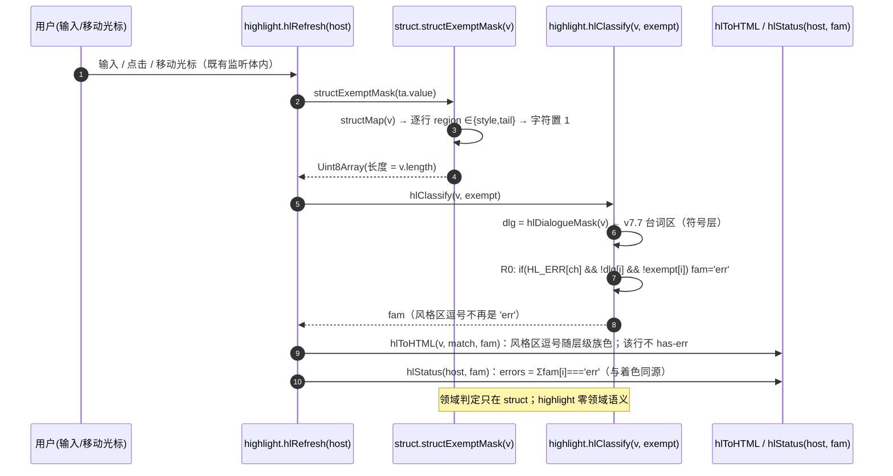
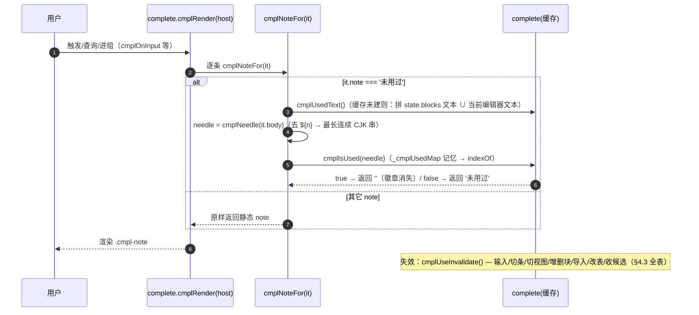
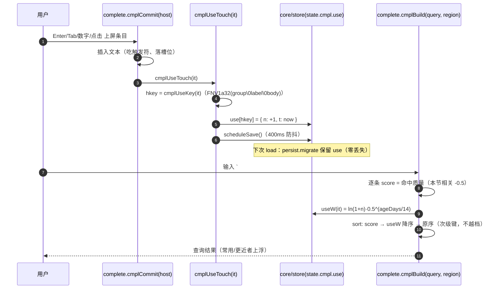
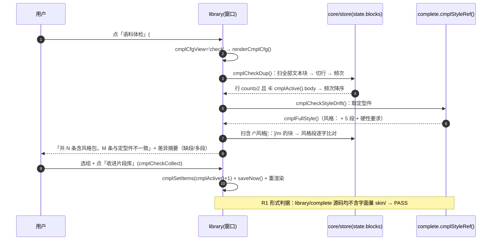
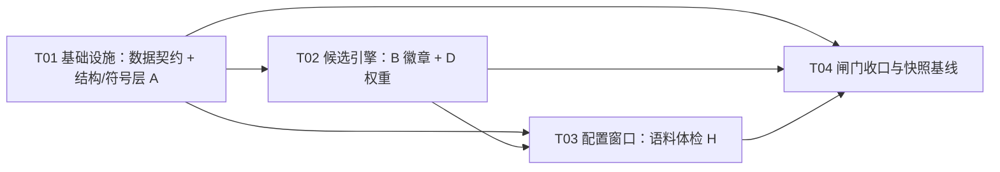

# 写作补全四项增强（A/B/D/H）· 增量设计（2026-09-18）

> 角色：架构师（高见远）｜ 输入：`写作补全_初衷复盘与改进建议_2026-09-18.md` §1/§2/§3(A·B·D·H)/§4（= 需求定义，等同一页 PRD）
> 现实现基线：**v7.15**（`PHJ.html` = **264162 B**，闸门 **8/8** 全绿，`state.version = 15`）
> 本文只做**设计与任务分解**，**不改任何 `dev/src/**`、不构建、不提交**。摸底为**只读**命令（`node dev/build.mjs` / `node dev/_qa/lib/skin-guard.mjs`）。
> **行号以实测为准**；凡与需求描述不符处，已在文中注明「实测」。

---

## §1 实现方案总述 + 「最小变更原则」边界声明

### 1.1 四条增强的本质与耦合

| 条款 | 本质 | 改动所属模块（层） | 依赖方向 |
|---|---|---|---|
| **A** 状态栏"假错误" | 把「行级结构区」落到「字符级豁免掩码」，让**着色/计数**对风格区逗号网开一面 | `editor/struct.js`（领域策略）+ `editor/highlight.js`（符号机制） | 无（自洽） |
| **B**「未用过」变活的 | 候选渲染时**动态判定**条目是否已在用户文本出现 → 决定是否显示徽章 | `editor/complete.js`（引擎）+ `view/write.js`/`shell/wiring.js`（失效接线） | 依赖 A 无关；依赖 store 无 |
| **D**「最近使用」加权 | 记录条目使用频次/时间，**查询结果**内加权上浮 | `editor/complete.js` + `core/store.js` + `core/persist.js` | 依赖 store/persist |
| **H** 语料体检（MVP） | 从用户写作里**持续发现规律**（重复句 / 风格包漂移），一键收进片段库 | `editor/library.js`（窗口）+ `index.html`/`52-library.css` + `editor/complete.js`（skin 接缝） | 依赖 B/D 已改的 complete |

**关键洞察（决定分层落点）**：四条落在**三个模块**（`highlight` / `complete` / `library`）+ 底层（`store`/`persist`/`struct`）。它们**不是链式依赖**，可拆成「底层契约 → 引擎 → 窗口 → 闸门」的**单向 4 步**（见 §10）。四条之间**零循环依赖**。

### 1.2 「最小变更原则」边界声明

1. **不新增任何皮肤内容**（`skin/corpus.js` 一字不改；不新增 `skin/**` 文件）→ 守住 **R5/R6**，`skin/corpus` **仍在 `SLICES` 第 9 位**。
2. **不新增 `document`/`window` 级 `keydown|keyup|blur` 监听**（H 的入口按钮只加 `click`；B 的失效只在既有监听体内加分支）→ 守住 **R7**、`P2-A`/`P3-A`（**必须仍绿**）。
3. **不引入任何外部依赖**、不改单文件产物形态、不改 `LS_KEY`、`version` 只进不退。
4. **着色层保持「零领域语义」**：A 的领域判定**全部**在 `struct.js`，`highlight.js` 只消费一个**不透明的布尔掩码**（它仍不认识任何内容含义）。
5. **新增中文文案仅落视图/窗口层**，且**不得**命中皮肤词元/`【…】`完整标记串/40+ 字长语料 → **`R3-A` 命中必须仍 ≤ 15**（当前实测 = **15**，已顶格，**任何新增泄漏即红**）。

### 1.3 明确不在本轮范围

- 轮盘（拍板 #6）、自动改写/批量修复、结构体检之外的新检查项、`CMPL_PER_GROUP` 兑现、C 条（`CMPL_GROUP_HINT` 挪出引擎）——**均不做**（见 §13）。

---

## §2 新增 / 修改文件清单（相对 `dev/`）

| 文件 | 动作 | 层 | 职责（本轮的变更） |
|---|---|---|---|
| `src/editor/struct.js` | **改** | editor | 新增 `structExemptMask(text)`（**领域策略**：风格区/硬性要求区 → 字符掩码）；`PHJ.struct` 增导它 |
| `src/editor/highlight.js` | **改** | editor | `hlClassify(text, exempt)` 增**可选**掩码参数（R0 分支加 `&& !exempt[i]`）；`hlRefresh` 传入掩码。**零领域语义** |
| `src/editor/complete.js` | **改** | editor | B：`cmplNeedle/cmplUsedText/cmplNoteFor/cmplUseInvalidate` + `CMPL_UNUSED_NOTE`；D：`cmplUseKey/Get/W/Touch`；H 接缝：`cmplStyleRef()`；`PHJ.complete` 增导 2 名 |
| `src/core/store.js` | **改** | core | `defaultState().cmpl` 增 `use: {}`；`version: 15 → 16` |
| `src/core/persist.js` | **改** | core | `migrate` **保留 `cmpl.use`**（零丢失）；`version: 16`；`load()` 阈值 `< 16` |
| `src/editor/library.js` | **改** | editor | H：`cmplCfgView` 视图开关 + 体检渲染（重复句/风格包漂移）+「收进片段库」+ 按钮 DCL 接线 |
| `src/view/write.js` | **改** | view | B：`wdOnInput`/`setView` 内调 `cmplUseInvalidate()`（失效接线，**不新增监听**） |
| `src/shell/wiring.js` | **改** | shell | B：画布块 input / JSON 导入处调 `cmplUseInvalidate()`（既有监听体内加分支） |
| `src/index.html` | **改** | 骨架 | config 窗口 foot **新增** `<button id="cmplCfgCheck">`（体检入口）；**CSS 链顺序不变** |
| `src/styles/52-library.css` | **改** | 样式 | 体检视图样式（复用既有 `.btn`/`.cmpl-cfg-*`，新增少量 `.cmpl-check-*`） |
| `dev/_qa/verify/verify_v78.mjs` | **改** | 闸门 | P2-B2 goldens（`complete`/`struct` 各 +名）；I7/I7b/X4 的 version 期望 15→16 |
| `dev/_qa/verify/verify_w.mjs` | **改** | 闸门 | W8/W9 的 version 期望 15→16 |
| `dev/_qa/verify/verify_build_equivalence.mjs` | **改** | 闸门 | `OLD` → `PHJ_v7.16_20260918.html` |
| `dev/_qa/run-gate.mjs` | **改** | 闸门 | [1] 体积注释、[2] 基准名注释（**无体积判定式**，实测见 §12） |
| `dev/_qa/snapshots/PHJ_v7.16_20260918.html` | **新** | 快照 | 新交付快照（等价性基准） |
| `dev/_qa/snapshots/BASELINE_v7.16.md` | **新** | 基线 | 新基线记录 |
| `dev/_qa/snapshots/INDEX.md` | **改** | 档案 | v7.16 升为当前基准，v7.15 转历史 |
| `dev/CHANGELOG.md` / `dev/README.md` | **改** | 档案 | 版本沿革与闸门描述同步 |
| **QA 新增断言载体**（建议 `dev/_qa/verify/verify_v78.mjs` 追加，或另立套件） | **新增** | 闸门 | A 对照 / B 动态徽章 / D 加权 / H 体检（**条数变动须先报 Holly 核准**，见 §12.4） |

> 说明：`skin/corpus.js`（第 9 位加载）**不动**；无新增切片（**§8**）。

---

## §3 A 的落点：按结构区豁免风格包的 `，`

### 3.1 先核清「v7.7 台词区豁免」在哪一层、怎么实现（**实测证据**）

| 事实 | 证据（文件:行） |
|---|---|
| 台词区豁免**在字符分类层**（`hlClassify`）内实现，用**纯符号**推导出的掩码 | `highlight.js:35-45` `hlDialogueMask()`（仅按成对中文双引号 `“ ”`，换行重置、未闭合不生效）；`highlight.js:48` `var ... dlg = hlDialogueMask(text)` |
| 豁免的落点是 **R0 错误分支**：`if(HL_ERR[ch] && !dlg[i]){ fam[i]='err'; continue; }` | `highlight.js:53` |
| 被豁免的逗号**继续走 R1~R5** → 随所在层级族色正常显示（非红、无波浪线） | `highlight.js:54-63`；断言 `verify_v77.mjs:104-106`（G3 引号族色 `rgb(11,100,184)`） |
| 计数**与着色同源**：`hlStatus()` 只数 `fam[i]==='err'`，用 `hlRefresh` 传入的同一 `fam` | `highlight.js:139-150`（`for(ei...) if(fam[ei]==='err') errs++`）、`highlight.js:164-167`（`fam` 只算一次，两处共用） |
| **行号标红**由 `hlToHTML` 在**同一 fam** 上派生：某行含 `err` 即 `has-err` | `highlight.js:117-121` |
| `hlStatus` **已经在调 `structAt`**（`highlight.js:154`）→ highlight→struct 的「编辑器内部」引用**既已存在** | `highlight.js:152-156` |

**结论**：v7.7 的豁免机制 = 「**字符级掩码 + 在 R0 分支上打一个 `!mask[i]` 补丁**」，掩码由**符号**推导（零领域语义）。风格区豁免**必须复用同一层**（否则着色层要认识领域，破功），但**掩码的来源必须是结构层**（领域语义只活在 `struct.js`）。

### 3.2 方案：领域策略外置到 `struct.js`，符号层只消费不透明掩码

**新增（`struct.js`）**：
```js
/* 结构区豁免掩码：风格区(style)/硬性要求区(tail) 的字符 → 1；其余 0。领域判定只在本文件。 */
function structExemptMask(text){
  var m = new Uint8Array(text.length), lines = String(text).split('\n'), map = structMap(text);
  var idx = 0;
  for(var li = 0; li < lines.length; li++){
    var reg = map[li] ? map[li].region : '';
    if(reg === 'style' || reg === 'tail'){
      for(var k = 0; k < lines[li].length; k++) m[idx + k] = 1;
    }
    idx += lines[li].length + 1;     /* +1 = 该行末尾的 '\n'（'body' 段，不置 1） */
  }
  return m;
}
```
`PHJ.struct = { structAt, structExemptMask }`（**+1 导出名**）。

**改（`highlight.js`）**：
- 签名 `function hlClassify(text, exempt)`（**新增可选参数**，缺省 `undefined` → **旧行为逐字不变**）。
- R0 分支改为：`if(HL_ERR[ch] && !dlg[i] && !(exempt && exempt[i])){ fam[i]='err'; continue; }`。
- `hlRefresh`：`var fam = hlClassify(ta.value, structExemptMask(ta.value));`（`hlToHTML`/`hlStatus` **不动**，它们只吃 `fam`）。

**行级 → 字符级的干净映射**：`structMap` 是**行级**、`hlClassify` 是**字符级**；`structExemptMask` 用与 `hlToHTML` **同源的索引推进法**（`idx += 行长 + 1`）把行 region 铺到字符数组上——**与 `hlToHTML:100-123` 的 `idx` 约定完全一致**，无二次切分、无越界（`Uint8Array(text.length)` 精确等长）。

**为什么放在「着色层之上的同层」而不是「新层」**：
- 「**豁免**」这件事必须发生在 `fam` 生成时（否则计数/标红/族色三处要各自再判一次，且会与 `fam` 脱钩、重蹈 v7.8 状态栏"不按 region 豁免"的覆辙）。
- 但「哪些区算风格区」是**领域策略**，由 `struct.js` 出（不透明掩码）；`highlight.js` 只做 `!exempt[i]` 的**机制**。→ 满足「着色层零领域语义」，且与 v7.7 台词区豁免**同层同构**（一个掩码来自符号、一个来自结构）。

> 备选（**不采用**）：把 `structExemptMask` 内联进 `hlClassify`（= 着色层认识领域）→ 违约，否决。或让调用方（`block-editor`/`write`）算掩码再传 `hlRefresh`（`hlRefresh` 被多处当事件处理器用，第 2 参会是 `Event`）→ 需在每个调用点加守卫，改动面更大且脆，否决。

### 3.3 对照组设计（防「把错误全关掉」）

| 区（`structMap` 的 `region`） | 逗号是否计入错误 | 依据 |
|---|---|---|
| `style`（`风格：` 起） | **豁免** | 需求 §3-A；实测 v7.8 假错误 ~18/22 来自风格块 |
| `tail`（`硬性要求：` 起） | **豁免** | 需求原文「把**风格区/硬性要求区**的逗号移出错误族」 |
| `anchor`（起手式，`画面开始：` 前） | **照旧计入** | 需求「正文区的逗号仍须计数」；anchor 语义同正文 |
| `body`（叙事正文 / 分镜） | **照旧计入** | 同上（**核心对照组**） |

**新增断言（QA）**（方向）：
1. 一段含 `风格：` + 风格段 + `硬性要求：` 的文本：`hlClassify(v, structExemptMask(v))` 的错误数 = **仅正文/起手式**里的逗号数；同名文本**不传掩码**时错误数 = 全部（证明掩码确实生效）。
2. **对照组**：纯正文文本（无 `风格：`）错误数 = 逗号总数（掩码全 0，行为不变）。
3. 风格区里的 `，` 在 DOM 里**无 `.hl-err` span、无波浪线、行号不标红**；且**随层级族色**（`【…】` 内的逗号呈 `lent` 族色）。
4. `hlStatus` 的 `stErr` 与 DOM `.hl-err` span 数一致（**同源**，不得一处豁免一处不豁免）。

---

## §4 B 的落点：「未用过」变活的

### 4.1 判定规则（精确）

**参与动态判定的条目**：`note === CMPL_UNUSED_NOTE`（新常量 `'未用过'`）的候选条目（实测当前 13 处 `note:'未用过'`；需求口径写"8 处"，**以实测 13 为准**）。

**needle 抽取（`cmplNeedle(body)`）**：
```
去槽位：body.replace(/\$\{\d+\}/g, ' ')
取「连续 CJK 串」：/[\u4e00-\u9fff]+/g 的全部匹配
needle = 最长的那个串；等长取最早出现的那个
needle 为空 → 视为「从未用过」（保守：保留徽章）
```
**命中判定（`cmplIsUsed(needle)`）**：`needle.length >= 2 && usedText.indexOf(needle) >= 0`。

**为什么用「最长 CJK 串」**（对 13 条逐一验证）：

| 条目 body | 最长串（needle） | 说明 |
|---|---|---|
| `然后 镜头缓慢推进 拍摄${1}` | `镜头缓慢推进` | 避开通用连接词「然后」 |
| `然后 镜头环绕${1}半圈` | `镜头环绕` | 避开「半圈」 |
| `然后 镜头平稳跟拍${1}` | `镜头平稳跟拍` | — |
| `中近景/大特写/全景/远景` | 同 body | 单词即 needle |
| `推镜头（缓慢推进）` | `缓慢推进` | 见 §13-U1（可接受：命中即"用过推进"） |
| `拉镜头（缓慢拉远）` | `缓慢拉远` | 同上 |
| `环绕` / `升降镜头` / `甩镜头` / `主观视角` | 同 body | — |

> 备选规则「有 `${n}` 取最长、无 `${n}` 取首个」对 `推镜头/拉镜头` 更精确，但**引入两条规则**；本轮取**单一规则**（够用且好解释），差异记入 §13-U1。

### 4.2 「用户文本」范围（定并论证）

**范围 = 全部文本块 ∪ 当前编辑器文本**：
- `state.blocks` 中**非图片块**的 `text` **全部拼接**（写作台与画布**同源**：`view/write.js` 的 `wdTextBlocks()` 与画布块都读 `state.blocks`）→ **覆盖最全**。
- **叠加当前编辑器文本**（`hostPopup.el('ta').value` / `hostDesk.el('ta').value`）：**弹窗编辑器**里的改写**要按「确定」才写回** `state.blocks`（`wiring.js:111-116`），输入过程中态不在 blocks 里；叠上它可覆盖「正在写、徽章已该变」的场景。
- 不做大小写/空白归一（needle 是**连续 CJK 串**，用户文本里的空白/标点不会切断它）；不做全角半角换算（本轮不涉）。

### 4.3 缓存与失效策略（**本条主要技术风险，正面设计**）

**两级结构**：
```
_cmplUsedText : 归一后的用户文本快照（字符串）
_cmplUsedMap  : { [needle]: boolean } 逐 needle 的记忆（同一 needle 不重复 indexOf）
```
**取用**：`cmplUsedText()` 惰性构建（缓存为 null 时构建）；`cmplIsUsed(needle)` 先查 `_cmplUsedMap`，未命中再 `indexOf` 并写回。

**失效时机（全部枚举）**——统一入口 `cmplUseInvalidate()`（清 `_cmplUsedText=null; _cmplUsedMap={}`）：

| # | 触发点 | 文件:位置（实测） | 说明 |
|---|---|---|---|
| 1 | 弹窗/写作台编辑器**输入** | `complete.js:cmplOnInput`（`input` 监听内，`complete.js:444`） | 每键失效（重建成本 = 一次拼接，可接受） |
| 2 | 写作台**实时写回** | `write.js:wdOnInput`（`write.js:330-339`） | 与 #1 同源但走另一路径，需各置一处 |
| 3 | 画布块**内联编辑** | `wiring.js:210-224`（`board` 的 `input` 分支内） | 既有监听体内加一行 |
| 4 | **切条**（写作台换选） | `write.js:wdSelect`（`write.js:217-225`） | 当前编辑器文本换块 |
| 5 | **切视图** | `write.js:setView`（`write.js:203-214`） | 视图切换会 `flush`+重填编辑器 |
| 6 | **增/删块** | `write.js:wdNew/wdDel`（`write.js:262-297`） | blocks 数量变 |
| 7 | **重排块** | `write.js:wdReorder`（`write.js:244-254`） | 拼接口径变（保守失效） |
| 8 | **JSON 导入** | `wiring.js:fileInput change`（`wiring.js:54-76`） | 整体换 state |
| 9 | **片段库改表**（增删改/导入资产/恢复内置） | `complete.js:cmplSetItems`（`complete.js:92-97`） | needle **来源**变了（`cmplNoteFor` 依赖条目清单） |
| 10 | **收候选** | `complete.js:cmplReset`（`complete.js:320-323`） | 顺带失效，防跨轮串味 |

**兜底（防御性，非主路径）**：`cmplUsedText()` 内附**廉价签名**校验 `_cmplUsedSig = blocks.length + ':' + Σtext.length + ':' + selId + ':' + 编辑器.value.length`；签名变则强制重建。**已知盲区**：同长度就地改写（改错别字）签名不变 → 缓存可陈旧一格。因徽章是**软提示**、且 #1/#2 每键失效已覆盖绝大多数输入，**盲区可接受**（记入 §13-U2）。

**性能**：构建 = 一次 `state.blocks` 遍历 + 字符串拼接（~10²–10³ 字符量级）；`indexOf` 仅对**正在渲染的候选**（≤40 条）里、`note==='未用过'` 的条目做（≤13 次），且 `_cmplUsedMap` 去重。→ **每次气泡渲染 O(文本长 + 40·needle)**，与现状同阶。

### 4.4 与静态 `note` 的共存规则

- **`note` 字段永不改写、永不删除**（语料的固有信息）。
- **渲染规则（仅候选气泡 `cmplRender`）**：`noteToShow = cmplNoteFor(it)`：
  - `it.note === '未用过'` → **动态**：`cmplIsUsed(cmplNeedle(it.body))` 为真 → **不渲染**（徽章消失）；为假 → 渲染 `'未用过'`。
  - `it.note` 为**其它值**（`项目级定型件`/`141 句的语法槽位`/`远近谱 · ✔ 用过 / ✘ 没用过`/自建备注/空…）→ **静态原样渲染**（不受任何影响）。
- **配置窗口（`library.js:cmplCfgRow:276-281`）显示的是 `note` 原文（静态）**——配置窗是「语料固有信息的浏览器」，气泡是「写作时的引导」。**两者的口径差**是**有意**的（记入 §13-U3；若要一致，只需把 `cmplCfgRow` 也改走 `cmplNoteFor`，一行）。
- **已知遗留**：`镜头句` 组的三条 **label 自带**「（你没用过）」（`skin/corpus.js:60-62`）——徽章会随使用消失，但 **label 里的括注不会**（label 是语料内容，改它=改皮肤+触碰 `R3-A`）。**本轮不动**（记入 §13-U1）。

---

## §5 D 的落点：「最近使用」加权

### 5.1 数据结构

```js
state.cmpl.use = { [hkey]: { n: <int ≥ 0>, t: <毫秒时间戳> } }   /* 缺省 {}；随 sanitizeState → localStorage / 导出 JSON 一起走 */
```
- `hkey = cmplUseKey(it) = 'h' + FNV1a32hex( (it.group||'') + '\u0000' + (it.label||'') + '\u0000' + it.body )`。

### 5.2 ★ 核心问题 1：key 稳定性 —— 不用位置 key，改**内容稳定 key**

- **问题实证**：内置 key 是 `'b:' + gi + ':' + ii`（`complete.js:75`，**位置相关**）。未物化（`items===null`、直接用内置表）时，若语料顺序一变（换皮肤 / 中间插一条），`b:2:1` 会指向**另一条** → 频次记错条目。
- **方案：内容派生 hkey（FNV-1a 32bit）**，**与 `it.key` 解耦**：
  - 免疫**语料重排 / 换皮肤 / 物化与否**；
  - 用户**改写条目内容** → hkey 变 → 使用计数**从头计**（**合理**：改了内容就是另一条）；
  - **代价**：① 一个 ~6 行 hash 函数（引擎层，**纯 ASCII，不增皮肤词元**）；② 32bit 碰撞概率 ~ n²/2³³（n<1000 时 < 6e-5，**可忽略**）；③ 两条 `(group,label,body)` **完全相同**的条目会**共享**计数（本就是重复条目，可接受）。
- **为什么不用「明确不记录未物化」**：那样一次「未物化就用」的会话全丢数据；而内容 hkey 让**未物化也能记**（`state.cmpl` 存在即可写 `use`）。
- **为什么不用「改内置 key 为内容 key」**：`'b:'+gi+':'+ii` 是 `cmplSeedItems` 的输出，**存量用户表**已按它物化（`persist.js` 保留 `items`）；改 key 格式会伤既有数据 + 波及 `I6`（`seed.every(s=>act.some(x=>x.key===s.key))`）→ **代价远大于收益，否决**。

### 5.3 ★ 核心问题 2：是否升 `state.version` 15 → 16？

**结论：建议升到 16。** 理由：

1. **`migrate` 无论如何都要改**：`migrate()` 是**重建** `cmpl = {v, items, gorder}`（`persist.js:83`）——**若不显式保留 `use`，每次 load 都会把使用数据抹掉**，直接**违反 R3「零丢失」**。所以「加字段」这一步**必然**触碰 migrate。
2. **`use` 是落盘字段**：项目契约里「持久形态变化 = 版本事件」有一贯先例（v13 加 `cmpl`、v14 `src` 边界、v15 加 `order`）。既然 migrate 必须感知该字段，**升版是让契约显式、可断言**的正道。
3. **成本有界且已列全（全是"期望值"改动、条数不变）**：见 §12.2 的 3 处（`verify_v78`）+ 2 处（`verify_w`）+ 源码 2 处。
4. **不升版的备选**（更省 5 处断言改动）：`use` 缺省 `{}`、`migrate` 仍要保留它，只是版本号停在 15。缺点：**留下一个"未登记的持久字段"**，弱化版本契约的可审计性。→ **列为 §13-U4 备选**，默认取「升 16」。

> ⚠️ **升版 → 需 Holly 核准**（§12.4）。

**migrate 的落点（`persist.js`）**：
```js
var cmpl = { v: ..., items: null, gorder: null, use: {} };
if(cmplIn && cmplIn.use && typeof cmplIn.use === 'object'){
  for(var uk in cmplIn.use){
    var u = cmplIn.use[uk];
    if(u && typeof u.n === 'number' && u.n > 0) cmpl.use[uk] = { n: u.n, t: (typeof u.t === 'number' ? u.t : 0) };
  }
}
```

### 5.4 ★ 核心问题 3：加权公式（与既有评分**不打架**）

**既有排序**（实测）：`cmplBuild` 先 `cmplScore`（命中质量 `0/1/2`，本节相关 `-0.5`），再 `sort((a,b)=> (a.score-b.score) || (a.ord-b.ord))`（`complete.js:219-230`）。

**本轮做法：不把使用量折进 `score`，而是作为 `score` 相等时的「次级排序键」** —— 这样**永不越过**命中质量与本节相关：
```
W(it) = ln(1 + n) * Math.pow(0.5, ageDays / 14)        /* 频次对数 × 半衰期 14 天 */
ageDays = (now - t) / 86400000

pool.sort((a,b) => (a.score - b.score)
                || (b.useW - a.useW)     /* ← 新增：同分时，"更常用/更近"的在前 */
                || (a.ord - b.ord));
```
- `useW` 在 push 进 pool 时**算一次**（不在比较器里重算）。
- 无 `use` 记录 → `useW = 0` → **行为与现状完全一致**（稳定排序保留原序）。
- **为什么用次级键而不是 `score -= bonus`**：`score` 已被 `-0.5` 的"本节相关"占用；任何 bonus 若 ≥0.5 就会**抢过一个相关档**、若 <0.5 又要小心浮点边界——**次级键天然无此风险**，且「质量 > 本节相关 > 使用习惯 > 原序」的优先级一目了然。

### 5.5 ★ 核心问题 4：记录时机

**只在「条目真正上屏成功」时记录一次**：
- 落点：`cmplCommit`（`complete.js:347-376`）里 **`it.kind !== 'group'` 且成功插入文本**之后 → `cmplUseTouch(it); scheduleSave();`。
- **不计**：进组（`cmplEnterGroup`）、查询输入（`cmplOnInput`）、`cmplMoveSel`、仅浏览。
- **理由**：需求是"直击重复劳动"——"重复"指**真的被用进文档**；进组/查询是浏览噪声，计进去会稀释信号。
- `scheduleSave()`（400ms 防抖，`persist.js:132`）足够（不是在关键路径）。

### 5.6 作用范围（**保守：仅查询视图**）

- **`cmplBuild`（查询结果）**：加 `useW` 次级键（§5.4）。
- **`cmplBuildGroupItems`（组内视图）**：**本轮不改排序**。原因 = **实测断言依赖**：`verify_v78.mjs` 的 **H7**（`verify_v78.mjs:251-263`）在「进 `风格包` 组 → 点第一条 → 断言尾部含 `FIX_TAIL`」，而 `风格包` 组内**第一条**必须是「风格包 · 全套」（尾部 = `FIX_TAIL`）。若组内按使用量重排，前面 `H6`（`#光影` 提交了某风格段）会让**该风格段浮到首位** → H7 必红。→ **组内重排 = 断言语义变更**，需 Holly 核准；**本轮不做**，记入 §13-U5。
- **`cmplBuildGroups`（组视图）**：**不改**（组顺序仍按 `CMPL_GROUP_HINT` 本节相关 + `gorder`）。

---

## §6 H 的落点：语料体检（MVP）

### 6.1 ★ R1 判据核实结论（**先核清，再决策**）

**R1 断言的真实判据（实测 `verify_v78.mjs:904-932`）**：
```js
const R1_ENGINE_VIOLATIONS = ENGINE_FILES.filter(f => /skin\//.test(stripComments(readIf(f)||'')))
```
- **形式化**：只查「**引擎源码（`core/`+`editor/`，剥注释后）里是否出现字面量 `skin/`**」。**不做"是否使用 skin 的顶层名"的语义检查**。
- **佐证**：`complete.js:71` 直接用 `CMPL_GROUPS`（`skin/corpus.js` 的顶层 `var`），**并不写 `skin/`** → R1 **通过**。→ 证明「编辑器层**可以直接读 skin 的顶层名**，只要不写字面量 `skin/`」。
- **另有**：`R1 语料归属`（`verify_v78.mjs:934-940`）查引擎原文**不含** `【光影逻辑】`；`R3-A` 查皮肤词元命中引擎代码 ≤15；`R3-B` 查长语料/完整标记串零命中。

**→ 结论：方案 i 与方案 ii 都**能通过 R1 形式判据**。取舍在**架构整洁**而非"合规"。

### 6.2 访问定型件的方案选择

**选方案 i：由 `complete.js` 暴露 `cmplStyleRef()`（→ `cmplFullStyle()`），`library.js` 调 `complete`。**
- **依据 1（单一接缝）**：现状**只有 `complete.js`** 一个 editor 文件读 skin 顶层名（`CMPL_GROUPS`）。让 `library.js` 直读 `cmplFullStyle`（方案 ii）会**新增第二个** skin 读者，接缝变宽、边界更难审。
- **依据 2（依赖已在清单里）**：`manifest.mjs:179-181` 已声明 `library.deps ∋ 'complete'` → 调 complete 是**既有依赖方向**，零新增耦合。
- **依据 3（代价小）**：`complete.js` 加 ~1 行 → `PHJ.complete` **+1 名** → `P2-B2` golden 更新（§12.2）。
- **代价**：需 Holly 核准 `complete` 对外面 +1 名。（方案 ii 可省此一处，但把边界摊宽；**默认取 i**，ii 留 §13-U6。）

### 6.3 入口形态

- **固定入口按钮**：`#cmplCfgMask` 的 foot 左组（`index.html:133-135`，与「恢复内置默认」同列）新增 `<button class="btn" id="cmplCfgCheck">语料体检</button>`。
- **形态**：**同一窗口内的视图切换**（`var cmplCfgView ∈ {'lib','check'}`），**不新开窗口**（复用 `.tpl-win` 骨架与 `#cmplCfgBody`）→ 改动最小、**不新增 `keydown/blur`**、`closeTopLayer` 的 Esc 结构**不动**。
- **接线**：`library.js` 增一个 `DOMContentLoaded` 只注册一次 `#cmplCfgCheck` 的 `click`（**先例**：`complete.js:470-471` 已有两处 DCL 只绑 `input`/`keydown`/`click` 类，**不涉** `P2-A`/`P3-A`）。按钮文案随视图切换（`语料体检` ↔ `返回片段库`）。
- **`openCmplCfg()`** 每次打开**复位** `cmplCfgView='lib'`（保证既有 `I1/I2` 断言看到的仍是库视图）。

### 6.4 检测 1 · 重复句发现（精确规则）

```
遍历 state.blocks（非图片块）→ 每个 text 按 '\n' 切行 → 逐行 trim
保留 trim 后长度 >= 8 的行 → 统计「完全相同行」的出现次数（跨块累计）
过滤：count >= 2  且  该行 trim 后 ∉ cmplActiveBodies()（cmplActive() 的 body 精确集合，trim 比对）
排序：count 降序 → 行长度降序 → 字典序
输出：{ text, count } 列表
```
- `cmplActiveBodies()` = `cmplActive().map(x=>String(x.body).trim())` 的 Set（**"当前不在片段库"** 的判据按需求口径取 body 集合）。

### 6.5 检测 2 · 风格包漂移（精确规则）

```
遍历 state.blocks（非图片块）→ 若 text 中存在 /^风格[:：]/m 的行：
  从该行起到「下一条 /^硬性要求[:：]/m 行（含）」或块尾 = 该块的「风格段」st
  与定型件 ref = cmplStyleRef()（= cmplFullStyle()）比较
    · 相等（CRLF→LF、去首尾空行后逐字）→ 一致
    · 不等 → 记入不一致，并算差异摘要：
        refLines = ref.split('\n')（去空行）
        blkLines = st.split('\n')（去空行）
        缺 = refLines 中不在 blkLines 的（按序）
        多 = blkLines 中不在 refLines 的（按序）
报告：共 N 条含风格包，其中 M 条与定型件不一致 + 每条差异摘要（缺哪段/多了什么）
```
- **逐字比对**（需求口径）：先 `\r\n→\n`、去首尾空行，再**整串相等**判定；摘要再按行做集合差，便于人读。

### 6.6 动作（唯一）· 收进片段库

- 每个**重复句**行附一个 `<select>`（选项 = `cmplGroupOrder()`）+ 「收进片段库」按钮。
- 落点 `cmplCheckCollect(text, group)`：`cmplSetItems(cmplActive().slice().concat([{ key: cmplNewKey(), group, label: text.slice(0,12), note:'', body: text, block:false, src:'user' }]))` + `saveNow()` + 重渲染体检视图。
- **顺手**：`cmplSetItems` 内部已 `cmplInvalidate()`（`complete.js:96`）→ 片段库变更即同步；B 的 needle 缓存也需随之失效（B 的失效点 #9 就在 `cmplSetItems`）。
- **明确不做**：自动改写、批量修复、结构体检之外的新检查项（需求 §H 收窄版）。

---

## §7 数据结构与接口（**新增/变更的顶层声明 + `PHJ.*` 导出名**）

### 7.1 新增顶层声明

| 文件 | 新增顶层名 | 用途 |
|---|---|---|
| `editor/struct.js` | `structExemptMask(text)` | A：结构区字符掩码（领域策略） |
| `editor/complete.js` | `CMPL_UNUSED_NOTE` | B：动态徽章触发串 `'未用过'` |
| `editor/complete.js` | `cmplNeedle(body)` / `cmplUsedText()` / `cmplIsUsed(needle)` / `cmplNoteFor(it)` / `cmplUseInvalidate()` | B |
| `editor/complete.js` | `cmplUseKey(it)` / `cmplUseGet(it)` / `cmplUseW(it)` / `cmplUseTouch(it)` | D |
| `editor/complete.js` | `cmplStyleRef()` | H：定型件接缝（→ `cmplFullStyle()`） |
| `editor/complete.js` | 会话缓存 `_cmplUsedText/_cmplUsedSig/_cmplUsedMap` | B 缓存 |
| `editor/library.js` | `cmplCfgView`（`'lib'|'check'`）/ `cmplCheckToggle()` / `cmplCheckDup()` / `cmplCheckStyleDrift()` / `cmplCheckRender()` / `cmplCheckCollect(text,group)` | H |

### 7.2 `PHJ.*` 导出面变更（**须同步 `P2-B2` golden**）

| 模块 | 现状 | 改为 | 触发原因 |
|---|---|---|---|
| `struct` | `['structAt']` | `['structAt','structExemptMask']` | `highlight.js` 跨模块引用 `structExemptMask`（P3 客观口径） |
| `complete` | `['CMPL_SEED_V','cmplActive','cmplExportAsset','cmplGroupOrder','cmplImportAsset','cmplNewKey','cmplReset','cmplSeedItems','cmplSetItems']` | `+ 'cmplStyleRef'`、`+ 'cmplUseInvalidate'` | `library.js` 引 `cmplStyleRef`；`write.js`/`wiring.js` 引 `cmplUseInvalidate` |

> `P2_MODULES`（18 个模块键）**不变**（无新模块）；`store`/`library`/`highlight` 导出面**不变**。
> 变更后总数：`P2_EXPORTS_GOLDEN` 名数 +3（struct +1、complete +2）。

### 7.3 持久数据形态

```
state.cmpl = { v, items, gorder, use }        // + use（新增）
state.cmpl.use = { [hkey]: { n, t } }         // 缺省 {}；随 sanitizeState/导出 JSON
state.version = 16                            // 15 → 16
```

---

## §8 SLICES / CSS 顺序决策

- **不新增任何切片**：`SLICES` 仍 **20 条**、`skin/corpus` 仍**第 9 位**（`manifest.mjs:107`）；`CSS` 仍 **10 条**（`manifest.mjs:122-133`）。
- **`index.html`**：仅**新增一个 `<button>`**（非 `<script>`/`<link>`）→ `CSS_RE`/`JS_RE` 锚点数不变，**构建期 CSS 链顺序校验**照旧通过。
- **`52-library.css`**：只**追加**选择器 → CSS 片数与顺序不变（**R6 不动**）。
- **加载期副作用序（R6/P2-A）**：`library.js` 新增的 `DOMContentLoaded` 只注册 `click`（**不在** `keydown|keyup|blur` 集合内）→ `P2-A` 的 8 条注册序**逐字不变**。
- **结论**：**无需任何 SLICES/CSS 顺序变更论证**；`R6` 零风险。

---

## §9 Mermaid 时序图

### ① A · 错误计数路径（着色与计数同源，掩码来自结构层）



### ② B · 动态徽章判定与缓存



### ③ D · 使用记录与排序加权



### ④ H · 体检扫描（入口 → 两项检测 → 唯一动作）



### ⑤ 类图（新增/变更的导出面）

```mermaid
classDiagram
    class struct {
      +structAt(text, caret) {region,label}
      +structExemptMask(text) Uint8Array
      -structMap(text) [{region,label}]
      -STRUCT_MARKS
    }
    class highlight {
      +hlRefresh(host)
      +hlSyncBox(host)
      -hlClassify(text, exempt) fam
      -hlDialogueMask(text) mask
      -hlToHTML(text, match, fam)
      -hlStatus(host, fam)
    }
    class complete {
      +CMPL_SEED_V
      +cmplActive()
      +cmplSeedItems()
      +cmplSetItems(arr)
      +cmplGroupOrder()
      +cmplNewKey()
      +cmplExportAsset() / cmplImportAsset()
      +cmplReset(host)
      +cmplStyleRef()  ★新
      +cmplUseInvalidate()  ★新
      -CMPL_UNUSED_NOTE  ★新
      -cmplNeedle(body) / cmplUsedText() / cmplIsUsed / cmplNoteFor(it)  ★新
      -cmplUseKey/Get/W/Touch(it)  ★新
      -cmplBuild / cmplBuildGroupItems / cmplBuildGroups / cmplScore / cmplRender / cmplCommit
    }
    class library {
      +openCmplCfg() / closeCmplCfg() / renderCmplCfg()
      +cmplCfgSave/Del/Reset/ResetAsk
      +cmplCfgAdding / cmplCfgEditing / cmplCfgQ
      -cmplCfgView  ★新
      -cmplCheckToggle/Dup/StyleDrift/Render/Collect  ★新
    }
    class store {
      +state
      +defaultState()  // cmpl.use ★新, version=16 ★变
      +normalizeOrder()
    }
    class persist {
      +migrate(d)  // 保留 cmpl.use ★新, version=16 ★变
      +load() / saveNow() / scheduleSave() / sanitizeState()
    }
    class write {
      +setView(v) / renderWrite() / wdOnInput() ...
    }
    class wiring {
      +exportJSON()
    }
    highlight ..> struct : structExemptMask(text)
    write ..> complete : cmplUseInvalidate()
    wiring ..> complete : cmplUseInvalidate()
    library ..> complete : cmplStyleRef() / cmplActive()
    complete ..> store : state.cmpl.use
    persist ..> store : 保留 use
    struct ..> struct : structMap
    complete ..> complete : 见内部机制
```

---

## §10 任务列表（**4 条 · 有序 · 含依赖 · 按实现顺序**）

> 硬约束自查：**≤5 条** ✓；**每条 ≥3 个相关文件** ✓；**T01 = 基础设施** ✓。
> 分组原则：按**层次/关注点**分组（基础设施 & 符号结构层 → 候选引擎 → 配置窗口 → 闸门），**不按单文件拆**。

| 任务 | 名称 | 涉及文件（相对 `dev/`） | 依赖 | 优先级 |
|---|---|---|---|---|
| **T01** | **基础设施：数据契约 + 结构/符号层（A 全域 + D 持久层）** | `src/core/store.js`、`src/core/persist.js`、`src/editor/struct.js`、`src/editor/highlight.js` | 无 | P0 |
| **T02** | **候选引擎：动态徽章 + 使用权重（B + D）** | `src/editor/complete.js`、`src/view/write.js`、`src/shell/wiring.js` | T01 | P0 |
| **T03** | **配置窗口「语料体检」（H）** | `src/editor/library.js`、`src/index.html`、`src/styles/52-library.css` | T01, T02 | P0 |
| **T04** | **闸门收口与快照基线** | `_qa/verify/verify_v78.mjs`、`_qa/verify/verify_w.mjs`、`_qa/verify/verify_build_equivalence.mjs`、`_qa/run-gate.mjs`、`_qa/snapshots/PHJ_v7.16_20260918.html`(新)、`_qa/snapshots/BASELINE_v7.16.md`(新)、`_qa/snapshots/INDEX.md`、`CHANGELOG.md`/`README.md` | T01–T03 | P0 |

> **并行建议**：T03 只依赖 T02 暴露的 `cmplStyleRef`（签名在 §7 冻结）；`#cmplCfgCheck` 的 DOM/样式（`index.html`/`52-library.css`）与 library.js 逻辑可**并行**。

### T01 · 基础设施：数据契约 + 结构/符号层

- **改哪个文件 / 做什么**：
  - `core/store.js`：`defaultState().cmpl` 增 `use: {}`；`version: 15 → 16`。
  - `core/persist.js`：`migrate` 的 `cmpl` 重建**保留 `use`**（§5.3 片段）；`version: 16`；`load()` 的 `if(d.version < 15)` → `< 16`。
  - `editor/struct.js`：新增 `structExemptMask(text)`（§3.2）；`PHJ.struct` 增导它。
  - `editor/highlight.js`：`hlClassify(text, exempt)` 增可选参 + R0 分支加 `&& !(exempt && exempt[i])`；`hlRefresh` 传 `structExemptMask(ta.value)`。
- **完成判据**：`node dev/build.mjs` 成功；`node dev/_qa/lib/skin-guard.mjs` **仍 `R3-A = 15 / R3-B = 0`**；控制台手验 `migrate({...version:15, cmpl:{use:{k:{n:3,t:1}}}}).cmpl.use.k.n === 3` 且 `.version === 16`；`hlClassify(v)`（不传掩码）错误数与现状一致。

### T02 · 候选引擎：动态徽章 + 使用权重

- **改哪个文件 / 做什么**：
  - `editor/complete.js`：§7.1 的 B/D 新增函数 + `cmplStyleRef()`；`cmplRender` 的 `it.note` 改走 `cmplNoteFor(it)`；`cmplBuild` 加 `useW` 次级键；`cmplCommit` 成功后 `cmplUseTouch(it)+scheduleSave()`；`cmplSetItems`/`cmplReset`/`cmplOnInput` 调 `cmplUseInvalidate()`；`PHJ.complete` 增导 `cmplStyleRef`、`cmplUseInvalidate`。
  - `view/write.js`：`wdOnInput`/`setView`/`wdSelect`/`wdNew`/`wdDel`/`wdReorder` 内调 `cmplUseInvalidate()`（**既有监听体内加行，不新增监听**）。
  - `shell/wiring.js`：`board` 的 `input` 分支 + `fileInput` 的 `change` 分支内调 `cmplUseInvalidate()`。
- **完成判据**：`node dev/_qa/verify/verify_v78.mjs` 的 H/I 现有断言**不回归**（`H5/H7/H16/H17` 特别关注——查询/组序未被扰）；`#` → 进 `镜头句` 组，输入文本出现「镜头缓慢推进」后**重开气泡**，「推镜」徽章消失、其余「未用过」仍在；查询 `#光影` 次序与现状一致（无 use 时 `useW=0`）。

### T03 · 配置窗口「语料体检」

- **改哪个文件 / 做什么**：
  - `index.html`：foot 左组加 `<button id="cmplCfgCheck">语料体检</button>`（**仅加 `<button>`，不动 CSS/JS 链**）。
  - `styles/52-library.css`：追加 `.cmpl-check-*`（复用 `.cmd-cfg-*`/`.btn` 视觉）。
  - `editor/library.js`：`cmplCfgView` + `cmplCheckToggle/Dup/StyleDrift/Render/Collect`；`renderCmplCfg` 按视图分支；`openCmplCfg` 复位 `cmplCfgView='lib'`；一个 DCL 绑 `#cmplCfgCheck` 的 `click`（唯一注册）。
- **完成判据**：配置窗打开默认**仍是片段库**（`I1/I2` 不回归）；点「语料体检」→ 列出重复句（含频次）与「共 N 条含风格包，M 条不一致」；点「收进片段库」→ 该句进所选组、`state.cmpl.items` 加一、落盘；`skin-guard` 仍 `15/0`。

### T04 · 闸门收口与快照基线

- **改哪个文件 / 做什么**：按 §12.2 更新 `verify_v78` 的 `P2-B2` goldens 与 `I7/I7b/X4` 的 version 期望；更新 `verify_w` 的 `W8/W9` version 期望；`node dev/build.mjs` 后**实测新体积**写进 `run-gate.mjs` 注释；产物拷为新快照 `PHJ_v7.16_20260918.html`；写 `BASELINE_v7.16.md`；改 `OLD`；更新 `INDEX.md`/`CHANGELOG.md`/`README.md`。
- **完成判据**：`node dev/_qa/run-gate.mjs` = **8/8 全绿**；`node dev/_qa/lib/skin-guard.mjs` = `15/0`；`P2-A`/`P3-A`/`P1-A`/`P1-C`/`P1-D`/`R1`/`R3-*`/`R4` **仍绿**。

### 任务依赖图



---

## §11 共享知识（跨文件约定）

**命名 / 常量**

- 新增常量：`CMPL_UNUSED_NOTE = '未用过'`（`complete.js` 唯一定义）；`cmplCfgView ∈ {'lib','check'}`。
- 新增数据键：`state.cmpl.use = { [hkey]: {n,t} }`；`hkey = 'h' + FNV1a32hex(group\0label\0body)`。
- 新增 DOM id（**仅 1 个**）：`#cmplCfgCheck`（体检入口按钮）。样式类前缀 `.cmpl-check-*`（**不复用** `.block`/`.wd-*`）。
- **量化常量（冻结）**：重复句 `len ≥ 8`、`count ≥ 2`；衰减半衰期 `14 天`；needle 最短 `2` 字符。

**层次边界 / 铁律**

- **着色层零领域语义**：`highlight.js` 只吃 `exempt` 不透明掩码；**禁止**在 `highlight.js` 出现 `风格/硬性要求/style/tail` 等领域词。
- **结构区判定只活 `struct.js`**；`core/**` 与 `editor/**` **不得**出现字面量 `skin/`（R1 形式判据）。
- **`skin/**` 一字不改、不新增**；`skin/corpus` 仍在 `SLICES` 第 9 位。
- **禁止**新增 `document`/`window` 级 `keydown|keyup|blur`；B 的失效只在**既有监听体内加行**。

**持久化**

- `LS_KEY` **不变**（`storyboard-prompt-panel:v1`）；`state.version = 16`；`migrate` **只加不删、零丢失**（必须保留 `use`）。
- `use` 随 `sanitizeState()` → localStorage 与导出 JSON 一起走。

**渲染 / 排序**

- 查询排序键序固定：`命中质量 score`（升）→ `useW`（降）→ `ord`（原序）。**`useW` 只做次级键，不改 `score`**。
- 候选徽章：`cmplNoteFor(it)` 是**唯一**的徽章取值入口；其它 note 值永远静态。

**文案 / 皮肤边界（R3）**

- 新增中文文案只落 `library.js`（窗口层）与 `index.html`；**必须**保证 `R3-A ≤ 15`（新增文案**不得**命中皮肤词元 / `【…】` 完整标记串 / 40+ 字长语料）。**改完必跑** `node dev/_qa/lib/skin-guard.mjs`。

**构建 / 闸门**

- `R10`：JS 块注释里**不要**写 `**83**/18` 这类（`**/` 提前闭合注释）。
- `R9` 合法路径：`node dev/build.mjs` → 拷快照 → 改 `OLD` → 改 `run-gate` 体积注释 → `node dev/_qa/run-gate.mjs` 须 8/8。

---

## §12 对既有闸门的冲击清单

### 12.1 预期**保持不动**的断言（守门人，务必自查）

- `P2-A`（8 条 keydown/keyup/blur 注册序）、`P3-A`（document keydown 3 处 / 含 Esc 1 处）—— 不新增键类监听 → **必须仍绿**。
- `P1-A`（dev≡prod 逐字）、`P1-C`（测试产物逐行 diff 恰 +1 行；访问器**自动扫名**）、`P1-D`（window 全局增量空集）—— 新顶层名都在 IIFE 内 → 仍绿。
- `R1`（引擎零 `skin/` 字面量）、`R3-A`（**≤15**）、`R3-B`（零泄漏）、`R3-C`、`R4`（皮肤可摘除）—— 皮肤未改、文案落窗口层 → 仍绿（**R3-A 必须仍 = 15**）。
- `verify_v7` A 组 / `verify_v76` F 组 / `verify_v77` G 组 / `verify_v78` H19 内置风格包逐字 —— 未触碰相关机制 → 仍绿。
- **A**：`F5/F11`（`stErr` 计数的文本均为**正文/起手式**、无 `风格：`）、`G2–G13`（台词区/半角对照文本无风格标记）、`H15`（`hlClassify(txt)` 单参）→ **均不受 A 影响**（实测：掩码对 anchor/body 恒 0）。

### 12.2 因契约/版本变化而必须更新的断言（**全部为"期望值"变化，条数不变**）

| 文件:行（实测） | 现状 | 改为 |
|---|---|---|
| `verify_v78.mjs:869` `P2_EXPORTS_GOLDEN.complete` | 9 名 | **+ `cmplStyleRef`、+ `cmplUseInvalidate`**（11 名） |
| `verify_v78.mjs:881` `P2_EXPORTS_GOLDEN.struct` | `['structAt']` | **`['structAt','structExemptMask']`** |
| `verify_v78.mjs:565` `I7` | `i7.version === 15 && ... && i7.oldV === 15` | **`=== 16`**（两处；文案 `:564` 同步） |
| `verify_v78.mjs:568` `I7b` | `i7.m13v === 15` | **`=== 16`**（文案 `:567` 同步） |
| `verify_v78.mjs:777` `X4` | `x4.v === 15` | **`=== 16`**（文案 `:776` 同步） |
| `verify_w.mjs:395` `W8` | `w8.version === 15` | **`=== 16`**（断言名/文案「v14→v15」同步为「v14→v16」） |
| `verify_w.mjs:422-423` `W9` | `flushed.version === 15 && after.version === 15` | **`=== 16`** |
| `src/core/store.js:31` | `version: 15` | `version: 16` |
| `src/core/persist.js:107` | `version: 15` | `version: 16` |
| `src/core/persist.js:120` | `if(d.version < 15)` | `if(d.version < 16)` |
| `run-gate.mjs:9` | 期望 `264162 B`（v7.15） | **新实测体积**（T04 构建后填；注释） |
| `run-gate.mjs:10` | 基准 `PHJ_v7.15_20260918.html` | `PHJ_v7.16_20260918.html`（注释） |
| `verify_build_equivalence.mjs:35` `OLD` | `PHJ_v7.15_20260918.html` | `PHJ_v7.16_20260918.html` |
| `snapshots/INDEX.md` | v7.15 为当前基准 | v7.16 为当前基准；v7.15 转历史 |

> 注：`run-gate.mjs` **没有体积判定式**（实测 `run-gate.mjs:227-236` 只 `String(size)+' B'` 展示、`ok = status===0`）——**唯一真闸门是等价性（逐字节）**。故「体积新值」只改**注释**，判定靠"构建 → 快照 → `OLD`"三者一致。

### 12.3 体积与快照

- 本变更**必然改产物字节**（新函数 + 导出面 + index.html 按钮 + CSS + 文案）。→ 走 **R9** 合法路径：
  1. `node dev/build.mjs`；2. 产物拷为 `dev/_qa/snapshots/PHJ_v7.16_20260918.html`；3. 改 `OLD`；4. 改 `run-gate` 注释；5. `run-gate` 须 **8/8**。
- **预计体积增量**：**+3～6 KB**（引擎 + 窗口逻辑 + 少量文案；无新语料）。**精确值由 T04 实测填充**（本设计不预填）。

### 12.4 ★ 需 Holly 核准的事项

1. **`state.version` 15 → 16** → `verify_v78` 的 `I7/I7b/X4` + `verify_w` 的 `W8/W9` 共 **5 处期望值** 改 15→16（**条数不变**）。→ **需 Holly 确认**（或选 §13-U4 的"不升版"备选）。
2. **`PHJ` 对外面扩大 3 名**（`struct +1`、`complete +2`）→ `P2-B2` golden 更新。→ **需 Holly 确认**「对外面 +3 名」是否接受。
3. **开 `v7.16` 定版与字节变更**（新快照 + `BASELINE` + `OLD` + `run-gate` 注释 + `CHANGELOG/README`）→ **需 Holly 确认**版本号与体积新值。
4. **新增断言（A 对照组 / B / D / H）**：建议由 QA 追加；**这会使套件条数变化**（如 `verify_v78` 由 54 → 54+k）→ **必须先在 Holly 处报备条数**。**本设计默认由 QA 给出条数与判定式**，Engineer 不擅自增删既有断言。

---

## §13 待明确事项

| # | 事项 | 本设计的暂定处置 |
|---|---|---|
| U1 | B 的 needle 规则：`推镜头（缓慢推进）` 取到 `缓慢推进`（非 `推镜头`）；`镜头句` 组 label 自带「（你没用过）」不会随使用消失 | 接受（单一规则优先）；label 括注属**皮肤内容**，改它=改皮肤+触 R3，**本轮不动** |
| U2 | B 的签名兜底对「同长度就地改写」盲区 | 接受（软提示 + 输入即失效已覆盖多数）；如需精确，改为每次 `cmplRender` 无条件重建 |
| U3 | 配置窗口显示**静态** `note`，气泡显示**动态**徽章（口径差） | 有意保留；若要一致，`cmplCfgRow` 一行改走 `cmplNoteFor`（未做） |
| U4 | D 的 `state.version` 是否**必须**升 16 | **默认升**（契约显式）；备选"不升版"（migrate 仍保留 `use`）→ 待 Holly 定 |
| U5 | D 是否也作用于**组内视图**（`cmplBuildGroupItems`） | **本轮不做**（会改 `H7` 语义 = 断言变更）；如需，须 Holly 核准 |
| U6 | H 访问定型件：方案 i（`complete` 暴露 `cmplStyleRef`）vs 方案 ii（`library` 直读 `cmplFullStyle`） | **默认取 i**（单一接缝）；ii 可省 `complete` +1 名，但摊宽皮肤边界 → 待 Holly 定 |
| U7 | A 的豁免区是否含 `anchor`（起手式） | **不含**（需求口径 = style + tail；anchor 同正文计数）→ 待 Holly 确认 |
| U8 | H 的「重复句」是否同时**跨块**统计（同一句出现在不同块） | **是**（跨块累计，覆盖最全）；若只想"同块内重复"，改一行 |
| U9 | H「收进片段库」的 label 取法（前 12 字符） | 暂定 `text.slice(0,12)`；用户可在配置窗随后改 |

---

> 备注：本文件**只做设计与任务分解**，未改任何 `dev/src/**`、未构建、未提交、未动 `.git`。
> 摸底只读命令与实测：`node dev/build.mjs` → `PHJ.html` **264162 B**（20 JS 片 / 10 CSS 片）；`node dev/_qa/lib/skin-guard.mjs` → **R3-A = 15 / R3-B = 0**（词元 146，泄漏 15，**已顶格**）。
> 行号以实测为准（`struct.js:35-63`、`highlight.js:35-67,139-168`、`complete.js:69-97,193-244,347-405,470-474`、`library.js:199-293,386`、`persist.js:82-107,120`、`verify_v78.mjs:565,568,777,869,881,904-940`、`verify_w.mjs:395,422-423`、`verify_build_equivalence.mjs:35`、`run-gate.mjs:9-10`）。
