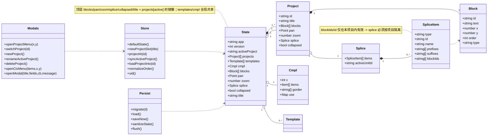
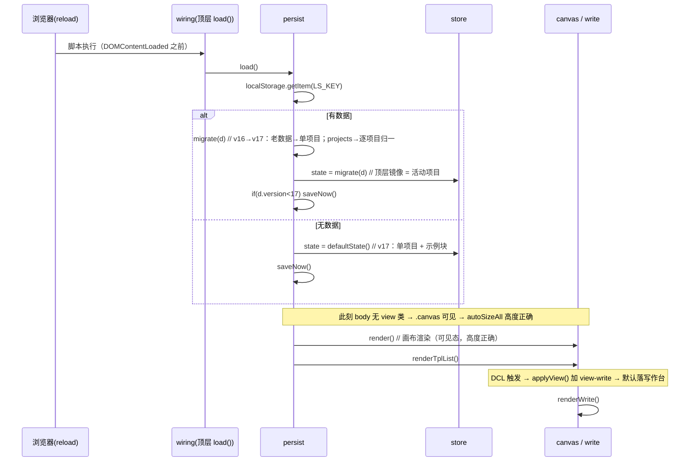

# 需求③「新建项目」· 增量设计（多项目容器）2026-09-19

> 对象：交付物 `PHJ.html` v7.17（288444 B / `state.version`=16 / `SLICES`=20 / 闸门 10/10）。
> 本轮目标版本：**v7.18**（`state.version` → **17**）。
> 上游：Holly 拍板「多项目（各自独立、可切换）」；口径见 §1。配套调查见 `dev/docs/design/排布错位_调查_2026-09-19.md`（需求②）。
> 红线遵守：R1 单文件经典脚本 / R3 `LS_KEY` 不变 + migrate 零丢失、version 只进不退 / R5 `skin/corpus` 一字不改且仍第 9 位 / R7 不新增 document/window 级 `keydown|keyup|blur` 监听 / R8 新中文文案不命中皮肤词元 / R9 改产物合法路径。

---

## 1. 方案总述 + 「最小变更原则」边界声明

**一句话：`state.blocks` 继续表示「当前项目的块」，多项目以「活动项目镜像 + 项目槽容器」实现；切换项目 = 写回当前槽 → 载入目标槽（替换引用）→ 只重渲染当前视图。**

### 1.1 核心决策（先给结论）

| 问题 | 结论 |
|---|---|
| **`state.blocks` 是否保持「当前项目的块」语义？** | **是，保持不变。** 现有**全部**消费 `state.blocks` 的代码（`canvas.render`/`write.renderWrite`/`wdTextBlocks`/`splice`/`pointer`/`paste`/`keys`/`overlay`/测试）**零改动**。 |
| 反对方案 | 「把全库改成 `activeProject().blocks`」——改动面覆盖 10+ 模块、破坏所有既有断言与测试访问器口径，**否决**。 |
| 多项目容器放哪 | 新增 `state.projects[]`（**全部**项目槽，含活动项目）+ `state.activeProject`（活动 id）；顶层 live 字段（`blocks/pan/zoom/splice/collapsed/title`）= 活动项目槽的**镜像引用**。 |
| 新模块 / 新切片 | **不新增**（零 `SLICES`/`CSS` 变更 → 加载期副作用注册序不变 → P2-A/P3-A 逐字不变）。全部落既有 5 个文件。 |

### 1.2 「最小变更原则」边界

- **改动文件数 = 5**：`core/store.js`、`core/persist.js`、`view/modals.js`、`shell/wiring.js`、`src/index.html`（+ 需求②的 `view/write.js`、`view/canvas.js`）。
- **不改**：`skin/corpus.js`（一字不改）、`LS_KEY`、`SLICES`/`CSS` 顺序、任何 `keydown/keyup/blur` 监听、`editor/**`、`interact/**`、`view/canvas.js` 的渲染编排（除需求②修复）。
- **不改数据契约的既有字段语义**：`state.blocks`（仍是当前项目块）、`templates`/`cmpl`（仍全局）、`order`（仍是块字段）。

---

## 2. 新增 / 修改文件清单

| 文件 | 动作 | 层 | 职责 |
|---|---|---|---|
| `dev/src/core/store.js` | **改** | core | `defaultState()` → v17（单项目容器 + 镜像）；新增项目槽构造 `newProjectSlot()`、`projectAt(id)`、`syncActiveProject()`、`loadProjectInto(id)`；`PHJ.store` 导出面 += |
| `dev/src/core/persist.js` | **改** | core | `migrate()` v16→v17（**多项目**：老数据 → 单项目；逐项目块/拼接归一）；`sanitizeState()` 逐项目剔图片；`load()` 阈值 `<16`→`<17`；`saveNow()` 前先 `syncActiveProject()` |
| `dev/src/view/modals.js` | **改** | view | 项目菜单 `openProjectMenu()`、切换 `switchProject()`、增 `newProject()`、改名 `renameActiveProject()`、删 `deleteProject()`；`#ctxMenu` 动作分发新增 `proj-*`；`PHJ.modals` 导出面 += |
| `dev/src/shell/wiring.js` | **改** | shell | 接线 `#btnProj` 的 `click`；导入 JSON 守卫接受 `projects`（兼容旧 `blocks`）；导入后按活动视图刷新 |
| `dev/src/index.html` | **改** | — | 顶栏新增 `<button id="btnProj">项目</button>`（位于 `#btnMenu` 之后，两视图均可见） |
| `dev/src/styles/20-menu.css` | **改（如需要）** | — | 项目菜单项「当前项目」态（`●` 前缀/禁用）与列表滚动；**复用既有 `.ctx-*`**，仅加最小规则 |
| `dev/src/view/write.js` | **改（需求②）** | view | `setView`：`applyView()` 提前到 `render()/renderWrite()` 之前（或进入画布后补 `autoSizeAll()`） |
| `dev/src/view/canvas.js` | **改（需求②）** | view | `autoResize`：隐藏态（`scrollHeight===0`）不写 `0px` |
| `dev/_qa/verify/verify_w.mjs` · `verify_v78.mjs` · `verify_c.mjs` | **改（期望值）** | QA | version 16→17；`P2_EXPORTS_GOLDEN` 同步 store/modals 新增导出名 |
| `dev/_qa/verify/verify_build_equivalence.mjs` + 新快照 + `run-gate.mjs` 注释 | **改** | QA | R9 流程 |
| `dev/_qa/snapshots/BASELINE_v7.18.md` | **新增** | QA | 本轮基线 |

> **不新增源文件**（除测试/文档）；**不新增 `SLICES` 条目**。

---

## 3. 数据模型（`state` 结构变化 + 逐字段「隔离/共享」裁定表）

### 3.1 `state` 结构（version 17）

```
state = {
  app: 'storyboard-prompt-panel',
  version: 17,

  /* ── 跨项目共享（全局） ── */
  templates: [ { id, units:[{id,prefixes[],suffixes[]}] } ],   // 拼接模板（写作资产）
  cmpl: { v, items, gorder, use },                             // 片段库/写作资产 + 使用记录

  /* ── 多项目容器 ── */
  activeProject: '<id>',
  projects: [
    { id, title, blocks:[…], pan:{x,y}, zoom, splice:{items,activeUnitId}, collapsed }
    , …
  ],

  /* ── 活动项目的「活」镜像（既有消费方零改动） ── */
  blocks: <projects[active].blocks>,     // 同一引用
  pan:    <projects[active].pan>,
  zoom:   <projects[active].zoom>,
  splice: <projects[active].splice>,
  collapsed: <projects[active].collapsed>,
  title:  <projects[active].title>,      // = 项目名
}
```

- **块对象**不变：`{ id, text, x, y, order, (type) }`；`order` 是块自身字段（随块走 → 天然按项目隔离）。
- **镜像关系**：`state.blocks === projects[active].blocks`（同一数组引用）。**任何时刻**通过 `syncActiveProject()` 重新关联（见 §5、§14）。
- **持久化**：`sanitizeState()` 序列化整个 `state` → 同时含「顶层镜像」与 `projects[]`（活动项目块在 JSON 中出现两份，见 §14 风险 12；保留顶层镜像是为了不破坏 W4/W9 等读取 `LS.blocks` 的既有断言）。

### 3.2 ★ 逐字段「按项目隔离 / 全局共享」裁定表

| 字段 | 裁定 | 理由 |
|---|---|---|
| `blocks` | **按项目隔离** | 项目的内容本体。 |
| `pan` / `zoom` | **按项目隔离** | 视角是「布置画布」的一部分；切回项目应回到离开时的视角。若全局共享，从大画布项目切到小项目会看到空白/错位。 |
| `splice`（`items`/`activeUnitId`） | **按项目隔离**（**必须**） | `splice.items` 与 `unit.blockIds` **按块 id 引用**，而块 id 属项目内 → 跨项目引用必然失效；不隔离会出现「切项目后拼接栏是空引用」。 |
| `block.order` | **随 `blocks` 走（天然隔离）** | `order` 是块字段，不需要单独裁定；`normalizeOrder` 仍对「当前项目」的块生效。 |
| `templates` | **全局共享** | 模板 = 可复用「拼接结构」（前缀/后缀值），是**写作资产**，与具体项目内容无关；用户期望跨项目复用（否则每建一个项目都要重建模板）。 |
| `cmpl`（片段库 / 写作资产 / `use`） | **全局共享** | 片段库是**跨项目写作资产**（内置风格包 + 用户导入资产）；`use` 是「越用越顺」的使用记录——`hkey` 为**内容 hash**（`'h'+FNV1a32(group\0label\0body)`，`editor/complete.js`），与项目无关，跨项目累计更合理。 |
| `title` | **按项目隔离** | 本设计中 **`title` = 项目名**（复用既有字段，零新增概念）；切换项目标题随之变化。 |
| `collapsed` | **按项目隔离（保守，可讨论）** | 严格说是「拼接栏折叠」这一视图态，可全局；但为「切进项目 = 回到离开时的样子」的观感一致，建议随项目。**待 Holly 定**（见 §15）。 |
| `activeView` | **全局会话态、不持久**（保持现状） | `core/store.js:22-23` 注释明确「刷新回默认写作台，不做记忆」。多项目不改此语义。 |

### 3.3 类图（Mermaid，独立文件 `多项目_类图.mermaid`）



---

## 4. `migrate` v16 → v17 精确规则（零丢失 + 观感不变）

### 4.1 规则（伪代码）

```
migrate(d):
  /* ① 全局字段：逐字沿用既有逻辑（cmpl / templates），不变 */
  cmpl      = migrateCmpl(d.cmpl)          // = 现有 persist.js:82-116 段逐字
  templates = migrateTemplates(d.templates)// = 现有 persist.js:55-75 段逐字

  /* ② 收集「项目源」列表 */
  if (Array.isArray(d.projects) && d.projects.length)          // v17+ 文档
      srcs = d.projects
  else                                                          // ★ v16 及更老（无 projects）
      srcs = [ { id: (合法 d.activeProject) || uid(),
                 title: d.title,
                 blocks: d.blocks, pan: d.pan, zoom: d.zoom,
                 splice: d.splice, collapsed: d.collapsed } ]

  /* ③ 逐项目归一（复用既有「块迁移」与「拼接迁移」逻辑，逐字同源） */
  projects = srcs.map(function(p){
     var blocks = migrateBlocks(p.blocks)        // 过滤图片 → (hasOrd,ord,y,x,i) 排序 → 赋 order=0..N-1（现 persist.js:11-27 段）
     var ids = {}; blocks.forEach(b => ids[b.id]=1)
     var splice = migrateSplice(p.splice, ids)   // 条目化 + 按 ids 过滤（现 persist.js:29-53 段）
     return { id: (typeof p.id==='string' && p.id) ? p.id : uid(),
              title: (typeof p.title==='string' && p.title) ? p.title : '未命名分镜',
              blocks: blocks,
              pan: (p.pan 合法) ? {x:p.pan.x,y:p.pan.y} : {x:0,y:0},
              zoom: (p.zoom>0 && p.zoom<=4) ? p.zoom : 1,
              splice: splice,
              collapsed: !!p.collapsed }
  })

  /* ④ 活动项目 id：命中则用，否则落第一个 */
  activeProject = projects.some(p => p.id === d.activeProject) ? d.activeProject : projects[0].id
  act = projects.find(p => p.id === activeProject)

  /* ⑤ 顶层镜像 = 活动项目（同一引用） */
  return { app:'storyboard-prompt-panel', version:17,
           templates, cmpl, projects, activeProject,
           blocks: act.blocks, pan: act.pan, zoom: act.zoom,
           splice: act.splice, collapsed: act.collapsed, title: act.title }
```

### 4.2 三个「必须成立」的保证

1. **零丢失**：`blocks` 的 `id/text/x/y/order`、`splice` 条目、`templates`、`cmpl`（含 `use`）、`pan`/`zoom`/`title`/`collapsed` **全部承接**，无字段被删。
2. **观感不变**：老数据（无 `projects`）→ **恰好一个项目**，其 `blocks/pan/zoom/splice/title/collapsed` 与**旧版 `migrate` 输出逐字相同**（用的是同一套块/拼接/pan 逻辑，只是包了一层项目槽）→ 用户看到的画布/写作台/视角**与升级前一致**。
3. **幂等 / version 只进不退**：输出恒为 `version:17`；再次 `migrate` 结果稳定（`projects` 已存在 → 逐项目归一，结果不变）。

### 4.3 配套改动

- `defaultState()`：`version:16 → 17`；返回结构改造为「一个项目槽 + 顶层镜像」；首个项目的示例块**逐字保留**（首启观感不变）。
- `load()`（`persist.js:130`）：`if(d.version < 16) saveNow();` → **`< 17`**（升级即落新结构）。
- `saveNow()`：调用 `syncActiveProject()` 后再 `sanitizeState()`（保证 `projects[active]` 与顶层镜像一致落盘）。
- `sanitizeState()`：`c.blocks` 剔图片（不变）**+ 每个 `c.projects[i].blocks` 剔图片**（新增）。

---

## 5. 切换项目的行为（时序 + 与 `setView`/`render`/`renderWrite` 的协同）

### 5.1 `switchProject(targetId)` 步骤

```
switchProject(targetId):
  if (targetId === state.activeProject) return            // 0 幂等
  flush()                                                 // ① 立即落盘（清防抖，不丢字）
  cmplUseInvalidate()                                     // ② 缓存失效（编辑器文本将整体更换）
  if (activeView === 'write') cmplReset(hostDesk)         // ③ 收当前视图临时层
  else closeBlockEditor()
  closeCtxMenu()                                          //    关项目菜单自身
  syncActiveProject()                                     // ④ 写回当前项目槽（projects[active] ← live）
  loadProjectInto(targetId)                               //    载入目标项目槽（activeProject=id; live ← 槽）
  selected = []; wdSelId = null                           // ⑤ 会话选中态跨项目无效 → 复位
  if (activeView === 'canvas') render();                  // ⑥ 只重渲染「当前视图」
  else renderWrite()
  applyView()                                             // ⑦ 计数/高亮/显隐
  scheduleSave()                                          // ⑧ 落盘
  toast('已切到项目「' + state.title + '」')
```

### 5.2 与 `setView`/`render`/`renderWrite` 的协同（**避免双向成环**）

- **单向原则**：`switchProject` **只渲染当前活动视图**；**另一个视图不主动渲染**，等 `setView` 进入时按需拉取（`view/write.js:211` 的既有设计）。
- **成环检查**：`switchProject → render/renderWrite/applyView`（这些**不回调** `switchProject`）；`setView → render/renderWrite`（**不回调** `switchProject`）。**无环**。
- ⚠️ **关键约束（与需求②强相关）**：`switchProject` **绝不在隐藏态渲染画布**——若 `activeView==='write'` 只调 `renderWrite()`，**不调** `render()`；否则会踩需求②的「隐藏态测量塌陷」bug。**需求②修复为 T03，须与 T01/T02 同批交付**。

### 5.3 视角 / 选中项处理

| 项 | 处理 |
|---|---|
| `pan` / `zoom` | 随项目槽载入（`applyPan()` 由 `render()` 内部触发；写作台视图下不涉及） |
| 画布多选 `selected` | 清空（跨项目 id 无效） |
| 写作台选中 `wdSelId` | 置 `null` → `wdEnsureSel()` 兜底落目标项目第一条文本块 |
| 拼接栏滚动 / 编辑器滚动 | 随 DOM 重建自然复位 |
| `activeView` | **不变**（切项目不切视图） |

---

## 6. UI 设计

### 6.1 入口落点（**两视图都要够得着**）

- 现状顶栏：`[写作｜画布] [分镜 N 条] [整] [导] [补] [100%]`。其中 `分镜 N 条`/`整`/`100%` 在**写作视图被 CSS 隐藏**（`55-write.css:18,24-25`）→ 只有 **胶囊 / `导` / `补` 在两视图都可见**。
- **裁定**：新增 `#btnProj`（文案「项目」）插在 **`#btnMenu`（导）之后** → **两视图均可见**，且与「导」同属「全局容器操作」语义（`导` = 导入导出全库，`项目` = 切换全库容器）。
- **不选**：塞进「导」下拉（会与「导入/导出」语义混淆，且用户找不到）；放拼接栏（写作视图无拼接栏）。

### 6.2 窗口/菜单形态（复用 vs 新增）

- **复用 `#ctxMenu` + `openCtxMenu(items,x,y)`**（`view/modals.js:383`）——与「导」下拉（`wiring.js:6-15`）**同型**，**零新 DOM / 零新窗骨架**。菜单项：
  ```
  ● 项目 A（当前）        → （disabled，仅作当前标识）
  ○ 项目 B                → act='proj-switch'
  sep
  ＋ 新建项目              → act='proj-new'
  重命名当前项目          → act='proj-rename'
  删除当前项目   danger   → act='proj-del'
  ```
- **理由**：项目菜单是「一列动作 + 列表选择」，与既有 ctx 菜单形态一致；新增独立浮窗需新 DOM/CSS/遮罩，收益不足（同「view/modals 不再拆」的判定口径）。
- **已知限制**：项目很多时 `#ctxMenu` 会超高 → 在 `20-menu.css` 给 `.ctx-menu` 加 `max-height:60vh; overflow:auto`（最小规则）。

### 6.3 新建 / 重命名 / 删除 的交互与危险操作兜底

| 操作 | 交互 | 兜底 |
|---|---|---|
| **新建项目** | `openModal('新建项目', [{label:'项目名称', value:'未命名项目'}], cb)` → 建**空项目槽**（`blocks:[]`）→ `switchProject(newId)` | 空项目进入写作台显示空态引导（`wd-empty`：还没有分镜）；画布显示 `.empty` 提示。**不复制当前项目内容**（= 真正「从零」）。 |
| **重命名** | `openModal('重命名项目', [{label:'项目名称', value: 当前}], cb)` → 写 `projects[i].title`（活动项目同时写顶层 `title`） | 名称去首尾空白；空名回落「未命名项目」。 |
| **删除项目** | ① **确认**（`openModal('删除项目', [], cb)`，复用 `#modalMask`，带一句说明文案）→ ② 删除 + `toast('已删除项目「X」', {label:'撤销', fn: 复位})` | **守卫**：若为**唯一项目** → 拒绝（`toast('至少保留一个项目')`）；若删的是**活动项目** → **先** `switchProject(相邻项目)` **再**删；撤销 = 把项目槽**插回原下标**（**不自动激活**，避免视图跳变）。 |

> `openModal` 目前只渲染输入行；为「确认框」需**扩一个可选 `message` 参数**（在 `modalBody` 顶部渲一段说明文字）——最小改动，`modals.js`。

---

## 7. 导出 / 导入 JSON 口径

| 场景 | 口径 | 理由 |
|---|---|---|
| **导出** | **全部项目** | `exportJSON()`（`wiring.js:279`）导出 `sanitizeState()` = 整个 `state` → **天然含 `projects[]` + `activeProject` + 顶层镜像**。**换机不丢数据**（只导当前项目会丢其它项目）。 |
| **导入** | **整体替换**（`state = migrate(d)`）→ 导入后**按活动视图刷新**（`activeView==='write'` → `renderWrite()`，否则 `render()`）+ `applyView()` | 旧（v16 及更早）单项目 JSON **仍可导入**（§4 兼容规则 → 落为单项目）。导入前仍写 `BACKUP_KEY` 备份 + 撤销（既有机制）。 |
| 兼容守卫 | `wiring.js:63` 的 `!Array.isArray(d.blocks)` → 改为 `!(Array.isArray(d.blocks) || Array.isArray(d.projects))` | 兼容「projects-only」文档（顶层镜像被裁时）。 |

---

## 8. 数据结构与 `PHJ.*` 导出面变更

**新增顶层声明（均在既有 IIFE 内，不泄漏 `window` → P1-D 仍绿）：**

| 位置 | 新增顶层名 | 是否纳入 `PHJ.*` |
|---|---|---|
| `core/store.js` | `newProjectSlot`、`projectAt`、`syncActiveProject`、`loadProjectInto` | 是 → `PHJ.store += 4` |
| `view/modals.js` | `openProjectMenu`、`switchProject`、`newProject`、`renameActiveProject`、`deleteProject` | 是 → `PHJ.modals += 5` |
| `core/persist.js` | （内部抽出 `migrateBlocks`/`migrateSplice` 辅助；**不新增导出**） | 否（仅 `migrate` 保持导出） |

- 结果：`PHJ` **模块键仍 18**（`P2_MODULES` 不变）；`P2_EXPORTS_GOLDEN` 的 `store`/`modals` 名单**各增**若干名（`P2-B2` 合计名数 126 → 126+9=**135**，以实测为准）。
- `P1-D`（window 零泄漏）用**自动扫描**（`test-artifact.mjs` 的 `nameCount`）→ 新增声明**只会让计数变大**，断言（delta=空集）**仍绿**。

---

## 9. `SLICES` / `CSS` 顺序决策

- **结论：不新增任何切片。** 改动仅落在既有模块文件内（`store`/`persist`/`modals`/`wiring`）+ `index.html` 加一个 `<button>`。
- **论证（为何不能随手新增片）**：`SLICES` 顺序由**加载期副作用**决定（`addEventListener` 注册序 + 顶层 `var` 初始化序）。本轮若新立 `view/project.js`，须论证其插入位置——由于本轮新增代码**无顶层 `addEventListener`（仅被 `#btnProj` 的既有 DCL 块调用）**，理论上可插在 `modals` 之后；但为**守住 P2-A/P3-A 逐字不变**与「不增复杂度」，**本轮明确不新增**。
- `skin/corpus` **仍第 9 位**（未动）。
- 若 QA/Holly 坚持单立模块，须按 R6 走「改顺序要论证 + 跑 P2-A」流程，**另议**。

---

## 10. Mermaid 图

> 独立文件：`dev/docs/design/多项目_时序图.mermaid`、`dev/docs/design/多项目_类图.mermaid`。

### 10.1 ① 新建项目

```mermaid
sequenceDiagram
    participant U as 用户
    participant W as wiring(#btnProj)
    participant M as modals
    participant S as store
    participant P as persist

    U->>W: 点顶栏「项目」→ 点「＋ 新建项目」
    W->>M: openProjectMenu → 动作 proj-new
    M->>M: openModal('新建项目',[名称],cb)
    U->>M: 输入名称 → 确定
    M->>S: newProjectSlot(name)  // {id,title,blocks:[],pan:{0,0},zoom:1,splice:{[],null},collapsed:false}
    S-->>M: slot
    M->>P: flush()
    M->>S: syncActiveProject()          // 写回旧项目槽
    M->>S: state.projects.push(slot)
    M->>S: loadProjectInto(slot.id)     // activeProject=slot.id; live ← slot
    M->>S: selected=[]; wdSelId=null
    alt 当前视图=写作台
        M->>M: renderWrite()            // 空态引导
    else 当前视图=画布
        M->>M: render()                 // .empty 提示
    end
    M->>M: applyView()
    M->>P: scheduleSave()
    M-->>U: toast('已新建项目「X」')
```

### 10.2 ② 切换项目

```mermaid
sequenceDiagram
    participant U as 用户
    participant M as modals
    participant S as store
    participant P as persist
    participant C as canvas / write

    U->>M: 项目菜单 → 点「项目 B」(act=proj-switch)
    M->>P: flush()                       // 清防抖、不丢字
    M->>M: cmplUseInvalidate()
    alt 当前=写作台
        M->>M: cmplReset(hostDesk)
    else 当前=画布
        M->>M: closeBlockEditor()
    end
    M->>M: closeCtxMenu()
    M->>S: syncActiveProject()           // projects[active] ← live(blocks/pan/zoom/splice/collapsed/title)
    M->>S: loadProjectInto('B')          // activeProject='B'; live ← projects['B']
    M->>S: selected=[]; wdSelId=null
    alt activeView==='canvas'
        M->>C: render()                  // 可见态渲染 → 高度正确
    else
        M->>C: renderWrite()             // ⚠不渲染隐藏的画布
    end
    M->>M: applyView()
    M->>P: scheduleSave()
    M-->>U: toast('已切到项目「B」')
```

### 10.3 ③ 重开工具（load → migrate → 渲染）



---

## 11. 任务列表（有序、含依赖、按实现顺序）

> 硬约束遵守：**≤5 个任务**、**每任务 ≥3 个相关文件**、**分组按功能/层次**、**T01 = 基础设施/数据层**。

### T01 · 多项目数据层与迁移（P0）
- **文件**：`dev/src/core/store.js`（`defaultState` v17、`newProjectSlot`、`projectAt`、`syncActiveProject`、`loadProjectInto`、`PHJ.store` 导出）· `dev/src/core/persist.js`（`migrate` v16→v17 多项目、`sanitizeState` 逐项目剔图片、`load` 阈值 `<17`、`saveNow` 先 `syncActiveProject`）· `dev/src/index.html`（新增 `#btnProj`）
- **依赖**：无
- **完成判据**：`node dev/build.mjs` 通过（CSS 链校验仍过）；`migrate(v16 老数据)` 输出**恰一个项目**且 `blocks/pan/zoom/splice/title/collapsed` 逐字等于旧版输出；`migrate` 幂等；控制台无异常。

### T02 · 项目 UI 与切换编排（P0）
- **文件**：`dev/src/view/modals.js`（`openProjectMenu`/`switchProject`/`newProject`/`renameActiveProject`/`deleteProject` + `ctx` 动作 `proj-*` 分发 + `openModal` 加可选 `message`）· `dev/src/shell/wiring.js`（`#btnProj` click 接线；导入守卫接受 `projects`；导入后按活动视图刷新）· `dev/src/styles/20-menu.css`（`.ctx-menu` 超高滚动 + 当前项态）
- **依赖**：T01
- **完成判据**：顶栏「项目」菜单可开；新建/切换/重命名/删除均可用；**切换后仅活动视图刷新、无双向成环**；删除唯一项目被拒；删除活动项目先切走；撤销复位。

### T03 · 需求②「间距不均」渲染时机修复（P0）
- **文件**：`dev/src/view/write.js`（`setView`：`applyView()` 提前，或进入画布后补 `autoSizeAll()`）· `dev/src/view/canvas.js`（`autoResize` 隐藏态 `scrollHeight===0` 不写 `0px`）· `dev/src/styles/10-canvas.css`（如需要，补注释/最小态）
- **依赖**：无（可与 T01/T02 并行）
- **完成判据**：切「画布」后每块 `inline style.height ≠ 0px`；3 个不同行数块 `cardH` 随行数**递增**；「整」后重开+切画布，`gaps` 与「整」当时一致（不塌陷）。**复跑 W 组确认仍绿**。

### T04 · 闸门期望值同步 + 基线收口（P0）
- **文件**：`dev/_qa/verify/verify_w.mjs`（W8/W9 `version===16`→17）· `dev/_qa/verify/verify_v78.mjs`（I7/I7b version→17；`P2_EXPORTS_GOLDEN` 的 `store`/`modals` 名单同步）· `dev/_qa/verify/verify_c.mjs`（D5/D7 version→17）· `dev/_qa/verify/verify_build_equivalence.mjs`（`OLD` → 新快照）· `dev/_qa/snapshots/PHJ_v7.18_2026-09-19.html`（新快照）· `dev/_qa/run-gate.mjs`（头注释体积）· `dev/_qa/snapshots/BASELINE_v7.18.md`
- **依赖**：T01、T02、T03
- **完成判据**：`node dev/_qa/run-gate.mjs` = **10/10**（**断言条数不变**，仅期望值/快照同步）；`node dev/_qa/lib/skin-guard.mjs` = `R3-A ≤15 / R3-B = 0`。

---

## 12. 共享知识（命名 / DOM id 前缀 / 事件名）

- **项目槽字段**：`{ id, title, blocks, pan, zoom, splice, collapsed }`；项目 id 用既有 `uid()`。
- **活动项**：`state.activeProject`（id 字符串）；顶层 live 字段 = 活动槽镜像。
- **必须成对调用**：`syncActiveProject()` 在 **`saveNow()`** 与 **`switchProject()`** 两处调用（否则块改动可能只留在顶层镜像、未回写项目槽 → 落盘/切换丢改动）。
- **DOM id**：`#btnProj`（顶栏按钮）；项目菜单**复用 `#ctxMenu`**；确认/命名框**复用 `#modalMask`**。**不新增窗骨架**。
- **事件**：无新增 `keydown/keyup/blur`；`#btnProj` 仅 1 个 `click`；`#ctxMenu` 动作名 `proj-switch` / `proj-new` / `proj-rename` / `proj-del`。
- **toast 文案**：`已新建项目「X」` / `已切到项目「X」` / `已重命名项目「X」` / `已删除项目「X」`+撤销 / `至少保留一个项目`。
- **皮肤边界（R1/R8）**：新中文文案一律落 `view/**` 或 `index.html`，**不得**命中皮肤词元；改完跑 `skin-guard`。

---

## 13. ★ 对既有闸门的冲击清单

| 闸门 / 断言 | 冲击 | 是否需 Holly 核准 |
|---|---|---|
| `state.version` 16 → 17 | 期望值变 | **是** |
| `verify_w.mjs` W8（`:395` `w8.version===16`） | 期望值 16→17 | **是** |
| `verify_w.mjs` W9（`:422,:423` `version===16`） | 期望值 16→17 | **是** |
| `verify_v78.mjs` I7（`:565` `version===16`、`oldV===16`） | 期望值 16→17 | **是** |
| `verify_v78.mjs` I7b（`:567` 文案「v13⇒v16」） | 文案（非判定） | 是（随上） |
| `verify_c.mjs` D5（`:500,:501` `version===16`） | 期望值 16→17 | **是** |
| `verify_c.mjs` D7（`:534,:535` `version===16`） | 期望值 16→17 | **是** |
| `verify_v78.mjs` `P2_EXPORTS_GOLDEN.store/modals`（`:874,:880`） | 期望**名**增加（store +4 / modals +5） | **是** |
| `P2-B2` 合计名数 | 126 → 约 135（实测） | 是（随上） |
| `P2-B` 模块键数 | **仍 18**（不新增模块） | 否 |
| `P1-D` 产品纯度 | 自动扫描，delta 仍空集 → **仍绿** | 否 |
| `P2-A` / `P3-A`（key 监听注册序/条数） | **零新增 key 监听** → 逐字不变 | 否 |
| `verify_build_equivalence.mjs` 的 `OLD` + 新快照 | R9 流程（新增 `PHJ_v7.18_...html`） | 否（流程） |
| `run-gate.mjs` 头注释（体积/快照名） | **无体积判定式**，只改注释 | 否 |
| `probe_dev_index.mjs`（18 项） | 不涉及顶栏按钮 → 不受影响 | 否 |
| `skin-guard`（R3-A/R3-B/R3-C） | 新文案须验 `≤15 / 0` | 否（例行） |
| `build.mjs` CSS 链顺序校验 | `<button>` 不影响 → 仍过 | 否 |

> ⚠️ **「断言条数变动须先报 Holly 核准」**：本设计**不新增、不删除任何断言**；仅**期望值**（version 字面量、导出万名、快照字节）变动。若 QA 为本需求另立常驻断言组，条数变动**须先报备**。
> ⚠️ `P2_EXPORTS_GOLDEN` 的增名**必须与实现逐名核对**（导入面「键存在 ≠ 面正确」）。

---

## 14. 风险清单

1. **`state.blocks` 被重新赋值 → 镜像解链**：`interact/pointer.js:82`（`bulkAction('del')` 用 `state.blocks = state.blocks.filter(...)` 产生**新数组**）等会把 `projects[active].blocks` 与顶层镜像断开。**对策**：`syncActiveProject()` **必须**在 `saveNow()` 与 `switchProject()` 两处调用（幂等重连）。
2. **`arrangeAll` 原地排序**（`canvas.js:133` `state.blocks.sort`）：同 1，靠 `syncActiveProject()` 兜底；**测试**需覆盖「整理后切项目再切回，位置保持」。
3. **`splice` 跨项目引用失效**：`splice.items[].id` / `unit.blockIds` 引块 id → **必须按项目隔离**；否则切项目后拼接栏引用空块（本设计已隔离）。
4. **`cmpl.use` 的 hkey 是内容 hash**：与项目无关 → **保持全局**；若误按项目隔离会割裂「越用越顺」的学习累计。
5. **`activeView` 会话态 + 需求②**：重开必落写作台 → 用户必点画布 → 撞需求②塌陷；`switchProject` 也**不得**在隐藏态渲染画布（本设计已约束「只渲染当前视图」）。
6. **`migrate` 重构的等价性风险**：抽出「块/拼接」per-project 归一后，**单项目路径必须逐字等价**（用 W8/I7 老数据回归；建议先跑旧断言确认行为不变，再改期望值）。
7. **删除项目 × 活动项目 × 撤销的耦合**：删除活动项目需**先切走再删**；撤销只把槽**插回原下标且不自动激活**（防视图跳变）。
8. **`index.html` 新增按钮**：`build.mjs` 只校验 CSS 链顺序与 `<script src="./dev-bundle.js">` 锚点；`<button>` 不影响 → 但**必须复跑 `node dev/build.mjs`** 确认仍过。
9. **观感不变（升级零打扰）**：老用户升级后单项目 → 画布/写作台/视角**逐像素一致**；`pan/zoom/splice/title/collapsed` + 块 `order` 逐字承接。
10. **皮肤词元（R8）**：新文案「项目/新建项目/重命名/删除项目」须跑 `skin-guard`（`R3-A ≤15`、`R3-B = 0`）。
11. **双向成环**：`setView` 与 `switchProject` **不得互调**（本设计单向：`switchProject` 只渲染当前视图，不调 `setView`）。
12. **JSON 体积**：顶层镜像 + `projects[active]` **重复存活动项目块** → 文件约增「一个活动项目的块」。**理由**：不破坏 W4/W9 等读 `LS.blocks` 的既有断言。可接受，记录备案；若 Holly 要求瘦身，另议（需同步改读取方与断言）。

---

## 15. 待明确事项

1. **新建项目的默认名**：`未命名项目`（建议）／`项目 N`／沿用 `未命名分镜`？
2. **新建项目是否零块**：建议**零块**（真正「从零」，两视图显空态引导）；是否要预置 1 个空块？
3. **删除项目是否需要「撤销」**：建议**要**（确认 + toast 撤销）；或仅确认不撤销？
4. **当前项目名是否显示在顶栏按钮**：建议按钮固定「项目」，当前名只在菜单内以 `●` 标识（避免顶栏进一步拥挤）。
5. **`collapsed`（拼接栏折叠）是否按项目隔离**：本设计取「按项目隔离（保守）」；可否接受全局？（对观感影响小）
6. **本轮是否含「复制项目 / 项目排序 / 导出单个项目」**：建议**不做**（超出 Holly 拍板口径）。
7. **需求②修复方案选型**：方案 A（`setView` 次序调整）是否可接受其对 W 组断言的影响（预期仍绿，需实测）。
8. **`P2_EXPORTS_GOLDEN` 增名清单**：需 Engineer 实现后逐名核对，确认无多导/漏导。

---

## 16. 附：需求②调查结论（摘要）

> 完整报告：`dev/docs/design/排布错位_调查_2026-09-19.md`。

**根因（真机复现 5/5，判为真 bug）**：切画布时 `setView()` **先 `render()` 后 `applyView()`**（`view/write.js:211→213`），此刻 `body.view-write .canvas{display:none}`（`styles/55-write.css:19,22`）→ `autoSizeAll()`（`canvas.js:123`）在**隐藏态**读 `scrollHeight=0` → `autoResize()`（`canvas.js:101`）把每个 `.block-text` 写成 `height:0px` → 全块塌成 `min-height:84`（卡片 126px）。因 `activeView` 不持久（重开必落写作台 → 必点画布）且块高不落盘，**重开后必现**；与「整」按真实块高烘焙的 `y` 间距叠加 → **间距不均**（实测 `gaps=[24,24,24]` → 重开 `[24,41,197]`）。
**修法建议**：方案 A（`setView` 把 `applyView()` 提前，或进入画布后补 `autoSizeAll()`）+ 方案 B（`autoResize` 隐藏态守卫）。**本设计已把该修复列为 T03，与多项目同批交付。**
