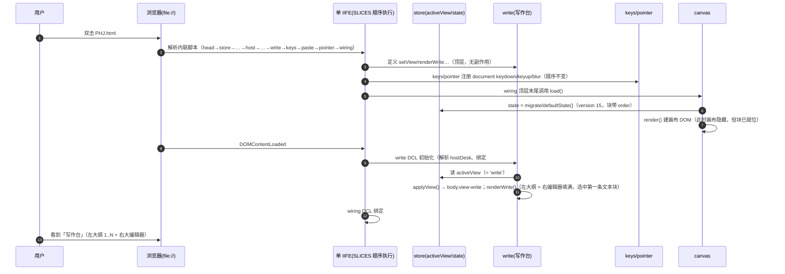
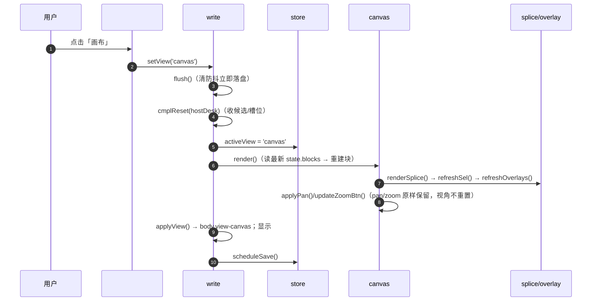
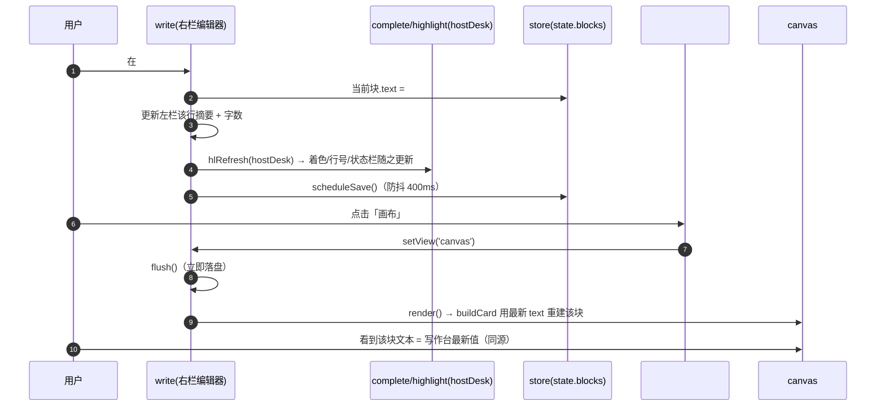
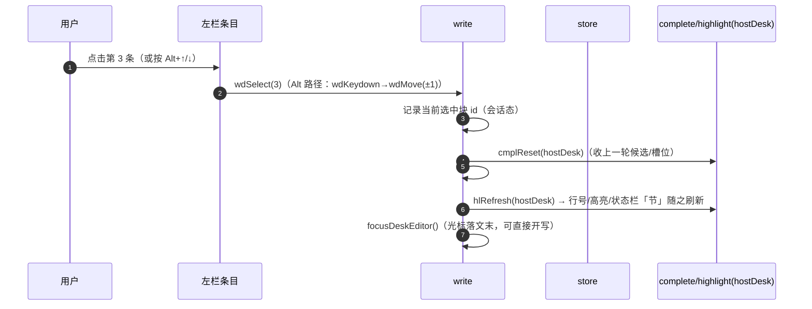
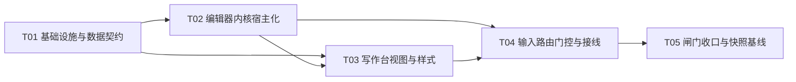

# 界面切换 + 「写作台」· 增量设计（v7.15）

> 作者：高见远（Architect）｜ 日期：2026-09-18 ｜ 状态：**待 Holly 核准（见 §10.4）**
> 上游：`dev/docs/decisions/增量需求_界面切换与写作台_2026-09-18.md`（许清楚，增量 PRD）+ 主理人已拍板 Q1/Q2/Q5/Q6/Q7/Q11 与方向决策 D1/D2/D3
> 对象：`dev/src/` 与交付物 `PHJ.html`（当前 **v7.14**，**230515 B**，sha256 `19d762a2…9fa6`）
> 范围：**仅本次变更**（视图切换 + 写作台）；不改无关模块、不改变既有行为
> 交付物：本设计文档 + 任务列表（§8）；另抽出 `sequence-diagram.mermaid` / `class-diagram.mermaid`

---

## §1 实现方案总述

**一句话方案**：在顶栏加一个**胶囊分段控件「写作 ｜ 画布」**，把「当前视图」提升为**会话态**（默认 `写作`）；画布视图原样保留，新增一个**写作台视图**（左大纲 + 右大编辑器）；两视图**同源**（同一份 `state.blocks`），**只有当前视图实时刷新**、切视图时**按需拉取最新**（单向刷新，不成环）；写作台右栏**复用既有 coding 编辑器内核**，办法是把内核里那批**单例 DOM 硬编码**（`#blkInput`/`.blk-hl`/`#blkHl`/`#cmplPop`/`#stLine…`）抽成一张**「宿主解析层」**（`editor/host.js`：`hostPopup` 与 `hostDesk` 两套宿主），内核函数改为**按宿主参数寻址**、**缺省 = 弹窗宿主**（既有调用零改动、行为逐字不变）；线性顺序由**新增的 `block.order` 字段**承载（`state.version` 14 → **15**，`migrate()` v1→v15；老数据按「原画布自上而下：先 y 后 x」补齐）；写作台内**禁用**画布专属交互（方向键 / 空格 / Ctrl+滚轮 / 双击空白 / 右键 / Ctrl+左键），门控落在 `keys.js` / `pointer.js` / `wiring.js` 三处，且**不新增 document 级 keydown**（守住 P2-A / P3-A 两条加载期副作用序断言）。

### 1.1 「最小变更原则」的边界声明

> **只在「本需求要求的行为」范围内改动；凡未被要求的既有行为——画布渲染、拼接栏、模板、片段库、弹窗编辑器、快捷语义、导出格式、皮肤边界——一律不动。**

落成可判定的边界（工程师**不得**越界）：

1. **不动 `SLICES` 既有 18 条的顺序**（只在 `corpus` 之后插入 `host`、在 `modals` 之后插入 `write`；`corpus` 仍是第 9 位）；不改任何既有切片之间的相对次序。
2. **不新增任何 `document.` / `window.` 级 `keydown|keyup|blur` 监听**（只在既有监听体内加分支）→ P2-A / P3-A 契约不动。
3. **不新增任何 `document.addEventListener('keydown'`** → P3-A 的「3 处 / 含 Esc 恰 1 处」不动。
4. **不改既有 DOM id**（`#blkInput`/`#blkMask`/`#cmplPop`… 原样）；写作台用**独立新 id 前缀 `wd*`**，不产生同 id 第二份。
5. **不改既有 `PHJ.<module>` 导出名的语义**（只**新增**模块键与个别导出名，见 §4.4）；不改 `#ctxMenu` / `toast` / modal 的用法。
6. **不改 `LS_KEY`**；`version` 只进不退；`migrate` 只加字段、不减字段。
7. **不改皮肤边界口径**：写作台**领域文案落在视图层**（`view/write.js` 与 `index.html`），**不写进 `skin/`**（理由见 §4.5 —— 写进皮肤会**顶穿 R3-A 棘轮**）。

---

## §2 新增 / 修改文件清单

| 文件（相对仓库根） | 动作 | 层 | 职责 / 改动要点 |
|---|---|---|---|
| `dev/manifest.mjs` | 修改 | 构建 | `SLICES` 新增 2 条（`host` 插在 `corpus` 后、`write` 插在 `modals` 后）；`CSS` 新增 1 条（`55-write.css`，插在 `52-library` 与 `90-effects` 之间）；`MODULES` 新增 `host`/`write` 两条 |
| `dev/src/index.html` | 修改 | 骨架 | ① 新增 CSS 链 `<link … ./styles/55-write.css>`（顺序须与 manifest 一致）；② 顶栏新增 `#viewSwitch`（胶囊两段 `data-view="write|canvas"`）与 `#viewCount`；③ 新增 `<div class="write-desk hide" id="writeDesk">`（左 `#wdOutline` + 右 `#wdPane`，含宿主 id `wdInput/wdHl/wdPop/wdStrip/wdCopy/wdLine/wdCol/wdLen/wdErr/wdStruct`）；④ **不动**既有 `#blkMask` 弹窗等 |
| `dev/src/styles/55-write.css` | **新增** | 样式 | 写作台布局（双栏、各自独立滚动、右栏编辑器填满）、胶囊控件、条目行、空态、`body.view-write` / `body.view-canvas` 的显隐、`prefers-reduced-motion` 降级 |
| `dev/src/core/store.js` | 修改 | core | 新增会话态 `var activeView = 'write';`；新增顺序工具 `normalizeOrder()`；`PHJ.store` 导出面 **+`activeView` +`normalizeOrder`** |
| `dev/src/core/persist.js` | 修改 | core | `migrate()`：块投影新增 `order`；返回 `version: 15`；`load()` 阈值 `d.version < 15` |
| `dev/src/editor/host.js` | **新增** | editor | **宿主解析层**：`hostPopup`（弹窗宿主）+ `hostDesk`（写作台宿主）；`host.el(name)` 惰性解析并缓存宿主内节点；`PHJ.host = { hostPopup, hostDesk }` |
| `dev/src/editor/highlight.js` | 修改 | editor | 4 处单例 DOM 查找（`:127-130`、`:138`、`:144-149`、`:156-157`）改为**按宿主寻址**；`hlRefresh/hlSyncBox/hlStatus` 增**可选宿主参数**（缺省 `hostPopup`） |
| `dev/src/editor/complete.js` | 修改 | editor | `cmplTa/cmplPop`（`:37-38`）改为**按宿主寻址**；`cmplOnInput/cmplKeydown/cmplBind/blkCopyAll` 增可选宿主参数；`#blkCopy`（`:453`）改为 `host.el('copy')`；新增一条 DCL 绑定 `hostDesk`（非 keydown，不影响 P2-A/P3-A） |
| `dev/src/editor/block-editor.js` | 修改（最小） | editor | 仅补注释：`openBlockEditor/closeBlockEditor/fitBlkWidth` **固定弹窗宿主**（缺省宿主 = `hostPopup`，行为不变）；不改语句 |
| `dev/src/view/write.js` | **新增** | view | **写作台视图**：`setView/applyView/renderWrite`；左大纲渲染（拖手/序号/摘要/字数/高亮/空态）；新建/删除/上下移/切条（≥2 入口）；拖拽排序；`Alt+*` 键处理函数；条目右键菜单；实时写回；`prefers-reduced-motion` 无关（动效在 CSS） |
| `dev/src/view/modals.js` | 修改 | view | 既有 `#ctxMenu` 点击分发（`:448-467`）**新增 3 个动作分支**：`wd-del` / `wd-up` / `wd-down`（复用现有菜单与 `closeTopLayer`） |
| `dev/src/interact/keys.js` | 修改 | interact | 既有方向键 keydown（`:21-32`）**顶部新增「写作视图分支」**：`Alt+*` 写作快捷键 + 左栏列表导航 + **一律不动画布**；**不新增监听** |
| `dev/src/interact/pointer.js` | 修改 | interact | ① 空格 keydown（`:219-226`）加 `if(activeView==='write') return;`；② `onMouseDown`（`:233`）顶部加同一门控（一并覆盖多选/平移/置顶） |
| `dev/src/shell/wiring.js` | 修改 | shell | ① 画布 `dblclick`（`:18`）与 `wheel`（`:26`）加写作视图门控（防御）；② DCL 内接线 `#viewSwitch` 两段点击 → `setView`；③ **不新增 document/window 级 key 监听** |
| `dev/_qa/snapshots/PHJ_v7.15_20260918.html` | **新增** | 快照 | 新交付快照（等价性闸门基准） |
| `dev/_qa/snapshots/BASELINE_v7.15.md` | **新增** | 快照 | 新基线文档 |
| `dev/_qa/snapshots/INDEX.md` | 修改 | 快照 | 当前基准改为 v7.15；v7.14 转入历史基准 |
| `dev/_qa/verify/verify_build_equivalence.mjs` | 修改 | 闸门 | 默认 `OLD` 指向 `PHJ_v7.15_20260918.html` |
| `dev/_qa/run-gate.mjs` | 修改 | 闸门 | 注释里构建期望体积改为新实测值（`:9`） |
| `dev/_qa/verify/verify_v78.mjs` | 修改 | 闸门 | `P2_MODULES` +`host`,`write`；`P2_EXPORTS_GOLDEN` +`host`/`write`，`store` +`activeView`,`normalizeOrder`；`I7`/`I7b`/`X4` 的 `version` 期望 14 → 15（含文案） |
| `dev/_qa/verify/verify_v7.mjs` · `verify_v76.mjs` · `verify_v77.mjs` · `diag/probe_dev_index.mjs` | 修改 | 闸门 | **仅加一行 preamble**：加载完成后 `setView('canvas')`（详见 §10.2；**判定式与条数不变**） |

> 备注：`dev/src/dev-bundle.js`、根 `PHJ.html` 均为生成物，**不手改**（`build.mjs` 产出）。

---

## §3 `SLICES` / `CSS` 顺序决策（含论证）

### 3.1 顺序不变式（必须吃进去的两条）

1. **注册序敏感**：`document`/`window` 上的 `keydown`/`keyup`/`blur` 监听按**注册序**调用 —— `interact/keys.js`（方向键、Esc 分发）与 `interact/pointer.js`（空格、mousedown）之间的相对次序构成 P2-A/P3-A 的**契约**。
2. **顶层 `var x = <表达式>` 初始化序敏感**：`skin/corpus` 提供顶层 `var`，被 `editor/complete` 的顶层 `var` 消费 → 必须**先声明后消费**（故 `corpus` 必须排在 `complete` 之前，且**位置不得前移**）。

### 3.2 新切片的插入位置与理由

```
SLICES（新，共 20 条；★ = 本次新增）
 0 head
 1 store          ← 修改（+activeView +normalizeOrder）
 2 persist        ← 修改（version 15 + order 迁移）
 3 clipboard
 4 overlay
 5 highlight      ← 修改（按宿主寻址）
 6 blockEditor    ← 修改（仅注释）
 7 struct
 8 corpus         ★★ 必须仍在**第 9 位**（1-based）—— 它提供顶层 var，被 complete 的顶层 var 消费；本条**前移一位都不行**
 9 host           ★ 新增（editor）——**插在 corpus 之后**：既满足「corpus 第 9 位」不变式，又满足「host 在任何运行期消费者之前」已定义
10 complete       ← 修改（按宿主寻址；在运行期消费 host）
11 library
12 canvas
13 splice
14 modals         ← 修改（+3 个菜单动作）
15 write          ★ 新增（view）——**插在 modals 之后**：view 层聚拢；其 DCL 在 complete 的 DCL 之后
16 keys           ← 修改（写作视图分支；**不新增监听**）
17 paste
18 pointer        ← 修改（2 处门控；**不新增监听**）
19 wiring         ← 末条（唯一启动入口；`load()` 在顶层末尾调用）
```

| 决策 | 位置 | **为什么** |
|---|---|---|
| `host` 插在 **`corpus` 之后、`complete` 之前**（新 idx 9） | 见上 | ① 若插在 `corpus` 之前（如 `highlight` 前），`corpus` 会从第 9 位跌到第 10 位 → **违背不变式 2**；② `host` 只做「定义宿主对象」的顶层 `var`，**无加载期副作用、无顶层消费**；被 `highlight/complete/block-editor/write` **仅在运行期（函数体内）引用** → 位置对行为零影响；③ 放在 `corpus` 后 = 零风险满足两条不变式。 |
| `write` 插在 **`modals` 之后、`keys/paste/pointer` 之前**（新 idx 15） | 见上 | ① `write` 只注册**元素级**监听（`#wdList`/`#wdInput`/…）+**1 条 DCL**（初始化）→ **不参与** P2-A 的「keydown/keyup/blur 注册序」，插入何处都不改契约；② 其 DCL 需在 `complete.cmplBind` 的 DCL 之后（`complete` idx 10 < `write` idx 15 ✔）；③ 让 `write` 的 DCL 早于 `wiring` 的 DCL（idx 19），使「初始视图应用」先于顶栏按钮接线，语义更清晰。 |
| **不重排任何既有切片** | —— | 重排会改变 ① 的注册序 → P2-A/P3-A 红 + 行为改变。 |

### 3.3 `manifest.mjs` 对应改动

- `SLICES`：在 `[corpus …]` 与 `[complete …]` 之间插入
  `{ id:'host', module:'host', layer:'editor', file:'editor/host.js' }`；
  在 `[modals …]` 与 `[keys …]` 之间插入
  `{ id:'write', module:'write', layer:'view', file:'view/write.js' }`。
- `CSS`：在 `{id:'library'}` 与 `{id:'effects'}` 之间插入 `{ id:'write', file:'styles/55-write.css' }`（**必须在 `50-editor`/`51-complete`/`52-library` 之后**，才能覆盖弹窗尺寸、让编辑器填满右栏；又必须在 `90-effects` 之前，让 `reduced-motion` 降级位于最末）。
- `MODULES`：新增两条（`host`：layer `editor`，deps `[]`，exports `['PHJ.host']`；`write`：layer `view`，deps `['store','canvas','splice','modals','highlight','complete','host']`，exports `['PHJ.write']`）。
- `index.html` 的 CSS 链顺序必须与 `manifest.CSS` 逐字一致（`build.mjs` 会校验，否则构建报错）。

---

## §4 数据结构与接口

### 4.1 `order` 字段定义（D3 落地）

| 项 | 定义 |
|---|---|
| 载体 | **每块一个字段** `block.order`（随块走、随导出 JSON 走），**不是**全局数组（避免与「删除同步」重复维护） |
| 类型 | `number`，**整数 ≥ 0** |
| 语义 | 写作台大纲的显示次序 = 按 `order` **升序**；`order` **只**表达「先讲哪条」，与画布 `x/y`（自由摆放）**互不干扰** |
| 连续性 | **写入即归一为连续 `0..N-1`**（仅对**文本块** `N = 文本块数`）。运行期**不强制**连续：画布视图新建的块可暂无 `order`（视作「排末尾」），直到下一次「写作台结构性操作」或 `renderWrite()` 的惰性归一（§4.3）时补齐 |
| 兜底序 | 凡 `order` 缺失或重复 → 以 **`y` 升序 → `x` 升序 → 数组下标** 为兜底全序（**确定性、无重复**） |
| 图片块 | `type:'image'` **不分配 `order`**、**不入大纲**、**不计数**（与 PRD P0-13 一致）；图片块本就**仅会话内存在**（`sanitizeState()` 落盘前剔除） |
| 与 `splice.items` | **两条独立顺序**：`splice.items`（拼接/组装顺序，属画布视图）**不读不写** `order`；写作台**不读不写** `splice.items` |

**为什么用「每块字段 + 惰性归一」而非「全量立即重排」**：`N` 量级为「几十~100+」（PRD §5.1），归一为 O(N) 且只在结构变更时发生；避免在每次画布新建/粘贴/克隆时触发全表重写与落盘。

### 4.2 `state.version` 14 → 15 与 `migrate()` v14→v15 精确规则

`state` 结构**唯一变化** = 每个块多一个 `order`。其余（`pan/zoom/splice/templates/cmpl/collapsed/title`）**逐字不动**。

`migrate(d)` 中块投影改为（伪代码，**给工程师精确规则**）：

```
blocks = d.blocks
  .filter(b => b && b.type !== 'image')          // 沿用既有：图片块不落盘（防御性剔除）
  .map((b, i) => ({ b, i }))                     // i = 原数组下标（兜底定序用）
  .map(({b, i}) => ({
     id: b.id || uid(),
     text: b.text || '',
     x: y 合法 ? b.x : gridPos(i).x,             // 沿用既有坐标兜底
     y: y 合法 ? b.y : gridPos(i).y,
     hasOrd: Number.isInteger(b.order) && b.order >= 0,
     ord:    b.order,
     i: i
  }));

// 1) 排序：有 order 的段在前（按 order, y, x, i），无 order 的段在后（按 y, x, i）
sorted = blocks.slice().sort((A, B) =>
     (A.hasOrd !== B.hasOrd) ? (A.hasOrd ? -1 : 1)                 // 有 order 优先
   : (A.hasOrd && A.ord !== B.ord) ? (A.ord - B.ord)               // 其次 order
   : (A.y !== B.y) ? (A.y - B.y)                                   // 再其次 y
   : (A.x !== B.x) ? (A.x - B.x)                                   // 再其次 x
   : (A.i - B.i));                                                 // 最后数组下标（保证全序唯一）

// 2) 依序赋连续 order = 0..N-1（覆盖写；id/text/x/y 原样）
blocks = sorted.map((z, k) => ({ id: z.id, text: z.text, x: z.x, y: z.y, order: k }));
```

**四条保证**（PRD P0-14 验收口径）：

1. **逐条零丢失**：块、`splice.items`、`templates`、`cmpl.items` 全部经既有规范化逻辑保留（本次只**多**写一个 `order` 字段，不删任何字段）。
2. **老数据（无 `order`）→ 原画布自上而下**：全部 `hasOrd=false` → 排序退化为 `(y, x, i)`，与现有「整」的排序口径 `(a.y-b.y)||(a.x-b.x)` **同源** → 老用户首次进写作台，大纲顺序 = 画布自上而下（不出现字母序/随机序）。
3. **稳定且无重复**：`(order, y, x, i)` 是**全序**（`i` 唯一兜底），故同 `y` 同 `x` 的块**由原数组下标定序**，结果唯一、`order` 必为 `0..N-1` 无重复。
4. **导入旧 JSON 同口径**：`wiring.js` 的导入路径（`:53`）与 `load()` 都调 `migrate()` → 自动同口径。

**配套改动**：

- `persist.js:94` 返回 `version: 15`；
- `store.js:29` `defaultState().version` → `15`，且默认示例块加 `order: 0`；
- `persist.js:107` `if(d.version < 14) saveNow();` → `if(d.version < 15) saveNow();`（升到 15 时把补齐后的结构落盘）。
- 迁移后**不改变任何既有既有字段语义**（`cmpl` 的 v→CMPL_SEED_V 逻辑等原样保留）。

### 4.3 会话态与顺序工具（`core/store.js`）

```js
var activeView = 'write';   // 会话态：'write' | 'canvas'。**不持久**（Q1：不做「记忆上次视图」）
```

- `activeView` 只活在内存（刷新回默认「写作台」，符合 P0-2）。
- `normalizeOrder()`：对 `state.blocks` 的**文本块**按 §4.2 同一规则归一为 `0..N-1`；若发生变化返回 `true`（调用方决定 `scheduleSave`）。`renderWrite()` 进入时惰性调用（仅在「有块缺 `order` / 有重复 / 非 0..N-1 紧致」时才动手）。

### 4.4 `PHJ` 对外面变更（★会扩大对外面，须同步 P2-B / P2-B2 契约）

| 模块 | 变化 | 内容 |
|---|---|---|
| **新增** `host` | 新键 | `PHJ.host = { hostPopup, hostDesk }` |
| **新增** `write` | 新键 | `PHJ.write = { setView, applyView, renderWrite, wdNew, wdDel, wdMove, wdSelect, wdKeydown, wdContext, focusDeskEditor }` |
| `store` | +2 名 | `+ activeView`、`+ normalizeOrder`（其余 21 名不动） |
| 其余 15 个模块 | **不变** | `highlight`/`complete`/`blockEditor`/`canvas`/`splice`/`modals`/`keys`/`pointer`/… 的既有导出名**逐名不变**（只加了**参数**，未加导出） |

- 结果：`PHJ` 模块键 **16 → 18**（`P2_MODULES` 清单 +`host`,`write`）；`P2_EXPORTS_GOLDEN` 同步（新增 `host`/`write` 两条、`store` 增 2 名）。
- **顶层声明**新增（会进测试产物访问器，**不泄漏到 window**，P1-D 仍空集）：`hostPopup`、`hostDesk`、`activeView`、`normalizeOrder`、`setView`、`applyView`、`renderWrite`、`wdNew`、`wdDel`、`wdMove`、`wdSelect`、`wdKeydown`、`wdContext`、`focusDeskEditor` 等。
- **不新增任何 window 全局名**（全部在单 IIFE 内）。

### 4.5 ★ 写作台「领域文案」的落层判断（R3 棘轮口径）

**先读口径**（`dev/_qa/lib/skin-guard.mjs`）：

- **R3-A（棘轮）** = 从 **`skin/**` 的字符串字面量**抽「连续 CJK 且长度 ≥ 2」的**词元**（当前 146 个），再统计这些词元**出现在「非皮肤 `.js` 源码（剥注释）」里的去重个数**（当前 **15**，冻结上限 15，**只减不增**）。**判据是 `engineCode.includes(token)` —— 子串命中**。
- 关键推论：**「词元」只从皮肤长出**。往**引擎 `.js` 里写 CJK，不会长出新词元**（它只可能「命中」已有的皮肤词元）。

**实测结论**（本次已跑 `node dev/_qa/lib/skin-guard.mjs` 与逐词验算）：

1. 现有 15 个命中词元 = `台词 景别 未用过 用过 画面开始 画面结束 硬性要求 结构件 角色 起手式 运镜 镜头 镜头句 风格 风格包`。
2. PRD 拟用的写作台文案（`写作 画布 大纲 分镜 条目 顺序 新建 删除 上移 下移 空分镜 已调整顺序 不影响 画布位置 还没有 写下 第一条 移除空行 复制全文 切换 视图 专注 摘要 字数 当前项 拖拽 排序 撤销 已删除 已恢复 拼接栏` …）**没有任何一个包含上述 146 个词元中的任一个作为子串**（逐词验算 `tokenSubstrOfW = []`）。

**因此本设计裁定（硬规则）**：

> **写作台文案一律落在视图层**（`view/write.js` 的 CJK 字面量 + `index.html` 静态标记）——**不得**写进 `skin/`。

**为什么不能写进 `skin/`**（这是本设计必须给出的、与直觉相反的判断）：皮肤词元**一旦新增**就会立刻被 R3-A 拿去在引擎里找 —— 而「分镜」（`editor/struct.js:44` 的 `'分镜 ' + mk.name`）、「顺序」（`core/store.js` 默认示例块「按顺序拼成整条」）、「条目」「新建」「删除」「切换」「视图」「拖拽」「排序」「撤销」「摘要」「不影响」「画布位置」「移除空行」「复制全文」……**早已存在于引擎代码里** → 每新增一个这样的皮肤词元，R3-A 命中就会 **+1**，把棘轮从 `15` 顶到 `16+` → **R3-A 必红**（且棘轮「只减不增」是红线）。反之，**把文案放在 `view/`**（本就不是 `core/`+`editor/` 的「引擎零领域语义」范围，且 `canvas.js`/`splice.js`/`modals.js`/`pointer.js` **already** 含着大量领域中文）——**R3-A 不受影响（仍 = 15 ≤ 15）**。

**给工程师的 MUST-AVOID 子串清单**（写作台文案中**不得出现**这些**皮肤词元**，否则 R3-A +1）：

```
镜头 镜头句 镜头构图 风格 风格包 角色 台词 台词区 景别 运镜 结构件 硬性要求 起手式
画面开始 画面结束 画面左侧是 画面右侧是 用过 未用过 没用过 你没用过 光影逻辑 渲染质感 负面提示词
近景 中景 中近景 全景 远景 大特写 半身 特写 摇镜 切镜 固定镜头 移镜 过肩 过肩视角 仰拍 俯拍
环绕 环绕 升降 升降镜头 甩镜头 推镜 推镜头 拉镜头 跟拍 主观视角 室内 拍摄 然后 音色 半圈
首帧画面 左右站位 事件发生在 场景照片 俯视站位参考图 全套 摇 切 移 …（完整 146 个见 skin-guard CLI）
```

**完成判据（硬）**：T01–T03 落地后跑 `node dev/_qa/lib/skin-guard.mjs`，必须仍打印 `R3-A 命中 … = 15 ≤ golden 15 → PASS` 且 `R3-B 命中 0`。`DOMAIN_HITS_GOLDEN` **保持 15 不上调**。

> 备注：`R3-B`（长语料 ≥ 40 字 ∪ 全部 `【…】` 完整标记串 在非皮肤**原文**零命中）要求写作台文案**不得**含 `【…】` 完整标记串、不得粘贴风格包长文（正常 UI 文案不会触犯）。`R3-C`（词元 ≥ 50 / 长语料 ≥ 3）在本次**不变**（皮肤未改）。

> 另一条被排除的方案：新增**第二个皮肤片** `skin/write.js`。**禁用** —— `verify_v78` 的 **R4「皮肤可摘除」** 断言里 `R4_SKIN_CONTRIB = R4_SKIN_REL.length === 1 ? … : null`（`:981`），皮肤片数一旦 ≠ 1 该断言直接**红**。故皮肤层本次**一片不加**。

---

## §5 编辑器内核复用方案（难点一）

### 5.1 已实测核对的「单例 DOM 硬绑定」证据

| 文件:行 | 语句 | 后果 |
|---|---|---|
| `editor/highlight.js:127` | `var _hlCode = null, _hlPre = null;` | 颜色层/行号层缓存是**模块级单例** |
| `editor/highlight.js:129` | `var ta = document.getElementById('blkInput');` | 编辑层锚点写死 |
| `editor/highlight.js:130` | `if(!_hlPre){ _hlPre = document.querySelector('.blk-hl'); }` | **`querySelector` 取第一个** `.blk-hl` → 两份 DOM 必错位 |
| `editor/highlight.js:138,144-147,149` | `getElementById('blkInput'/'stLine'/'stCol'/'stLen'/'stErr'/'stStruct')` | 状态栏写死 |
| `editor/highlight.js:156-157` | `getElementById('blkInput')` / `getElementById('blkHl')` | 刷新写死 |
| `editor/complete.js:37-38` | `cmplTa()/cmplPop()` → `getElementById('blkInput'/'cmplPop')` | 候选引擎锚点写死 |
| `editor/complete.js:453,455` | `getElementById('blkCopy')` / `addEventListener('DOMContentLoaded', cmplBind)` | 复制钮 + 绑定写死 |
| `editor/block-editor.js:3,6,7,17,23` | `blkInput` / `blkMask` / `.blk-win` | 打开/关闭/宽度写死 |
| `dev/src/index.html:88-113` | **唯一** `#blkMask` 宿主 | 只有一套宿主 DOM |

> 结论与主理人描述**一致**（行号经实测核对无误）。若直接复制 DOM → **两个同 id 元素**，`getElementById` 只认第一个 → 高亮/行号/状态栏/补全**全部错位**。

### 5.2 三个方案评估与择定

| 方案 | 内容 | 代价 | 判定 |
|---|---|---|---|
| **A（择定）** | **宿主解析层 + 实例参数（缺省 = 弹窗宿主）**：新增 `editor/host.js`，把「编辑窗口」抽象成宿主对象；内核的 `getElementById/querySelector` 改为 `host.el(name)`；内核函数**增可选 `host` 参数，缺省 `hostPopup`** | 改 2 个内核文件（`highlight.js` 的 4 处查找、`complete.js` 的锚点/绑定）；**不改导出名**；既有零参调用**行为逐字不变** | ✅ **选**：最小、最稳、可平滑升级到 B；对既有 H/F/G 断言**零影响** |
| B（实例化） | 内核真正实例化：每宿主一套状态（`_hlPre/_hlCode` 按宿主存、`cmplItems/cmplOpen/cmplSlots/cmplGroup` 各一份） | 需重构 `complete.js` 的全部**模块级运行态**（`:25-27`）；而 CDP 断言**直接引用**这些顶层名（`cmplItems`/`cmplGroup`/`cmplSlots`/`cmplOnInput`…）→ 必须为「主实例」保留同名全局 → 改动面 ×3，回归风险高 | ❌ 现在不做（A 已够；B 的语义收益 = 两视图**同时**开编辑器，而两视图**互斥**，无收益）。列为后续演进 |
| C（退役弹窗） | 写作台右栏成为内核**唯一常驻宿主**，画布「⤢ 放大」改为复用写作台，弹窗形态退役 | H 组 40 条 + F 组 18 条 + G 组 16 条断言**全部**基于 `openBlockEditor` + `#blkMask` + `#blkInput`；退役弹窗 = 大面积红 → 违背「画布能力不减」 | ❌ 否决（破坏面过大） |

**为什么 A 足够**：**两视图互斥**（画布视图下才可能出现弹窗编辑器；写作台视图下画布隐藏、无可点的「⤢」；切视图时先 flush 并 `closeBlockEditor()`）→ **同一时刻只有一个「活跃宿主」** → 内核的**单份运行态**（`complete.js` 的 `cmplItems` 等）天然够用，无需实例化。

### 5.3 宿主解析层接口（`editor/host.js`）

```js
/* 宿主 = 一套「编辑器节点」的逻辑视图。解析惰性、按 root 作用域、结果缓存。 */
function makeHost(id, rootId, map){          // map: name → 选择器（相对 root）
  var h = { id: id, rootId: rootId, _root: null, _cache: {} };
  h.root = function(){ return h._root || (h._root = document.getElementById(h.rootId)); };
  h.el   = function(name){
    if(h._cache[name] !== undefined) return h._cache[name];
    var r = h.root(); var el = r ? r.querySelector(map[name]) : null;
    h._cache[name] = el; return el;
  };
  h.inval = function(){ h._root = null; h._cache = {}; };   // 切视图/重建后清缓存
  return h;
}
var hostPopup = makeHost('popup', 'blkMask', {
  ta:'#blkInput', pre:'.blk-hl', code:'#blkHl', pop:'#cmplPop',
  copy:'#blkCopy', strip:'#blkStrip', stStruct:'#stStruct', stLine:'#stLine', stCol:'#stCol', stLen:'#stLen', stErr:'#stErr'
});
var hostDesk  = makeHost('desk', 'writeDesk', {
  ta:'#wdInput', pre:'.wd-hl', code:'#wdHl', pop:'#wdPop',
  copy:'#wdCopy', strip:'#wdStrip', stStruct:'#wdStruct', stLine:'#wdLine', stCol:'#wdCol', stLen:'#wdLen', stErr:'#wdErr'
});
PHJ.host = { hostPopup, hostDesk };
```

- **弹窗宿主复用既有 id**（`#blkInput`/`#blkHl`/`#cmplPop`/`#blkCopy`/`#blkStrip`/`#stLine…`），**不动既有 DOM**；
- 弹窗的 `<pre class="blk-hl">` **原无 id** → 用 `root.querySelector('.blk-hl')` **作用域化**解决（不再全局取第一个）；
- 写作台宿主用**独立 id `wd*`**，**无 id 冲突**。

### 5.4 内核调用关系（改后）

```
highlight.js   hlRefresh(host?) / hlSyncBox(host?) / hlStatus(host?, fam)
                   host = host || hostPopup        ← 既有零参调用自动落到弹窗宿主
complete.js    cmplTa(host?) / cmplPop(host?) / cmplOnInput(host?) / cmplKeydown(e, host?)
               cmplBind(host?) / blkCopyAll(host?)
                   host = host || hostPopup
               DCL#1: cmplBind()            （弹窗宿主，既有）
               DCL#2: cmplBind(hostDesk)    （写作台宿主，新增；非 keydown，不影响 P2-A/P3-A）
block-editor.js openBlockEditor/closeBlockEditor/fitBlkWidth 固定弹窗宿主（缺省），**语句不变**
write.js       focusDeskEditor()/onDeskInput() → hlRefresh(hostDesk) / cmplBind(hostDesk) 等
```

- **`highlight.js` 缓存**：`_hlPre/_hlCode` 由「模块单例」改为**挂在宿主对象上**（`h._cache` 已承担），语义等价且天然按宿主隔离。
- **`complete.js` 的 `cmplCommit`**（`:364-366`）里对 `fitBlkWidth()` 的调用**仅当当前宿主 = 弹窗**时执行（写作台宿主不需要弹窗宽度自适应）。

---

## §6 视图状态与门控方案（难点二）

### 6.1 「当前视图」放哪

- **放 `core/store.js` 的会话态**：`var activeView = 'write';`（**不持久**，Q1 不做记忆）。
- 归入 store 的理由：它是**跨模块可见的瞬时态**（P3 会话态收编约定的同一类），被 `write`（写）、`keys`/`pointer`/`wiring`（读）共享。
- 视图切换只改这一个变量 + 应用 DOM（`setView`）。

### 6.2 门控改造点清单（★给具体文件:行号）

现有门控是 `if(document.querySelector('.modal-mask:not(.hide)')) return;`（`keys.js:24`、`pointer.js:223`）—— **写作台不是 `.modal-mask`，故现有门控不覆盖它**。改造如下：

| # | 文件:行 | 现状 | 改动 | 覆盖的「禁用项」 |
|---|---|---|---|---|
| G1 | **`interact/keys.js:21-32`**（document keydown，方向键） | 先做「输入态豁免」再判 modal | **在函数体最顶部**插入写作视图分支：`if(activeView === 'write'){ … }`（见下）| 方向键平移 / 写作台 `Alt+*` / 左栏 `↑↓` 导航 |
| G2 | `interact/pointer.js:219-226`（document keydown，空格平移） | modal 门控 | 顶部加 `if(activeView === 'write') return;` | `Space` 平移 |
| G3 | `interact/pointer.js:233-327`（`onMouseDown`） | 分支持续 | 函数顶部加 `if(activeView === 'write') return;` | 空白平移 / `Ctrl+左键`多选 / 点块置顶 / 点空白清焦点 |
| G4 | `shell/wiring.js:18-23`（画布 `dblclick`） | 仅排 `inside .block/.splice-panel/.topbar` | 顶部加 `if(activeView === 'write') return;`（**防御**：写作台内画布已隐藏） | 双击空白新增块 |
| G5 | `shell/wiring.js:26-38`（画布 `wheel`） | 接管 Ctrl+滚轮缩放 | 顶部加 `if(activeView === 'write') return;`（**防御**） | `Ctrl+滚轮`缩放 / 滚轮上下平移 |
| G6 | `view/modals.js:408-447`（`contextmenu`） | `if(!e.target.closest('.canvas')) return;` | **不改** | 画布右键菜单仅在 `.canvas` 内 → 写作台天然不触发；写作台用自己的条目右键菜单（复用 `openCtxMenu`） |
| G7 | `interact/keys.js:66-69`（Esc 分发 `closeTopLayer`） | 最上层优先 | **不改** | `Esc` 语义不变（关最上层；写作台条目右键菜单用的就是 `#ctxMenu`，已被 `closeTopLayer` 覆盖） |

**G1 的写作视图分支（示意）**：

```js
document.addEventListener('keydown', function(e){
  if (activeView === 'write') {                       // ★ 写作台分支（新增，位于原「输入态豁免」之前）
    if (e.altKey && wdKeydown(e)) { e.preventDefault(); return; }   // Alt+↑/↓、Alt+Shift+↑/↓、Alt+Enter、Alt+Backspace
    var ae0 = document.activeElement;
    var inInput = ae0 && (ae0.tagName === 'TEXTAREA' || ae0.tagName === 'INPUT' || ae0.isContentEditable);
    if (!inInput && e.key.indexOf('Arrow') === 0) { wdMove(e.key === 'ArrowUp' ? -1 : 1); e.preventDefault(); return; }  // 左栏导航
    return;                                           // ★ 写作台内一律不动画布
  }
  /* …以下为既有逻辑，逐字未改… */
  var ae = document.activeElement;
  if (ae && (ae.tagName === 'TEXTAREA' || ae.tagName === 'INPUT' || ae.isContentEditable)) return;
  if (document.querySelector('.modal-mask:not(.hide)')) return;
  …
});
```

**要点**：

- `Alt+*` 判定**放在「输入态豁免」之前** → 焦点在**右栏编辑器**时 `Alt+↑/↓` 等**仍生效**（PRD §4.4「焦点在右栏编辑器时 `Alt+*` 仍生效」）。
- 普通方向键在**编辑器内**不被 `preventDefault`（落 `return`，交原生/候选气泡）→ 光标移动正常；在**左栏**（非输入态）→ 列表导航。
- 本改动**只在既有监听体内加分支** → **不新增监听** → `P2-A` 的 8 条 keydown/keyup/blur 注册序**逐字不变**、`P3-A` 的「3 处 document keydown / 含 Esc 恰 1 处」**不变**。

### 6.3 `setView(v)` 的行为（编排总控，正难点四）

```js
function setView(v){                         // 'write' | 'canvas'
  if (v !== 'write' && v !== 'canvas') return;
  flush();                                   // ① 立即落盘（清防抖）——不丢字（P0-9）
  if (activeView === v){ applyView(); return; }
  /* ② 离开视图的收尾 */
  if (activeView === 'write') {
    cmplReset(hostDesk);                     //    收候选/槽位（与关窗口径一致）
  } else {
    closeBlockEditor();                      //    画布视图离开：关弹窗编辑器（若有）
  }
  activeView = v;
  /* ③ 进入视图的「按需拉取最新」（单向，不成环） */
  if (v === 'canvas') { render(); }          //    画布总渲染（读最新 state）
  else { renderWrite(); }                    //    写作台总渲染（读最新 state）
  applyView();                               // ④ 显隐/高亮/按钮可见性
  scheduleSave();
}
```

- **「渲染总控」归属**：**画布 = 既有 `canvas.render()`（语义不变）**；**写作台 = `write.renderWrite()`**。**没有**第三个「总渲染」；两视图**各管各的**，切换时由 `setView` **拉取**对方的最新态。
- **避免双向成环**：**只有当前视图**在其交互路径里刷新（画布内联编辑 → `scheduleSave`+`syncSpliceText`；写作台输入 → 写块+局部更新左栏行摘要+`scheduleSave`）；**隐藏视图一律不监听、不刷新**，其一致性由「切视图时拉取」保证。→ **不存在 A↔B 互刷**。

---

## §7 时序图

> 另存为 `dev/docs/design/sequence-diagram.mermaid`。以下 5 段同在该文件内。







```mermaid
sequenceDiagram
    autonumber
    participant U as 用户
    participant IT as 左栏条目(.wd-item)
    participant W as write
    participant ST as store
    U->>IT: 按住拖手 ⠿ 拖动第 5 条到第 2 位
    IT->>W: wdMove(idx, target)（HTML5 DnD / 指针拖拽）
    W->>ST: 重排 state.blocks 的 order（normalizeOrder() → 0..N-1 紧致）
    W->>W: renderWrite()（序号 1..N 即时重排）
    W->>ST: saveNow()
    W->>U: toast「已调整顺序（不影响画布位置）」
    Note over ST,C as 画布 x/y 完全未变；重开浏览器仍是新顺序（order 已落盘）
```



---

## §8 任务列表（实现顺序 · 含依赖）

> 硬约束：≤ 5 个任务；每任务 ≥ 3 个相关文件；T01 = 项目基础设施。文件路径见 §2。

| 任务 | 名称 | 涉及文件 | 依赖 | 优先级 |
|---|---|---|---|---|
| **T01** | **基础设施与数据契约** | `dev/manifest.mjs`、`dev/src/index.html`、`dev/src/core/store.js`、`dev/src/core/persist.js` | 无 | P0 |
| **T02** | **编辑器内核宿主化** | `dev/src/editor/host.js`（新）、`dev/src/editor/highlight.js`、`dev/src/editor/complete.js`、`dev/src/editor/block-editor.js` | T01 | P0 |
| **T03** | **写作台视图与样式** | `dev/src/view/write.js`（新）、`dev/src/styles/55-write.css`（新）、`dev/src/view/modals.js` | T01, T02 | P0 |
| **T04** | **输入路由门控与接线** | `dev/src/interact/keys.js`、`dev/src/interact/pointer.js`、`dev/src/shell/wiring.js` | T01, T02, T03 | P0 |
| **T05** | **闸门收口与快照基线** | `dev/_qa/verify/verify_v78.mjs`、`verify_v7.mjs`、`verify_v76.mjs`、`verify_v77.mjs`、`dev/_qa/diag/probe_dev_index.mjs`、`dev/_qa/verify/verify_build_equivalence.mjs`、`dev/_qa/run-gate.mjs`、`dev/_qa/snapshots/PHJ_v7.15_20260918.html`（新）、`BASELINE_v7.15.md`（新）、`INDEX.md` | T01–T04 | P0 |

> 并行建议：`T02` 与 `T03` 可**对照 §5.3 的宿主接口冻结签名**并行开发（`T03` 只依赖 `hostDesk` 的既有接口，不依赖 `T02` 内部实现）。

### T01 · 基础设施与数据契约

- **改哪个文件 / 做什么**：
  - `manifest.mjs`：按 §3.3 加 2 条 `SLICES`、1 条 `CSS`、2 条 `MODULES`。
  - `index.html`：按 §2 加 `55-write.css` 链、顶栏 `#viewSwitch`/`#viewCount`、`#writeDesk` 骨架（宿主 id 用 `wd*`）。
  - `store.js`：加 `activeView`（默认 `'write'`）与 `normalizeOrder()`；`defaultState().version = 15` 且示例块加 `order: 0`；`PHJ.store` 加 `activeView`/`normalizeOrder`。
  - `persist.js`：按 §4.2 改 `migrate()` 块投影 + `version: 15` + `load()` 阈值 `< 15`。
- **完成判据**：`node dev/build.mjs` 成功（CSS 链校验过）；`node dev/_qa/lib/skin-guard.mjs` 仍 `R3-A = 15 / R3-B = 0`；控制台手工验 `migrate({version:14, blocks:[{id:'a',text:'',x:100,y:50},{id:'b',text:'',x:20,y:20}]}).blocks.map(b=>[b.id,b.order])` → 得 `b` 在 `a` 前（y 后 x）；`version === 15`。

### T02 · 编辑器内核宿主化

- **改哪个文件 / 做什么**：
  - 新建 `editor/host.js`（§5.3）。
  - `highlight.js`：按 §5.4 把 4 处单例查找改为 `host.el(…)`，三函数加可选 `host`（缺省 `hostPopup`），缓存挂宿主。
  - `complete.js`：`cmplTa/cmplPop` 按宿主寻址；`cmplOnInput/cmplKeydown/cmplBind/blkCopyAll` 加可选 `host`；`#blkCopy` → `host.el('copy')`；`cmplCommit` 里 `fitBlkWidth()` 仅弹窗宿主执行；新增 DCL 绑定 `hostDesk`（**非 keydown**）。
  - `block-editor.js`：仅补注释（语句不变）。
- **完成判据**：零参调用路径行为不变——`node dev/_qa/run-gate.mjs` 的 [3]–[7] 中，与弹窗编辑器相关的断言（v7 B6c、v76 F 组、v77 G 组、v78 H 组）全绿（此时写作台尚未接线，断言应仍全绿）；`P2-B/P2-B2` 若报 `host` 缺失属**预期**（T05 才更新契约）。

### T03 · 写作台视图与样式

- **改哪个文件 / 做什么**：
  - 新建 `view/write.js`：`setView/applyView/renderWrite/wdSelect/wdNew/wdDel/wdMove/wdKeydown/wdContext/focusDeskEditor`；左栏渲染（拖手/序号/首行摘要/字数/高亮/空态「（空分镜）」）；`#wdAdd` 常驻；**实时写回**（`#wdInput` 的 `input`→改块文本+局部更新左栏+`scheduleSave`）；拖拽排序（改 `order`→`normalizeOrder`→`renderWrite`）；条目右键菜单（复用 `openCtxMenu`）；图片块过滤 + 选中兜底落到第一条文本块；条目计数。
  - 新建 `styles/55-write.css`：双栏布局、各自独立滚动、右栏编辑器**填满**（覆盖 `.blk-input` 的 `height:80vh` 等弹窗尺寸）、胶囊控件、条目行、空态；`body.view-write`/`body.view-canvas` 显隐；**`@media (prefers-reduced-motion:reduce){ …无动画… }`**。
  - `modals.js`：`#ctxMenu` 点击分发新增 `wd-del` / `wd-up` / `wd-down`。
- **完成判据**：`file://` 打开 `PHJ.html` 呈现写作台；两栏独立滚动；空库显示空态引导；输入即写回且切画布后文本一致；`node dev/_qa/lib/skin-guard.mjs` 仍 `15/0`（文案未顶穿棘轮）。

### T04 · 输入路由门控与接线

- **改哪个文件 / 做什么**：
  - `keys.js`：按 §6.2 G1 加写作视图分支（**不新增监听**）。
  - `pointer.js`：按 §6.2 G2/G3 加门控。
  - `wiring.js`：按 §6.2 G4/G5 加防御门控；DCL 内接线 `#viewSwitch` 两段点击 → `setView`（**不新增 key 监听**）。
- **完成判据**：写作台内按方向键/空格 **不动画布**、`Ctrl+滚轮`**不缩放**、双击空白**不新增块**、无画布右键菜单；`node dev/_qa/verify/verify_v78.mjs` 的 `P2-A`/`P3-A` **仍绿**（注册序未变）。

### T05 · 闸门收口与快照基线

- **改哪个文件 / 做什么**：按 §10.1/§10.2 更新 `verify_v78` 契约与 version 期望、给 4 套件 + probe 加 `setView('canvas')` preamble；`node dev/build.mjs` 后**实测新体积**并写进 `run-gate.mjs` 注释；`build` 产物拷为新快照 `PHJ_v7.15_20260918.html`；写 `BASELINE_v7.15.md`；改 `verify_build_equivalence.mjs` 的 `OLD`；更新 `INDEX.md`。
- **完成判据**：`node dev/_qa/run-gate.mjs` = **7/7 全绿**，`node dev/_qa/lib/skin-guard.mjs` = `15/0`。

### 任务依赖图



---

## §9 共享知识（跨文件约定）

**命名与 DOB 前缀**

- 写作台宿主 id 前缀 **`wd*`**（`wdInput/wdHl/wdPop/wdStrip/wdCopy/wdLine/wdCol/wdLen/wdErr/wdStruct`）；容器 `#writeDesk`；左栏 `#wdOutline`/`#wdList`；右栏 `#wdPane`；顶部位置指示 `#wdPos`；计数 `#viewCount`；胶囊 `#viewSwitch`。
- 写作台样式类前缀 **`.wd-*`**；**绝不复用** `.block`（避免污染画布几何/断言选择器）。
- 编辑器节点**复用既有排版类**（`.blk-hl`/`.blk-input`/`.blk-status`/`.cmpl-pop` + `.hl-*`），样式覆盖写在 `55-write.css`。

**DOM/宿主**

- 宿主访问统一走 `h.el(name)`（`name ∈ ta/pre/code/pop/copy/strip/stStruct/stLine/stCol/stLen/stErr`）；**禁止**再写 `document.getElementById('blkInput')` 之类全局单例查找。
- 切视图/重建后调 `host.inval()` 清宿主缓存。

**状态 / 版本**

- 会话视图态：`activeView`（`'write'|'canvas'`，默认 `'write'`，**不持久**）。
- `state.version = 15`；`LS_KEY` **不变**（`storyboard-prompt-panel:v1`）；`migrate` 只加 `order`。
- `order`：整数 ≥ 0，仅文本块；显示序 = 升序；兜底 `(y,x,i)`；`normalizeOrder()` 归一 `0..N-1`。

**门控 / 事件名**

- 门控函数约定：各处理点首行写 `if (activeView === 'write') return;`（G2/G3/G4/G5）或在写作分支内处理（G1）。
- 写作快捷键：`Alt+↑/↓`（切条）、`Alt+Shift+↑/↓`（上下移）、`Alt+Enter`（新条）、`Alt+Backspace`（删条）—— 全在 `Alt` 家族，与既有键零交叠；`Esc` 语义**不变**。
- **禁止**：新增 `document.addEventListener('keydown'…` / 新增 `document|window` 级 `keydown|keyup|blur`；新增 `body`/`html` 级 keydown。

**文案与皮肤边界（R3）**

- 写作台领域文案 = **视图层 CJK 字面量**（`view/write.js`）+ `index.html` 静态标记；**不得**写进 `skin/`；**不得**含 §4.5 的皮肤词元子串 / `【…】` 完整标记串 / 40+ 字长语料。
- `DOMAIN_HITS_GOLDEN` 保持 **15**，不上调。

**渲染编排**

- 画布：`canvas.render()`（**语义不变**）；写作台：`write.renderWrite()`；切换：`write.setView()`（flush → 收尾 → `activeView` → 拉取目标视图 → `applyView` → `scheduleSave`）。**只有当前视图实时刷新**。

**构建 / 闸门**

- 改 `src/` 后必跑：`node dev/build.mjs` → 快照 → 改 `OLD`/`run-gate` 期望 → `node dev/_qa/run-gate.mjs` 须 **7/7**。
- 块注释里**不要**写 `**83**/18` 这类内容（`**/` 会提前闭合注释 → 构建红）。

---

## §10 对既有闸门的冲击清单

### 10.1 因「默认视图 = 写作台」而必须适配的断言（**setup 变化，判定式与条数不变**）

> 根因：既有 4 套 CDP 套件都**默认画布可见/可点**（点 `#btnArrange`/`#btnZoom`、按块坐标 `getBoundingClientRect` 驱动鼠标、经 `.block [data-act=zoom]` 打开弹窗编辑器）。产品改为默认写作台后，画布被隐藏 → 这些坐标/点击会落到写作台上 → 大量**假红**。

**措施（唯一）**：在每套件**加载完成后**插入**一行** `await evalJS("if (typeof setView === 'function') setView('canvas');")`（并 `await sleep(300)`）。**不新增/不删除任何断言，不改任何判定式**。

| 套件 | 插入位置（当前行号） | 备注 |
|---|---|---|
| `verify_v7.mjs` | `:53` 之后 | 单次导航 |
| `verify_v76.mjs` | `:41` 之后 | 有 1 次 reload |
| `verify_v77.mjs` | `:42` 之后 | 有 1 次 reload |
| `verify_v78.mjs` | `:104`、`:152`（H19 复位 reload 后）、`:760`（X4 reload 后）之外各加一行 | **3 处导航**，需各加 |
| `diag/probe_dev_index.mjs` | `:93` 之后 | 注意 probe 走 **dev `index.html`**（不等于测试产物） |

> 备选（**不推荐**）：把 `setView('canvas')` 追加进 `test-artifact.mjs` 生成的**那一行访问器**里，让 4 套件零改动。缺点：把「纯名字暴露」的访问器变成「测试引导」，语义不再单纯；且 probe 走 dev 页面仍要改。故推荐上表的显式 preamble。

### 10.2 因契约（模块/导出面/版本）变化而必须更新的断言（**期望值/清单变化，条数不变**）

| 文件:行 | 现状 | 改为 |
|---|---|---|
| `verify_v78.mjs:849` `P2_MODULES` | 16 个模块键 | **+`host`、+`write`**（→ 18 个；同一行内的**文案「16」也要改**） |
| `verify_v78.mjs:855-872` `P2_EXPORTS_GOLDEN` | `store` 21 名 | `store` **+`activeView` +`normalizeOrder`**；新增 `host: ['hostDesk','hostPopup']`、`write: [ … ]` |
| `verify_v78.mjs:559` `I7` | `i7.version === 14 && i7.oldV === 14` | `=== 15`（文案 `:558` 同步） |
| `verify_v78.mjs:561-562` `I7b` | `i7.m13v === 14` | `=== 15`（文案同步） |
| `verify_v78.mjs:768` `X4` | `x4.v === 14` | `=== 15`（文案 `:769` 同步） |
| `run-gate.mjs:9` | 期望 `230515 B` | **新实测体积**（T05 构建后填） |
| `verify_build_equivalence.mjs:35` `OLD` | `PHJ_v7.14_20260917.html` | `PHJ_v7.15_20260918.html` |
| `snapshots/INDEX.md` §一/§二 | v7.14 为当前基准 | v7.15 为当前基准；v7.14 转历史 |
| `probe_dev_index.mjs:49` `BASE_JS_MIN=17` | 下限 17 | **不必改**（新清单 20 ≥ 17；下限只抓「删模块」） |

### 10.3 预期**保持不动**的断言（守门人，务必自查）

- `P2-A`（keydown/keyup/blur 注册序 8 条）与 `P3-A`（document keydown 3 处 / 含 Esc 1 处）—— 本次**刻意**不新增监听 → **必须仍绿**。
- `P1-A`（dev≡prod 逐字）、`P1-C`（测试产物逐行 diff 恰 +1 行）、`P1-D`（window 全局增量空集）—— 新顶层声明都在 IIFE 内 → 仍绿。
- `R1` / `R3-A` / `R3-B` / `R3-C` / `R4`（皮肤边界）—— 皮肤层**未改**、文案落视图层且无词元子串 → 仍绿（`R3-A` 仍 = 15）。
- `verify_v7` 的 A 组空行规则、`verify_v76`/`v77` 的着色/台词区、`verify_v78` 的 H19 内置风格包逐字 —— 未触碰相关机制 → 仍绿。

### 10.4 ★ 需 Holly 核准的事项

1. **v7.15 定版与字节变更**：本需求必然改动产物字节（新模块 + 宿主化 + 骨架）。按项目合法路径：新建快照 `PHJ_v7.15_20260918.html` + 写 `BASELINE_v7.15.md` + 改 `OLD` + `run-gate` 期望值 → **需 Holly 确认「开 v7.15」与体积新值**。
2. **`PHJ` 对外面扩大**（+2 模块键 `host`/`write`；`store` +2 名）→ 契约（`P2-B`/`P2-B2`）随之更新 → **需 Holly 确认**「对外面扩大 2 个模块」是否接受。
3. **`state.version` 14 → 15** → `I7`/`I7b`/`X4` 三条断言的**期望值**从 14 改 15（**条数不变**）→ **需 Holly 确认**。
4. **不改变任何断言的条数与判定式结构**（本次不含「新增断言」）。若 Holly 希望为「启动默认写作台」等 P0 行为**新增断言**（建议新增 `W` 组，约 6–8 条，跨 v7/v76/v77/v78 的计数会变）→ **须先报 Holly 核准条数**。**本设计默认不加新断言**（先保 7/7 与零条数变动），W 组列为 §11 待明确。

---

## §11 待明确事项

| # | 事项 | 本设计的暂定处置 |
|---|---|---|
| U1 | 是否**新增 `W` 组断言**覆盖写作台（默认视图、切换、拖序、门控、空态、图片块不入大纲）？ | **默认不加**（零条数变动）；建议 Holly 核准后由 QA 另立 `W` 组（需先报条数） |
| U2 | 窄窗口下双栏下限（自动折单栏？最小宽） | 本轮**固定宽度**（Q6）；窄窗给最小宽度 + 水平滚动，不做折叠（P1） |
| U3 | 图片块是否给一行灰字提示「画布另有 M 张图片」 | 本轮**不做**（P1；Q3 口径） |
| U4 | 画布块是否显示 `order` 角标（P1-3） | 本轮**不做**（保持画布视图零改动） |
| U5 | 写作台「复制全文」（P1-6）是否要做 | 本轮**不做**（Q2 已拍板挂起） |
| U6 | 「记忆上次视图」 | 本轮**不做**（Q1 已拍板）；`activeView` 故意不持久 |
| U7 | 拖拽排序用 **HTML5 DnD**（与模板单元/片段库一致）还是**指针拖拽**（与画布一致） | 倾向 **HTML5 DnD**（与既有 `.tpl-card`/片段库排序同型，代码更短、与 `order` 语义契合）；若实测在 `file://` 下列表现不佳，降级为指针拖拽 |
| U8 | 写作台是否给条目「⋮」菜单（P1-7） | 本轮**不做**；P0 的 ≥2 入口已由「按钮 + `Alt` + 右键」满足 |

---

> 备注：本文件**只做设计与任务分解**，未改任何 `dev/src/**`、未提交、未动 `.git`。摸底用只读命令：`node dev/build.mjs`（产物与基线逐字节一致，230515 B）、`node dev/_qa/lib/skin-guard.mjs`（R3-A 15 ≤ 15 / R3-B 0）。行号以实测为准（与主理人描述一致）。
